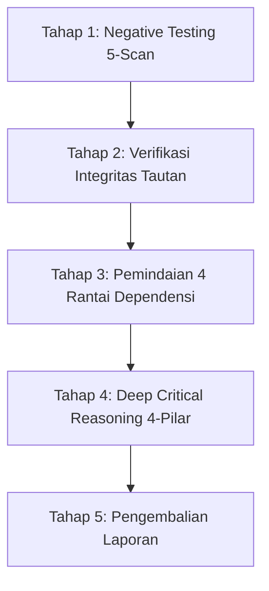

# Cross-Check Documentation Protocol (/cross-check-docs)

## Purpose
Skill ini mengatur **prosedur audit konsistensi silang dokumentasi pra-produksi** di semesta *Lentera Pudar — 3D Action RPG (Unreal Engine 5 + Blender 5.2 LTS)* untuk memastikan keselarasan lintas-domain berbasis bukti fisik (*evidence-driven*), bebas halusinasi, dan mendeteksi inkonsistensi secara dini.

---

## Activate When
- Dipicu via perintah `/cross-check-docs` atau instruksi audit sinkronisasi dokumentasi.
- Verifikasi pasca-revisi besar pada spesifikasi desain, numerik, atau rekam jejak arsitektur.
- Validasi integritas tautan dan kepatuhan invarian sebelum rilis milestone.

---

## Do Not Use When
- Pembuatan aset 3D atau penulisan kode terisolasi yang tidak berdampak pada struktur dokumentasi.
- Diskusi brainstorming ide awal yang belum masuk ke tahap standarisasi dokumentasi.

---

## Canonical Dependencies
- [master-index.md](../../../references/00-governance/master-index.md) — Router owner `authority_scope` dan resolusi konflik.
- [ADR register](../../../references/00-governance/adr/README.md) — Keputusan arsitektur aktif.
- [ai-agent-methodology.md](../../../references/06-pipeline-qc/ai-agent-methodology.md) — Kebijakan anti-halusinasi dan integritas bukti.

---

## Delapan Aturan Baku Protokol Audit

1. **Sumber Kebenaran Wajib dari Isi File Aktual**:
   - Audit HARUS membaca ulang isi file fisik secara langsung menggunakan tool (`view_file`, `grep_search`), bukan mengandalkan memori sesi percakapan.
2. **Wajib Bukti Kutipan Konkret & Larangan Kutipan Selektif**:
   - Setiap baris verifikasi wajib mencantumkan tautan file markdown, bab/seksi, dan kutipan teks kata-per-kata aktual.
   - Dilarang hanya mengutip baris yang benar sambil mengabaikan nilai lama di baris lain.
3. **Eksplisit Menyatakan Gap (*Anti-Smoothing*)**:
   - Jika suatu topik belum memiliki pembahasan langsung dan spesifik, WAJIB dicatat sebagai **OPEN GAP** tanpa dihalus-haluskan.
4. **Larangan Klaim "Zero Gaps" Tanpa Bukti Rinci per Item**:
   - Laporan yang hanya berisi checklist centang tanpa rincian kutipan per baris adalah output tidak valid.
5. **Penempatan "Open Gaps" di Bab Awal Laporan**:
   - Daftar Open Gaps wajib diletakkan di Bab 1 pada bagian awal laporan agar menjadi perhatian utama.
6. **Siklus Audit Ulang Mandiri per Gap**:
   - Menutup satu gap di suatu modul tidak mengasumsikan gap di modul lain otomatis selesai. Verifikasi dilakukan bertahap.
7. **Deteksi Duplikasi File & Penegakan Single Source of Truth**:
   - Audit memindai duplikasi antara file root vs `references/` dan menegakkan otoritas dokumen kanonikal di `master-index.md`.
8. **Analisis Kritis 4-Pilar (*Deep Critical Reasoning*)**:
   - Evaluasi mendalam mencakup: *Core Tension Analysis*, *System-Boundary Failure Modes*, *Agent Alignment Guard*, dan *Asumsi Emosional Playtest Manusia (`[Needs Human Playtest Validation]`).*

---

## Model Otoritas & Resolusi Konflik

Audit konsistensi silang menggunakan **Otoritas Berbasis Lingkup** yang diatur pada [master-index.md](../../../references/00-governance/master-index.md) dan [ADR-004](../../../references/00-governance/adr/ADR-004-scope-authority-capability-truth-verification-governance.md):
- ADR memegang otoritas keputusan HANYA jika berstatus `ACCEPTED` dan secara eksplisit mengatur domain/nilai terkait.
- Jika tidak ada ADR eksplisit, Dokumen Otoritas Kanonikal untuk domain tersebut berlaku penuh.
- Jika terdeteksi konflik tanpa resolusi jelas $\rightarrow$ tandai `[CONFLICT]`, laporkan kutipan kedua sumber, dan minta resolusi manusia.

---

## Alur 5-Tahap Eksekusi Audit Sistematis



### Tahap 1: Negative Testing 5-Scan (Grep Active Hunting)
1. **Scan Istilah/File Usang**: Memastikan tidak ada sisa terminologi arsitektur deprecated.
2. **Scan Pelanggaran Anti-RPG Mandate**: Memastikan tidak ada konsep terlarang (Level 1..99, stat leveling generik, skill tree bebas, gacha/loot koin).
3. **Scan Integritas Log ADR**: Memastikan urutan ADR berurutan dan utuh tanpa celah penomoran.
4. **Scan Nilai Deprecated**: Memastikan parameter lama tidak tersisa di luar catatan riwayat.
5. **Scan Kebersihan Root**: Memastikan root direktori bersih dari file usang.

### Tahap 2: Otomasi Verifikasi Integritas Tautan
Jalankan skrip otomasi verifikasi tautan:
```bash
node tools/verify_repository.mjs
```
Target: **0 Broken Links** di seluruh repositori.

### Tahap 3: Pemindaian 4 Rantai Ketergantungan 6-Domain
1. **Rantai Biomekanika**: `04-art-3d` (Shingling) $\rightarrow$ `06-pipeline-qc` (SOP 3 & DoD C) $\rightarrow$ `02-gameplay` (Ability Specs).
2. **Rantai Fisika Kain**: `04-art-3d` (Modular Scarf) $\rightarrow$ `06-pipeline-qc` (SOP 4 & DoD C) $\rightarrow$ `03-narrative` (Sacrifice Stages).
3. **Rantai Combat Timing**: owner scope combat di `01-core`/`02-gameplay` $\rightarrow$ `06-pipeline-qc` (DoD C), tanpa identifier ADR retired.
4. **Rantai Psikologi & Level**: `07-foundations` (Psychology) $\rightarrow$ `02-gameplay` (Level & Visibility Stakes) $\rightarrow$ `06-pipeline-qc` (Emotional Playtesting).

### Tahap 4: Deep Critical Reasoning 4-Pilar
Evaluasi titik lemah teknis, batasan handoff antar-sistem, pencegahan bias AI, dan identifikasi asumsi yang membutuhkan pengujian manusia.

### Tahap 5: Pengembalian Laporan
Kembalikan laporan lengkap ke task Work/Chat aktif. Persistensi hanya dilakukan jika diminta secara eksplisit dan ke lokasi yang telah disetujui secara eksplisit; audit tidak membuat direktori penyimpanan implisit.

---

## Output Expectations (Format Laporan Standar)

```markdown
# Laporan Audit Konsistensi Dokumentasi (/cross-check-docs)
*Tanggal: YYYY-MM-DD | Status: [SYNCHRONIZED / ACTION REQUIRED]*

## 1. Daftar Open Gaps & Kebutuhan Desain Terbuka (Bab Utama)
| No | Topik / Modul | Deskripsi Kesenjangan | Tingkat Keparahan | Rekomendasi Resolusi |
|---|---|---|---|---|

## 2. Hasil Negative Testing & Integritas Tautan (5-Scan Results)
- Scan Istilah Usang: [Pass / Fail]
- Anti-RPG Mandate Guard: [Pass / Fail]
- Integritas Rantai ADR: [Pass / Fail]
- Nilai Deprecated: [Pass / Fail]
- Link Checker: 0 Broken Links

## 3. Matriks Verifikasi Lintas-Sistem (Disertai Bukti Kutipan Langsung)
| Parameter / Topik | Status Keselarasan | Dokumen Rujukan & Lokasi | Bukti Kutipan Teks Aktual |
|---|---|---|---|

## 4. Evaluasi Titik Lemah, Asumsi Kritis & Risiko Implementasi
- Analisis Handoff Sistem & Solusi Arsitektur
- Penegakan Invarian Desain & Anti-RPG Guardrails
- Asumsi Emosional yang Membutuhkan Validasi Playtest Manusia ([Needs Human Playtest Validation])

## 5. Rekomendasi Tindakan Selanjutnya (Action Items)
```
