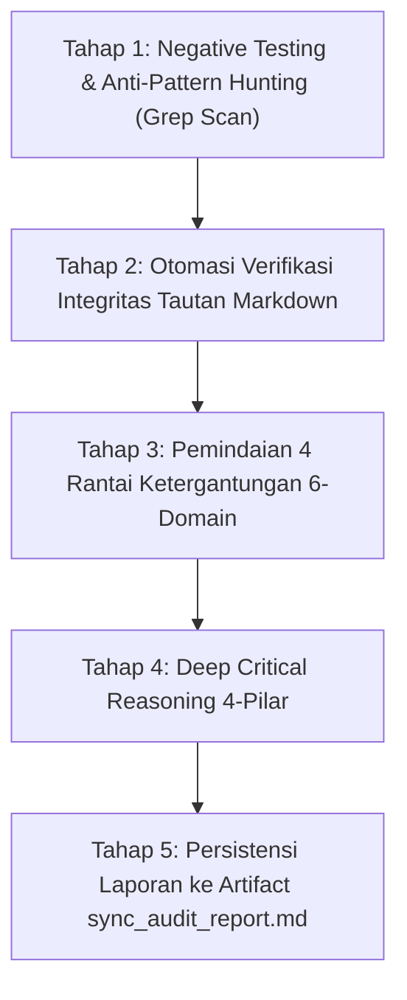

# Cross-Check Documentation Protocol (/cross-check-docs)

> **Dokumen Protokol Audit Konsistensi Silang Tingkat Industri (Industrial-Grade Master Cross-Check Standard)**  
> Menegakkan standar audit berbasis bukti fisik (*evidence-driven*), anti-halusinasi, pelaporan gap jujur, uji negatif anti-pattern, dan mitigasi risiko teknis/naratif di seluruh semesta *Lentera Pudar — 3D Action RPG (Unreal Engine 5 + Blender 5.2 LTS)*.

---

## 1. Delapan Aturan Baku Protokol Audit (The 8 Mandatory Audit Rules)

Setiap agen yang menjalankan tugas audit `/cross-check-docs` WAJIB mematuhi 8 aturan tanpa pengecualian:

### 1. Sumber Kebenaran Wajib dari Isi File Aktual (No-Session-Memory Mandate)
- Audit HARUS membaca ulang isi file yang relevan secara langsung menggunakan tool pembaca file (`view_file`, `grep_search`), bukan mengandalkan ringkasan percakapan sebelumnya atau asumsi judul file semata.
- Klaim yang tidak dapat ditelusuri ke isi file yang dibaca saat sesi berlangsung dilarang diberi status sinkron.

### 2. Wajib Bukti Kutipan Konkret & Larangan Kutipan Selektif (*Anti-Selective Citation*)
- Setiap baris verifikasi wajib mencantumkan bukti fisik dengan format minimal:
  - **Tautan File Markdown**: `[nama-file.md](file:///d:/GodotProjects/Lentera-Pudar/references/...)`
  - **Nomor Bab / Seksi / Baris** yang tepat.
  - **Cuplikan Teks Kutipan Singkat Kata-per-Kata** yang membuktikan klaim tersebut.
- **Larangan Kutipan Selektif**: Dilarang hanya mengutip baris yang benar sambil mengabaikan sisa nilai lama di baris lain. Auditor wajib memverifikasi bahwa parameter lama telah benar-benar $0$ (nol) di seluruh dokumen.
- **Aturan Status Keselarasan**:
  - Kolom `Status Keselarasan ✅` **HANYA boleh diisi** jika istilah/kode yang diklaim ditemukan **tertulis kata-per-kata di file eksternal yang dirujuk**.
  - Jika klaim hanya berasal dari file yang sedang diaudit (*self-reference*), **WAJIB ditulis `⚠️ Self-Reference / Belum Ada di File Eksternal`**.
  - Jika belum pernah dibahas di dokumen manapun, **WAJIB ditulis `⚠️ Belum pernah dibahas/didokumentasikan — kandidat GAP baru (Perlu ADR Baru)`** selaras dengan format ITS.

### 3. Eksplisit Menyatakan Gap (Anti-Smoothing & No-Assumption Mandate)
- Dilarang keras menyimpulkan suatu topik "sudah cukup relevan / tercakup" hanya karena bersinggungan dengan sistem lain.
- Jika belum ada pembahasan langsung dan spesifik, topik tersebut WAJIB dicatat sebagai **OPEN GAP** tanpa dihalus-haluskan.

### 4. Larangan Klaim Ringkasan "100% Zero Gaps" Tanpa Bukti Rinci per Item
- Laporan audit yang hanya menampilkan kesimpulan optimis atau checklist centang tanpa rincian kutipan per baris adalah **OUTPUT TIDAK VALID**.
- Status selesai hanya sah jika setiap parameter pendukung diverifikasi dengan kutipan aktual.

### 5. Penempatan "Open Gaps" di Bagian Awal Laporan
- Laporan audit wajib memisahkan secara tegas antara daftar **Open Gaps** dan daftar **Telah Terverifikasi Sinkron**.
- Bagian **Open Gaps** WAJIB diletakkan di Bab 1 pada bagian atas/awal laporan agar menjadi perhatian utama pembaca.

### 6. Siklus Audit Ulang Mandiri per Gap (Incremental Verification Cycle)
- Menutup satu gap di suatu modul TIDAK PERNAH mengasumsikan gap di modul lain otomatis selesai.
- Setiap gap memiliki siklus verifikasi mandiri: `Rancang ➔ Integrasikan ➔ Audit Ulang dengan Bukti Kutipan Baru`.

### 7. Deteksi Duplikasi File & Penegakan Single Source of Truth
- Audit wajib memindai file di root workspace vs file di folder `references/`.
- Jika ditemukan duplikasi isi atau potensi tumpang tindih sumber kebenaran, audit wajib melaporkannya sebagai **Anomali Duplikasi** dan menetapkan file master di `references/` sebagai *Single Source of Truth (SSoT)* utama.

### 8. Bagian Wajib "Titik Lemah, Asumsi Kritis & Risiko Implementasi" (Deep Critical Reasoning)
- Setiap laporan audit WAJIB menjalankan analisis metakognitif mendalam yang mencakup 4 pilar evaluasi kritis:
  1. **Analisis Tarikan Filosofis (*Core Tension Analysis*)**: Membedah potensi benturan filosofis antar pilar desain (misal: duka hening *Hellblade* vs kepuasan mekanik *Kena/GRIS*).
  2. **Titik Rapuh Handoff Antar-Sistem (*System-Boundary Failure Modes*)**: Mengidentifikasi titik rawan kegagalan integrasi antar modul/engine (misal: transisi *Chaos Cloth vs Control Rig*, *Hit-Stop Delta-Time Accumulator*). **Wajib langsung disertai solusi arsitektur konkret**.
  3. **Pencegahan Bias Generik AI (*Agent Alignment Guard*)**: Menilai kerentanan dokumen terhadap *creeping features* atau bias generik model AI (seperti usulan stat leveling/skill tree RPG konvensional).
  4. **Asumsi Emosional Playtest Manusia (`[Needs Human Playtest Validation]`)**: Mengidentifikasi hipotesis emosional yang tidak bisa divalidasi oleh AI semata (misal: *Pacing Monumental Sektor 4 / Solemn Engagement vs Disengaged Fatigue*, *Loss Aversion $2.5\times$*).

---

## 2. Hirarki Otoritas Sumber Kebenaran (Ground Truth Hierarchy)

Jika terjadi perbedaan spesifikasi atau parameter antar dokumen, audit wajib menggunakan piramida prioritas keputusan berikut:

```
┌─────────────────────────────────────────────────────────────┐
│  👑 TIER 1 (Otoritas Tertinggi):                            │
│     references/01-core/design-decisions.md (ADR-001 s.d. 041)│
├─────────────────────────────────────────────────────────────┤
│  🥈 TIER 2 (Spesifikasi Teknis & Naratif Master):           │
│     game-design-document.md, style-guide.md,                │
│     anatomy-kinesiology.md, sector-ability-progression.md   │
├─────────────────────────────────────────────────────────────┤
│  🥉 TIER 3 (SOP Kerja, Checklist QC & Skills):              │
│     sop-workflow.md, qa-qc-framework.md,                    │
│     .agents/skills/*/SKILL.md, .agents/AGENTS.md            │
└─────────────────────────────────────────────────────────────┘
```

> **Hukum Otoritas**: Jika dokumen Tier 2 atau Tier 3 bertentangan dengan keputusan ADR di Tier 1, **ADR adalah pemenang mutlak**, dan dokumen yang lebih rendah wajib diselaraskan mengikuti ADR terkait.

---

## 3. Alur 5-Tahap Eksekusi Audit Sistematis



### Tahap 1: Negative Testing & Anti-Pattern Hunting (5 Grep Scans)
Auditor wajib menjalankan pemindaian aktif sebelum membaca detail:
1. **Scan Nama File Usang**: `grep_search` untuk istilah legacy seperti `expert-3d-foundations`, `additional-techniques`, `expert-mathematics`, dll. Target: 0 matches.
2. **Scan Pelanggaran Anti-RPG Mandate**: `grep_search` untuk kata terlarang seperti `Level 1..99`, `STR/DEX/INT`, `Gacha`, `Loot Koin`, `Skill Tree Bebas`. Target: 0 matches (kecuali di bagian larangan).
3. **Scan Integritas Rantai ADR**: Memastikan urutan ADR tidak ada yang terputus (ADR-001 s.d. ADR-041 lengkap).
4. **Scan Nilai Deprecated**: Memastikan angka lama (seperti `hit-stop 3 frame`) tidak lagi ada di luar catatan riwayat.
5. **Scan Kebersihan Root**: Memastikan root workspace bersih dari file pointer `.md` legacy.

### Tahap 2: Otomasi Verifikasi Tautan Markdown
Auditor wajib menjalankan skrip otomasi:
```bash
python tools/update_and_verify_links.py
```
Memastikan **0 Broken Links** di seluruh repositori.

### Tahap 3: Pemindaian 4 Rantai Ketergantungan 6-Domain
Auditor wajib memeriksa keselarasan lintas domain pada 4 jalur kritis:
1. **Rantai Biomekanika**: `04-art-3d` (Tri-Layer Shingling) ➔ `06-pipeline-qc` (SOP 3 & DoD C) ➔ `02-gameplay` (`GA_ShatterStrike`).
2. **Rantai Fisika Kain**: `04-art-3d` (Modular Scarf) ➔ `06-pipeline-qc` (SOP 4 & DoD C) ➔ `03-narrative` (4 Stages of Sacrifice).
3. **Rantai Combat Timing**: `01-core` (ADR-040 Hit-Stop 50ms) ➔ `02-gameplay` (GDD 6.2 & Progression) ➔ `06-pipeline-qc` (DoD C).
4. **Rantai Psikologi & Level**: `05-foundations` (Loss Aversion $2.5\times$) ➔ `02-gameplay` (Lumen Stakes 800cm-200cm) ➔ `06-pipeline-qc` (Emotional Playtesting).

### Tahap 4: Deep Critical Reasoning 4-Pilar
Mengevaluasi Core Tension, System-Boundary Handoff, Agent Bias Guardrails, dan Asumsi Human Playtest.

### Tahap 5: Persistensi Laporan ke Artifact
Menyimpan dan memperbarui laporan lengkap ke artifact:
`sync_audit_report.md` di brain directory untuk memastikan persistensi jejak audit.

---

## 4. Struktur Format Laporan Audit Standar

Setiap laporan `/cross-check-docs` wajib mengikuti struktur berikut:

```markdown
# Laporan Audit Konsistensi Dokumentasi (/cross-check-docs)
*Tanggal Audit: YYYY-MM-DD | Auditor: [Nama Agent/Role] | Status: [SYNCHRONIZED / ACTION REQUIRED]*

## 1. Daftar Open Gaps & Kebutuhan Desain Terbuka (Diletakkan di Awal)
(Tabel gap terbuka, topik yang belum dibahas langsung, dan tingkat keparahan)

## 2. Hasil Negative Testing & Integritas Tautan (5-Scan Results)
(Hasil scan istilah usang, anti-RPG guard, kelengkapan ADR, link checker 0 broken links)

## 3. Deteksi Duplikasi File & Status Single Source of Truth (SSoT)
(Status kebersihan root workspace, 32 file master 6-domain, dan 9 skills)

## 4. Matriks Verifikasi Lintas-Sistem (Wajib Disertai Kutipan Kata-per-Kata)
| Parameter / Topik | Status | Tautan File & Bab/Baris | Bukti Kutipan Teks Aktual |
|---|---|---|---|

## 5. Evaluasi Titik Lemah, Asumsi Kritis & Risiko Implementasi
### A. Titik Rapuh Teknis, Kinesiologi & Integrasi Engine (dengan Solusi Arsitektur)
- [Masalah Handoff / Boundary] ➔ Solusi Teknis Terukur
### B. Analisis Tarikan Filosofis & Pencegahan Bias AI Sub-Agent
- Penegakan Anti-RPG Mandate & Grounded Kinetic Commitment
### C. Asumsi Emosional yang Membutuhkan Validasi Playtest Manusia ([Needs Human Playtest Validation])
- Hipotesis Emosional Intended vs Perceived & Indikator Lolos Uji Gate 2

## 6. Rekomendasi Tindakan Selanjutnya (Action Items)
```
