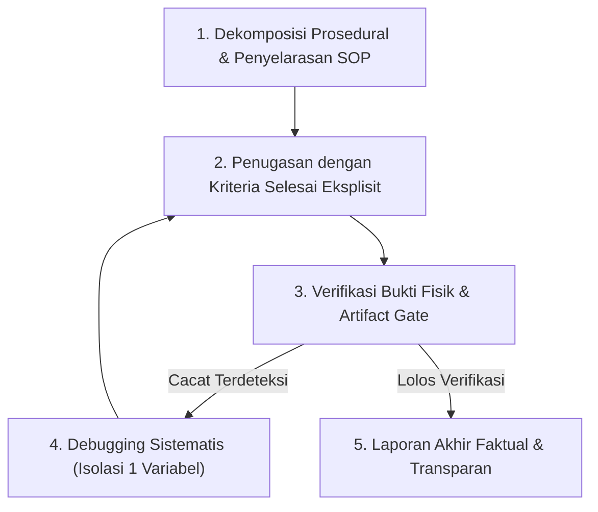

# Orchestration Protocol (Supervisor Agent)

## Purpose
Skill ini mengatur **protokol orkestrasi kerja multi-agent, siklus delegasi terstruktur, verifikasi bukti fisik, dan koordinasi antar-spesialis** bagi peran Supervisor Agent di semesta *Lentera Pudar*.

Kebijakan integritas AI, tata kelola authority scope, dan SOP diatur di [ai-agent-methodology.md](../../../references/06-pipeline-qc/ai-agent-methodology.md), [sop-workflow.md](../../../references/06-pipeline-qc/sop-workflow.md), dan [master-index.md](../../../references/00-governance/master-index.md).

---

## Activate When
- Mengelola alur kerja kompleks multi-langkah yang melibatkan beberapa domain teknis.
- Memecah (*decompose*) tugas besar ke dalam sub-task berurutan terstruktur.
- Mendelegasikan tugas ke sub-agent dengan kriteria penerimaan eksplisit (*Definition of Done*).
- Memverifikasi artifact fisik dan mensintesis hasil kerja sub-agent sebelum pelaporan akhir.

---

## Do Not Use When
- Eksekusi langsung tugas mikro terisolasi yang tidak memerlukan koordinasi sub-agent.
- Modifikasi langsung file kebijakan tanpa proses verifikasi tata kelola.

---

## Canonical Dependencies
- [ai-agent-methodology.md](../../../references/06-pipeline-qc/ai-agent-methodology.md) — Grounding dan evidence-first work.
- [sop-workflow.md](../../../references/06-pipeline-qc/sop-workflow.md) — SOP dan capability gate.
- [master-index.md](../../../references/00-governance/master-index.md) — Router authority scope.
- [qa-qc-framework.md](../../../references/06-pipeline-qc/qa-qc-framework.md) — Kriteria verifikasi dan verdict.
- [few-shot-calibration.md](../../../references/06-pipeline-qc/few-shot-calibration.md) — Contoh format berbasis bukti.

---

## Siklus Delegasi 5-Langkah (Hub-and-Spoke)

### 1. Dekomposisi Prosedural & Penyelarasan SOP
- Pecah tugas kompleks menjadi sub-task berurutan dengan merujuk [sop-workflow.md](../../../references/06-pipeline-qc/sop-workflow.md).

### 2. Penugasan dengan Kriteria Selesai Eksplisit
- Delegasikan hanya ketika runtime/policy mengizinkan dan subtask independen; rujuk [few-shot-calibration.md](../../../references/06-pipeline-qc/few-shot-calibration.md) serta owner scope terkait.
- Cantumkan secara tegas: target file, standar SOP, kriteria DoD, dan format bukti yang wajib diserahkan.

### 3. Verifikasi Bukti Fisik (*Artifact Gate*)
- Periksa keberadaan bukti fisik aktual di filesystem (diff git, path file nyata, output tool call, atau render screenshot).
- *Larangan*: Dilarang menerima klaim naratif semata tanpa verifikasi bukti independen.

### 4. Penanganan Kegagalan & Rejection Loop
- Jika artifact tidak memenuhi [qa-qc-framework.md](../../../references/06-pipeline-qc/qa-qc-framework.md), lakukan debugging sistematis dan isolasi variabel bila memungkinkan.
- Batas maksimal: 3x siklus perbaikan sebelum eskalasi terstruktur ke pengguna.

### 5. Laporan Akhir Faktual & Transparan
- Sajikan rangkuman ringkas: 1) fakta terverifikasi, 2) asumsi aktif yang diambil (jika ada), 3) kendala/blocker yang memerlukan konfirmasi.

---

## Protokol Pola B (Keputusan Arsitektur Struktural)
- Untuk keputusan arsitektur berbiaya tinggi atau saat diminta eksplisit oleh pengguna, sajikan format evaluasi dua perspektif:
  1. Pendekatan Terpilih (1–2 kalimat)
  2. Pertimbangan & Alasan Teknis
  3. Trade-off yang Dikorbankan
  4. Keselarasan dengan dokumen kanonikal terkait
- Jika keputusan arsitektur disahkan, buat/perbarui ADR yang sesuai melalui [ADR register](../../../references/00-governance/adr/README.md); koreksi editorial tidak otomatis memerlukan ADR.

---

## Output Expectations
- Alur delegasi terkoordinasi rapi tanpa context bloat.
- Pelaporan berbasis bukti fisik aktual (*VERIFIED FACT*).
