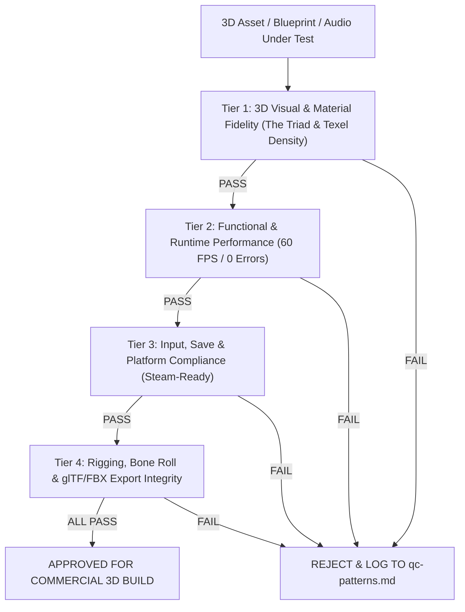

# Commercial Release Quality Control (3D QC Gate Protocol)

> **Standar Mutu Komersial (Steam-Ready Grade)**: Setiap aset 3D, armature rig, material shader, skrip gameplay, level, dan audio diuji dengan tolok ukur kelayakan rilis publik di PC/Steam merujuk pada [qa-qc-framework.md](file:///d:/GodotProjects/Lentera-Pudar/references/qa-qc-framework.md), alur eksekusi [sop-workflow.md](file:///d:/GodotProjects/Lentera-Pudar/references/sop-workflow.md), [additional-techniques.md](file:///d:/GodotProjects/Lentera-Pudar/references/additional-techniques.md), dan kalibrasi mutu [few-shot-calibration.md](file:///d:/GodotProjects/Lentera-Pudar/references/few-shot-calibration.md).

---

## 1. Enam Pilar Definition of Done (DoD) & 4-Tier Inspection



---

### 🎨 Tier 1: 3D Visual & Material Fidelity (Standar Grafis, The Triad & Texel Density)
- [ ] **Kepatuhan Palet The Triad 3D**:
  - Kuning Jiwa Aina: `#F4B860` (2700K Kelvin Warm Emissive pada syal, terhubung ke MPC).
  - Biru Kutukan Pudar: `#4A6FA5` & `#7EE8FA` (6500K Kelvin Cold Shard kristal es transparan dengan Subsurface Scattering).
  - Netral Gelap: `#2A211C` / `#141013` (Jubah kelana, eyepatch, batu dungeon).
- [ ] **Kualitas Shading, Siluet & Texel Density (Kena Benchmark)**:
  - Material PBR terdefinisi presisi (Roughness, Metallic, Transmission, SSS teruji dari $\ge 2$ sudut cahaya).
  - **Texel Density**: $512\text{ px/m}$ untuk Hero & Boss, $256\text{ px/m}$ untuk Prop Lingkungan.
  - Pencahayaan dinamis Lumen/PointLight tidak overexposed (Chiaroscuro 8:1 s.d. 12:1).
  - Lolos uji simulasi filter buta warna (*Colorblind Accessibility Check*).
- [ ] **Konsistensi Asimetri 3D**:
  - Lengan kiri kluster kristal es prisma $(-X)$ dan eyepatch mata kanan $(+X)$ konsisten secara geometris di seluruh sudut pandang kamera 360°.

---

### ⚡ Tier 2: Functional & Runtime Performance (Stabilitas Mesin & 60 FPS)
- [ ] **Nol Error Konsol & Zero Blocking Bugs**:
  - Runtime bersih dari error fatal, warning memori, dan zero softlock.
- [ ] **Penguncian Frame Rate Solid 60 FPS / 120 FPS**:
  - Waktu frame persentil ke-99 ($99^{th}$ percentile frame time) $< 16.6\text{ ms}$ di area terpadat sektor.
- [ ] **Animasi & Kinematika Biomekanik**:
  - Siklus gerak 8-fase lokomosi mulus dengan *Pelvic Tilt* dan *Counter-Rotation* tanpa *foot sliding*.
  - Simulasi fisika kain Syal Aina (*Chaos Cloth & 5-Bone Spring Chain*) berkibar alami tanpa distorsi atau clipping parah pada gerakan Idle, Jog, dan Evade Dash.
  - IK kaki aktif menyesuaikan kontur tanah/lantai dungeon.

---

### 🎮 Tier 3: Input, Save-State, Audio & Platform Compliance (Standar Steam & PC)
- [ ] **Dukungan Input Komprehensif**:
  - Kontrol Keyboard + Mouse dan Gamepad (Xbox, DualSense, Steam Deck) responsif dengan button glyphs dinamis.
  - Kamera Third-Person Adaptif (Eksplorasi FOV 78° vs Duel Boss FOV 70°) mulus dengan collision clipping prevention.
- [ ] **Integritas Save/Load (Steam Cloud Ready)**:
  - Protokol penulisan simpanan atomic anti-korupsi teruji stabil $\ge 10\text{x}$ siklus.
- [ ] **Audio Dynamic Ducking & Binaural Spatialization**:
  - Normalisasi loudness $-16\text{ LUFS}$ (Combat BGM) / $-18\text{ LUFS}$ (Dialog) dengan audio ducking ($-6\text{ dB}$, attack 150ms, release 400ms) saat narasi/bisikan jiwa beku.
  - Tata suara 3D binaural terverifikasi via headphone fisik.
- [ ] **Kepatuhan UI/UX & Aksesibilitas Empatik (Lihat [ui-ux-accessibility.md](file:///d:/GodotProjects/Lentera-Pudar/references/ui-ux-accessibility.md))**:
  - Mode Buta Warna teruji (Protanopia/Deuteranopia/Tritanopia) dengan pembedaan bentuk/simbol.
  - Closed Captions lengkap mencakup deskripsi vokal non-verbal (`[napas tercekat]`, `[jeda hening]`).
  - Full Control Remapping & Parry Window Assist slider berfungsi tanpa distorsi gameplay.
  - Text container adaptif (+40% ekspansi) dan zero baked text pada aset tekstur 3D.

---

### 🧪 Tier 4: Rigging, Bone Roll, Bony Landmarks & glTF/FBX Export Integrity
- [ ] **Armature & Transforms**:
  - Transform ter-apply 100% (`Location=(0,0,0)`, `Rotation=(0,0,0)`, `Scale=(1,1,1)`).
  - Orientasi rest pose $+Z$ forward / $+Y$ up.
- [ ] **Weight Painting & Bony Landmarks**:
  - Bony landmarks terbaca jelas (Acromion, Clavicle, Olecranon, Iliac Crest, Patella, Malleolus).
  - Corrective shape keys aktif pada fleksi siku 140° (+ Biceps Muscle Bulge) tanpa pinching atau volume loss.

---

### 💖 Gate Validasi Emosional (Lihat [emotional-playtesting.md](file:///d:/GodotProjects/Lentera-Pudar/references/emotional-playtesting.md))
- [ ] **Intended vs Perceived Alignment**:
  - Momen naratif dan transisi altar duka memiliki dokumen *Intended Emotion* vs *Design Signals* (lighting, FACS, audio).
  - Ditandai status `[Needs Human Playtest Validation]` — verifikasi AI tidak menggantikan validasi pemain manusia sungguhan.
- [ ] **Observasi Non-Intrusif & Retensi**:
  - Format wawancara pasca-sesi reflektif tanpa leading questions.

---

## 2. Klasifikasi Severity Bug & Format Pencatatan Wajib

| Severity | Dampak | Aturan Tindakan |
|---|---|---|
| 🔴 **Blocking** | Softlock, crash saat streaming level, progres terhenti total. | Wajib difix instan sebelum gate berikutnya. |
| 🟠 **Critical** | Pengalaman gameplay/narasi rusak (Curse Meter macet, clipping parah). | Wajib difix sebelum masuk fase Beta. |
| 🟡 **Major** | Transisi animasi kaku, ducking audio terlambat. | Wajib difix sebelum Release Candidate. |
| 🟢 **Minor** | Masalah kosmetik minor pada area tersembunyi. | Masuk backlog pemeliharaan. |

### 📝 Format Wajib Pencatatan Bug
Setiap bug yang ditemukan wajib dicatat dengan struktur field berikut (bukan catatan naratif bebas):
- **ID & Severity**: Format `BUG-[BLK/CRT/MAJ/MIN]-[XXX]` (contoh: `BUG-CRT-001`).
- **Langkah Reproduksi**: Urutan langkah presisi untuk memicu bug.
- **Kondisi**: Sektor/ruang, commit git/versi build, platform/hardware.
- **Status Lifecycle**: `Open` ➔ `Fixed` ➔ `Verified`.
  > [!CAUTION]
  > Status `Fixed` tanpa proses `Verified` ulang oleh reviewer/agent terpisah **TIDAK DIANGGAP SELESAI** dan tidak boleh menutup task atau milestone Stage-Gate manapun.

---

## 3. Protokol Anti-Theater & Larangan Self-Grading

1. **Observability-First**: Tool inspeksi wajib dijalankan sebelum menyatakan aset/fitur selesai.
2. **Larangan Self-Grading**: AI pembuat/pengedit suatu modul **DILARANG KERAS** menulis status "✅ Lolos QC", "Passed", atau "100% Terverifikasi" untuk hasil kerjanya sendiri.
   - Status awal maksimal AI pembuat: **`Ready for QC / Menunggu Verifikasi`**.
   - Status **`Verified / Lolos`** hanya sah setelah proses QC dijalankan sebagai langkah verifikasi terpisah yang secara eksplisit mencari potensi cacat/regresi.

---

## 4. Protokol Regression Check

Sebelum suatu perubahan pada sistem inti disahkan, wajib dilakukan verifikasi dampak silang ke sistem dependen:
- **Combat Timing (Hit-Stop / Frame Data)** ➔ Verifikasi parry window, kinetic chain animation, dan haptic feedback.
- **Curse Meter Mechanics** ➔ Verifikasi *Freeze of Despair*, *Breather Room recovery*, *Sealed Eyepatch*, dan *Ice Palm strike*.
- **Cloth / XPBD Physics** ➔ Verifikasi Syal Aina (Chaos Cloth), jubah kelana Kaelen, dan *Hybrid Hair System*.
- **Level & Collision Layout** ➔ Verifikasi *Safe Archway Checkpoints*, *World Partition Streaming*, dan *BP_SpectralLandingZone*.

## 5. Protokol Anti-False-Negative (Adversarial QC Mandate)

QC yang hanya memverifikasi checklist DoD TIDAK CUKUP untuk menemukan bug — checklist hanya mengonfirmasi kesesuaian spesifikasi, bukan ketahanan terhadap *edge case*. Setiap sesi QC wajib menyertakan usaha aktif mencari kegagalan sistem:

1. **Wajib Minimal 3 Skenario Adversarial per Modul/Sistem**:
   - Skenario dirancang sengaja untuk memicu anomali, *race condition*, tumpang tindih state mesin, atau kegagalan logika.
2. **Dokumentasi Hasil Skenario Wajib**:
   - Format pencatatan: `"Dicoba: [deskripsi skenario adversarial] ➔ Hasil: [tidak ada anomali / ditemukan bug]"`
   - Laporan "Nol Bug" tanpa rincian skenario adversarial dianggap **TIDAK VALID**.
3. **Penandaan First-Pass Clean**:
   - Sesi QC perdana untuk sistem yang belum pernah diuji sebelumnya jika tidak menemukan bug **WAJIB** berstatus:  
     `⚠️ First-Pass Clean — Perlu Verifikasi Independen`  
     (Bukan langsung `Verified & Approved`).
   - Status `Verified & Approved` penuh hanya sah setelah $\ge 2$ sesi QC terpisah dengan variasi skenario adversarial berbeda.
4. **Pemicu Audit Meta**:
   - Jika 3 laporan QC berturut-turut untuk sistem berbeda semuanya mengklaim "Nol Bug", audit meta terhadap standar keketatan pengujian wajib dipicu.

---

## 6. Format Laporan QC Wajib (Standardized Template)

```markdown
# 🛡️ 3D Quality Control Inspection Report

- **Target Inspeksi**: [Nama Asset 3D / Blueprint / Dokumen / Sistem]
- **Kategori**: [3D Visual / Rigging / Combat / Audio / Level / Narrative]
- **Commit / Versi Target**: [Hash commit git & path file aktual]
- **Status Pra-QC (Dari Pembuat)**: `Ready for QC / Menunggu Verifikasi`
- **Waktu Eksekusi QC**: [Timestamp]
- **QC Pass Number**: [Pass 1 (First-Pass) / Pass 2 (Independent Re-verification)]

### 📋 Checklist Evaluation (6-DoD & 4-Tier):
- [x] Tier 1: 3D Visual & Material Fidelity (The Triad & Texel Density) — PASS
- [x] Tier 2: Functional & Runtime Performance (60 FPS) — PASS
- [x] Tier 3: Input, Save & Platform Compliance — PASS
- [x] Tier 4: Rigging & Export Integrity — PASS
- [x] Emotional Gate: Intended vs Perceived Framework — PASS / [Needs Human Playtest Validation]

### 🥊 Pengujian Skenario Adversarial (Anti-False-Negative):
1. **Skenario Adversarial 1**:
   - *Aksi*: [Deskripsi tindakan ekstrem / edge case]
   - *Ekspektasi Kegagalan*: [Potensi crash/softlock/race condition yang dicari]
   - *Hasil Uji*: Dicoba: [X] ➔ Hasil: [tidak ada anomali / ditemukan bug]
2. **Skenario Adversarial 2**:
   - *Aksi*: [Deskripsi tindakan ekstrem / edge case]
   - *Ekspektasi Kegagalan*: [Potensi crash/softlock/race condition yang dicari]
   - *Hasil Uji*: Dicoba: [X] ➔ Hasil: [tidak ada anomali / ditemukan bug]
3. **Skenario Adversarial 3**:
   - *Aksi*: [Deskripsi tindakan ekstrem / edge case]
   - *Ekspektasi Kegagalan*: [Potensi crash/softlock/race condition yang dicari]
   - *Hasil Uji*: Dicoba: [X] ➔ Hasil: [tidak ada anomali / ditemukan bug]

### 🔄 Sistem Terdampak & Hasil Regression Check:
| Sistem Dependen Terdampak | Potensi Risiko Dampak | Hasil Uji Regresi |
|---|---|---|
| [Sistem A] | [Risiko desinkronisasi/perubahan nilai] | PASS / NO REGRESSION |
| [Sistem B] | [Risiko clipping/logic loop] | PASS / NO REGRESSION |

### 🐛 Log Temuan Bug Terstruktur (Jika Ada):
| ID & Severity | Langkah Reproduksi | Kondisi | Status Lifecycle |
|---|---|---|---|
| `BUG-XXX-001` | 1. ... 2. ... | Sektor X, Commit Y | Open / Fixed / Verified |

### 🎯 Keputusan Akhir QC Gate:
**STATUS AKHIR QC: [⚠️ First-Pass Clean — Perlu Verifikasi Independen / VERIFIED & APPROVED / REJECTED]**
- **Severity (Jika Reject)**: [Blocking / Critical / Major / Minor]
- **Catatan & Tindakan Lanjutan**: [Langkah verifikasi atau perbaikan teknis]
```


