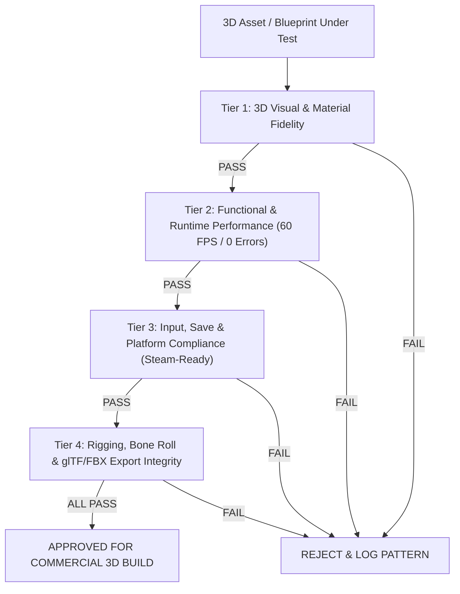

# Commercial Release Quality Control (3D QC Gate Protocol)

> **Standar Mutu Komersial (Steam-Ready Grade)**: Setiap aset 3D, armature rig, material shader, skrip gameplay, dan audio diuji dengan tolok ukur kelayakan rilis publik di PC/Steam.

---

## 1. Empat Lapis Checklist Mutu Komersial (The 4-Tier Commercial Gate)



---

### 🎨 Tier 1: 3D Visual & Material Fidelity (Standar Grafis & The Triad)
- [ ] **Kepatuhan Palet The Triad 3D**:
  - Kuning Jiwa Aina: `#F4B860` (2700K Kelvin Warm Emissive pada syal).
  - Biru Kutukan Pudar: `#4A6FA5` & `#7EE8FA` (6500K Kelvin Cold Shard kristal es transparan).
  - Netral Gelap: `#2A211C` / `#141013` (Jubah kelana, eyepatch, batu dungeon).
- [ ] **Kualitas Shading & Siluet**:
  - Material PBR terdefinisi presisi (Roughness, Metallic, Transmission kristal es).
  - Pencahayaan dinamis Lumen/PointLight tidak overexposed (bebas dari blown-out white pixels).
- [ ] **Konsistensi Asimetri 3D**:
  - Lengan kiri kluster kristal es prisma $(-X)$ dan eyepatch mata kanan $(+X)$ konsisten secara geometris di seluruh sudut pandang kamera 360°.

---

### ⚡ Tier 2: Functional & Runtime Performance (Stabilitas Mesin & 60 FPS)
- [ ] **Nol Error Konsol (Zero Console Errors/Warnings)**:
  - Runtime bersih dari error fatal dan warning memori.
- [ ] **Penguncian Frame Rate Solid 60 FPS / 120 FPS**:
  - Waktu frame persentil ke-99 ($99^{th}$ percentile frame time) $< 16.6\text{ ms}$.
- [ ] **Animasi & Kinematika Biomekanik**:
  - Siklus gerak lari/jalan atletis mulus tanpa *foot sliding*.
  - Simulasi fisika kain syal Aina (*Cloth Physics & Spring Bones*) berkibar alami tanpa distorsi atau jitter.

---

### 🎮 Tier 3: Input, Save-State & Platform Compliance (Standar Steam & PC)
- [ ] **Dukungan Input Komprehensif**:
  - Kontrol Keyboard + Mouse dan Gamepad (Xbox, DualSense, Steam Controller, Steam Deck) responsif.
  - Kamera Third-Person 360° mulus dengan collision clipping prevention.
- [ ] **Integritas Save/Load (Steam Cloud Ready)**:
  - Protokol penulisan simpanan atomic anti-korupsi.
- [ ] **Audio Dynamic Ducking**:
  - Normalisasi loudness $-14$ s.d. $-16$ LUFS dengan audio ducking saat narasi/dialog Aina.

---

### 🧪 Tier 4: Rigging, Bone Roll & glTF/FBX Export Integrity
- [ ] **Armature & Transforms**:
  - Transform ter-apply 100% (`Location=(0,0,0)`, `Rotation=(0,0,0)`, `Scale=(1,1,1)`).
  - Orientasi rest pose $+Z$ forward / $+Y$ up.
- [ ] **Weight Painting**:
  - Vertex deform mulus tanpa pinching pada lipatan siku, lutut, dan pundak.

---

## 2. Format Laporan QC Wajib

```markdown
# 🛡️ 3D Quality Control Inspection Report

- **Target Inspeksi**: [Nama Asset 3D / Mesh / Scene]
- **Kategori**: [3D Visual / Rigging / Combat / Platform]
- **Waktu Eksekusi**: [Timestamp]

### 📋 Checklist Evaluation:
- [x] Tier 1: 3D Visual & Material Fidelity — PASS
- [x] Tier 2: Functional & Runtime Performance (60 FPS) — PASS
- [x] Tier 3: Input, Save & Platform Compliance — PASS
- [x] Tier 4: Rigging & Export Integrity — PASS

### 🎯 Keputusan Akhir:
**STATUS: [PASS / REJECTED]**
```
