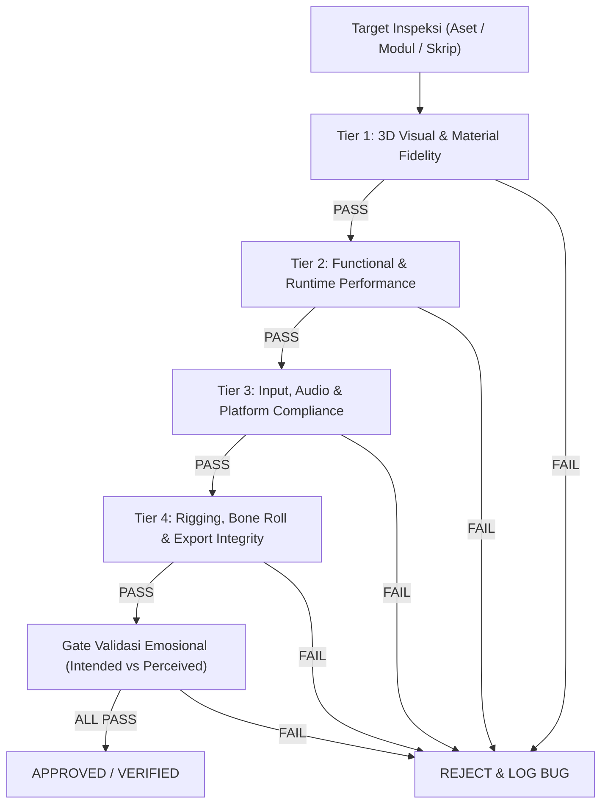

# Commercial Release Quality Control (3D QC Gate Protocol)

## Purpose
Skill ini mengatur **prosedur eksekusi Quality Control (QC Gate)** tingkat komersial (Steam-Ready Grade) untuk memverifikasi aset 3D, armature rig, material shader, skrip gameplay, level, dan audio di semesta *Lentera Pudar*.

Seluruh kriteria penerimaan, parameter numerik, dan Definition of Done diatur di [qa-qc-framework.md](../../../references/06-pipeline-qc/qa-qc-framework.md) dan [style-guide.md](../../../references/04-art-3d/style-guide.md).

---

## Activate When
- Dipicu via perintah `/qc-check` atau penugasan verifikasi mutu stage-gate.
- Verifikasi penyelesaian task sebelum disahkan ke milestone berikutnya.
- Pengujian regresi pasca-perubahan pada sistem inti (combat timing, physics, level streaming).

---

## Do Not Use When
- Proses perancangan/drafting awal yang masih dalam iterasi aktif oleh pembuat.
- Penilaian mandiri oleh agen pembuat (self-grading dilarang keras).

---

## Canonical Dependencies
- [qa-qc-framework.md](../../../references/06-pipeline-qc/qa-qc-framework.md) — DoD, stage gates, severity, dan verification contract.
- [style-guide.md](../../../references/04-art-3d/style-guide.md) — Parameter numerik dan visual.
- [sop-workflow.md](../../../references/06-pipeline-qc/sop-workflow.md) — SOP dan capability gate.
- [qc-patterns.md](../../../references/06-pipeline-qc/qc-patterns.md) — Pattern registry dengan evidence status.
- [few-shot-calibration.md](../../../references/06-pipeline-qc/few-shot-calibration.md) — Contoh non-evidence.
- [emotional-playtesting.md](../../../references/06-pipeline-qc/emotional-playtesting.md) — Gate playtest manusia yang belum dieksekusi.

---

## 4-Tier Inspection Workflow



### 1. Tier 1: 3D Visual & Material Fidelity
- Validasi palet warna The Triad, nilai Kelvin pencahayaan, dan parameter PBR terhadap [style-guide.md](../../../references/04-art-3d/style-guide.md).
- Validasi texel density dan kualitas shading dari minimal 2 sudut cahaya.
- Verifikasi konsistensi asimetri geometris 3D dan integritas deformasi siku (*Tri-Layer Shingling*).

### 2. Tier 2: Functional & Runtime Performance
- Verifikasi error konsol, softlock, dan frame rate hanya ketika runtime tersedia; rujuk [qa-qc-framework.md](../../../references/06-pipeline-qc/qa-qc-framework.md).
- Validasi siklus lokomosi, simulasi fisika kain (Chaos Cloth), dan konsistensi hit-stop gameplay.

### 3. Tier 3: Input, Audio & Platform Compliance
- Validasi dukungan kontrol ganda (Gamepad / Keyboard+Mouse) dengan button glyphs dinamis.
- Verifikasi integritas save/load data atomic.
- Validasi audio merujuk ke [style-guide.md](../../../references/04-art-3d/style-guide.md) Bab 10.
- Validasi aksesibilitas merujuk ke [ui-ux-accessibility.md](../../../references/02-gameplay/ui-ux-accessibility.md).

### 4. Tier 4: Rigging, Bone Roll & Export Integrity
- Validasi transform mesh ter-apply 100% (`Location=0, Rotation=0, Scale=1`).
- Verifikasi bony landmarks, bone roll, dan deformasi merujuk ke [anatomy-kinesiology.md](../../../references/04-art-3d/anatomy-kinesiology.md).

### 5. Gate Validasi Emosional
- Evaluasi keselarasan *Intended vs Perceived* terhadap momen naratif.
- Tandai status `[Needs Human Playtest Validation]` untuk respon emosional yang tidak dapat divalidasi penuh oleh AI.

---

## Protokol Pengujian Adversarial (Anti-False-Negative)

Cheklist verifikasi pasif tidak memadai untuk menemukan edge case. Setiap sesi QC wajib menyertakan pengujian adversarial aktif:
1. **Minimal 3 Skenario Adversarial per Modul**: Rancang skenario untuk memicu race condition, tumpang tindih state, batas nilai ekstrem, atau tabrakan sistem.
2. **Dokumentasi Hasil Skenario**: Format wajib `"Dicoba: [deskripsi aksi ekstrem] ➔ Hasil: [tidak ada anomali / ditemukan bug]"`.
3. **Penandaan First-Pass Clean**: Sesi QC perdana yang tidak menemukan bug WAJIB berstatus `⚠️ First-Pass Clean — Perlu Verifikasi Independen`. Status `Verified & Approved` penuh mensyaratkan verifikasi terpisah.

---

## Klasifikasi Bug & Aturan Tindakan

| Severity | Dampak | Aturan Tindakan |
|---|---|---|
| 🔴 **Blocking** | Softlock, crash runtime, progres gameplay terhenti total. | Wajib difix seketika sebelum melangkah ke gate berikutnya. |
| 🟠 **Critical** | Kerusakan mekanik/narasi mayor (Curse Meter macet, clipping parah). | Wajib diselesaikan sebelum build Beta. |
| 🟡 **Major** | Anomali animasi, ducking audio terlambat, glitch visual sekunder. | Wajib diselesaikan sebelum Release Candidate. |
| 🟢 **Minor** | Cacat kosmetik minor pada area non-kritis. | Dicatat ke backlog pemeliharaan. |

---

## Output Expectations (Standard QC Inspection Report)

```markdown
# 🛡️ 3D Quality Control Inspection Report

- **Target Inspeksi**: [Nama Aset / Modul / Dokumen]
- **Kategori**: [3D Visual / Rigging / Combat / Audio / Level / Narrative]
- **Commit / Versi Target**: [Hash commit & path aktual]
- **Status Pra-QC**: `Ready for QC / Menunggu Verifikasi`
- **QC Pass**: [Pass 1 (First-Pass) / Pass 2 (Independent Re-verification)]

### 📋 Hasil Evaluasi 4-Tier & DoD:
- [x] Tier 1: Visual & Material Fidelity — PASS / FAIL
- [x] Tier 2: Functional & Runtime Performance — PASS / FAIL
- [x] Tier 3: Input, Audio & Platform Compliance — PASS / FAIL
- [x] Tier 4: Rigging & Export Integrity — PASS / FAIL
- [x] Emotional Gate: Intended vs Perceived — PASS / [Needs Human Playtest Validation]

### 🥊 Pengujian Skenario Adversarial:
1. *Aksi*: [Deskripsi tindakan ekstrem] ➔ *Hasil*: Dicoba: [X] ➔ Hasil: [Pass/Bug]
2. *Aksi*: [Deskripsi tindakan ekstrem] ➔ *Hasil*: Dicoba: [X] ➔ Hasil: [Pass/Bug]
3. *Aksi*: [Deskripsi tindakan ekstrem] ➔ *Hasil*: Dicoba: [X] ➔ Hasil: [Pass/Bug]

### 🔄 Hasil Uji Regresi (Cross-Impact Check):
| Sistem Dependen Terdampak | Potensi Risiko Dampak | Status Regresi |
|---|---|---|
| [Sistem A] | [Risiko desinkronisasi/perubahan] | PASS / NO REGRESSION |

### 🐛 Temuan Bug Terstruktur (Jika Ada):
| ID & Severity | Langkah Reproduksi | Kondisi / Sektor | Status Lifecycle |
|---|---|---|---|
| `BUG-[BLK/CRT/MAJ/MIN]-001` | 1. ... 2. ... | Sektor X, Commit Y | Open / Fixed / Verified |

### 🎯 Keputusan Akhir QC Gate:
**STATUS AKHIR: [⚠️ First-Pass Clean — Perlu Verifikasi Independen / VERIFIED & APPROVED / REJECTED]**
- **Catatan & Rekomendasi Tindak Lanjut**: [Rincian verifikasi atau perbaikan teknis]
```
