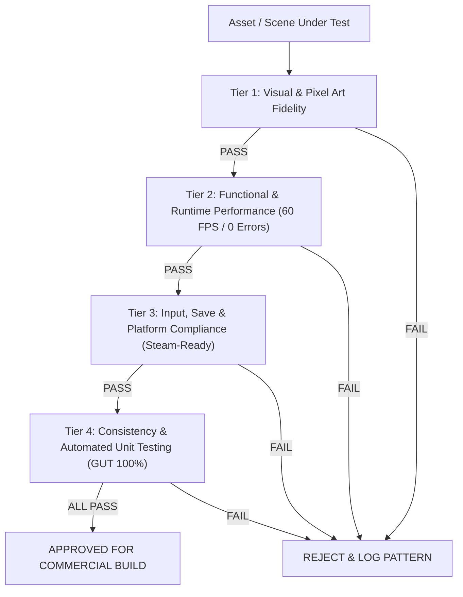

# Commercial Release Quality Control (QC Gate Protocol)

> **Standar Mutu Komersial (Steam-Ready Grade)**: Setiap aset visual, skrip logika, scene, dan audio diuji dengan tolok ukur kelayakan rilis publik di PC/Steam, bukan sekadar prototipe.

---

## 1. Empat Lapis Checklist Mutu Komersial (The 4-Tier Commercial Gate)



---

### 🎨 Tier 1: Visual & Pixel Art Fidelity (Standar Grafis & Kerapihan)
- [ ] **Kepatuhan Palet The Triad**:
  - Kuning Jiwa Aina: `#F4B860` (2700K Kelvin — Emissive PointLight2D).
  - Biru Kutukan Pudar: `#4A6FA5` (6500K Kelvin — Denyut Shader).
  - Netral Gelap: `#2A211C` (CanvasModulate & Batuan).
  - Penutup Mata Kaelen: `#141013` (Hitam Kulit).
- [ ] **Zero Bilinear / Filter Blur**:
  - Filter `Nearest` mutlak aktif di SubViewport, ViewportContainer, dan Texture2D.
  - Tampilan pixel-perfect pada scaling integer (1x, 2x, 4x, 1080p, 1440p, 4K) tanpa subpixel shimmering/jitter.
- [ ] **Konsistensi Asimetri 8-Arah Kardinal**:
  - Lengan kiri es dan eyepatch kanan tidak pernah tertukar akibat 2D mirroring.
- [ ] **Tipografi & UI Snapping**:
  - Font bitmap ter-render tajam 1:1 tanpa antialiasing blur.
  - Panel 9-slice tidak mengalami distorsi sudut (*corner deformation*).
- [ ] **HDR & Lighting Clamp**:
  - Pencahayaan tidak mengalami overexposure/blinding (nilai intensitas HDR $\le 1.2$).

---

### ⚡ Tier 2: Functional & Runtime Performance (Stabilitas Mesin & 60 FPS)
- [ ] **Nol Error Konsol (Zero Console Errors/Warnings)**:
  - `get_console_output()` dan `get_last_error()` bersih dari log error merah dan warning runtime.
  - Zero orphan nodes (tidak ada node yang tertinggal di memori tanpa parent).
- [ ] **Penguncian Frame Rate Solid 60 FPS**:
  - Waktu frame persentil ke-99 ($99^{th}$ percentile frame time) $< 16.6\text{ ms}$.
  - Bebas dari spike *Garbage Collection* atau stutter saat transisi room.
- [ ] **Animasi & Procedural Gait Biomekanik**:
  - Siklus jalan sinusoidal berjalan mulus tanpa *foot sliding*.
  - Bone roll konsisten (tidak ada limb yang berputar 360° atau sendi terkilir).
  - Fisika syal spring-damper berhenti natural saat karakter diam (tanpa jitter osilasi tak terhingga).
- [ ] **Shader Uniform Binding**:
  - Parameter shader `CursedHand.gdshader` ter-update presisi real-time sesuai fluktuasi nilai *Curse Meter*.

---

### 🎮 Tier 3: Input, Save-State & Platform Compliance (Standar Steam & PC)
- [ ] **Dukungan Input Komprehensif**:
  - Kontrol Keyboard + Mouse dan Gamepad (Xbox, DualShock, Steam Controller, Steam Deck) berfungsi instan.
  - Tombol aksi remappable (dapat diubah pemain di menu opsi).
  - Sistem Circular Input Buffer merekam dan membaca input tanpa ada penekanan tombol yang hilang (*dropped inputs*).
- [ ] **Integritas Save/Load (Steam Cloud Ready)**:
  - Penulisan save file menggunakan metode **Atomic Write** (tulis ke file `.tmp` ➔ validasi checksum ➔ rename ke `.dat` + backup ke `.bak`) untuk mencegah korupsi save saat game force-close/mati lampu.
  - Save/Load memuat 100% status persisten: stage syal Aina, curse meter, trigger altar, dialog flags.
- [ ] **Audio Master & Dynamic Ducking (Standar LUFS)**:
  - Normalisasi loudness terintegrasi pada target $-14$ s.d. $-16$ LUFS (standar industri PC/Steam).
  - Hirarki bus audio (`Master`, `BGM`, `SFX`, `Ambience`, `Voice`) dengan audio ducking otomatis saat dialog/SFX kritis berbunyi.
  - Bebas dari audio clicking/popping saat loop musik atau transisi bus.
- [ ] **Resolusi Dinamis & Window Handling**:
  - Kompatibel dengan rasio 16:9 (Native), 16:10 (Steam Deck 1280x800), dan 21:9 (Ultrawide pillarbox).
  - Game otomatis melakukan **Auto-Pause** dan mematikan audio sementara saat kehilangan fokus window (Alt-Tab).

---

### 🧪 Tier 4: Consistency & Automated Unit Testing (Uji Deterministik GUT)
- [ ] **Kelulusan Unit Test Otomatis (100% GUT Pass)**:
  - Test suite GUT untuk Finite State Machine (FSM), formula damage combat, perhitungan curse rate, dan buffer AI bos lulus 100% tanpa kegagalan.
- [ ] **Validasi Integritas File & UID**:
  - Semua file `.tscn` dan `.tres` memiliki UID valid tanpa ada *broken resource dependencies*.
  - glTF 2.0 valid dengan rest pose $+Z$ forward.

---

## 2. Format Laporan QC Wajib

Setiap eksekusi `/qc-check` wajib mengeluarkan laporan terstruktur:

```markdown
# 🛡️ Quality Control Inspection Report

- **Target Inspeksi**: [Nama Scene / Resource / Skrip]
- **Kategori**: [Visual / Functional / Platform / Consistency]
- **Waktu Eksekusi**: [Timestamp]

### 📋 Checklist Evaluation:
- [x] Tier 1: Visual & Pixel Art Fidelity — PASS
- [x] Tier 2: Functional & Runtime Performance (60 FPS) — PASS
- [x] Tier 3: Input, Save & Platform Compliance — PASS
- [x] Tier 4: Automated Testing (GUT) — PASS

### 🎯 Keputusan Akhir:
**STATUS: [PASS / REJECTED]**

*(Jika REJECTED, wajib menyertakan detail parameter kegagalan dan mencatatnya ke references/qc-patterns.md)*.
```
