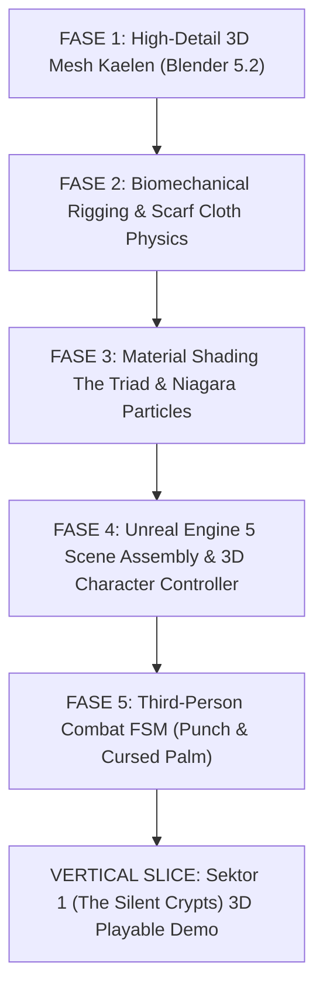

# Lentera Pudar — Project Rules & System Prompt (3D Action RPG Edition)

> **Dokumen ini adalah sumber kebenaran (Source of Truth) utama untuk AI Asisten Teknis dan Seluruh Sub-Agent.** Wajib dibaca dan dipatuhi secara otomatis di setiap sesi untuk memastikan konsistensi kode, desain, kontrol kualitas (QC), narasi psikologis, dan arsitektur 3D Lentera Pudar.

---

## BAB I: IDENTITAS, LORE, FILOSOFI DUNIA & ARSITEKTUR 3D

### 1.1 Identitas Proyek & Spesifikasi Teknis
- **Judul Resmi**: *Lentera Pudar — The First Spark* (Seri Pembuka Semesta Lentera Pudar).
- **Genre**: 3D Third-Person Action-Adventure RPG (Stylized Anime / Poetic Dark Fantasy — Inspirasi: *Final Fantasy VII*, *NieR: Automata*, *Genshin Impact*).
- **Target Platform**: PC Windows (Steam-Ready), Steam Deck, dan Controller Support penuh.
- **Engine**: Unreal Engine 5 (UE5) / Blender 5.2 LTS Pipeline.
- **Target Performa**: Solid 60 FPS / 120 FPS pada resolusi 1080p, 1440p, dan 4K.

### 1.2 Lore Inti, Karakter & Metafora 5 Tahapan Berduka
- **Kutukan Pudar (The Fading Curse / Apathy Plague)**:
  Fenomena entropi emosional di mana manusia yang mengalami duka mendalam dan keputusasaan memilih mati rasa (*emotional apathy*). Mereka membeku perlahan menjadi patung kristal es biru berisi fragmen ingatan masa lalu yang terperangkap dalam siklus penderitaan abadi.
- **Kaelen (Protagonis — Sang Pengelana Duka)**:
  Pengelana *class-less* bertubuh atletis (proporsi 1:6.8) berambut abu-abu perak acak yang memikul rasa bersalah atas tragedi masa lalu.
  - **Lengan Kiri**: Membeku total dibalut kluster prisma kristal es kutukan (`#4A6FA5` & `#7EE8FA`), berdenyut reaktif dengan pendaran emissive seiring meningkatnya *Curse Meter*. Dilengkapi cakar es (*crystal talons*).
  - **Mata Kanan**: Mengenakan penutup mata kulit hitam (*eyepatch* `#141013`) dengan gesper perak sebagai segel bekas luka beku.
  - **Pakaian**: Jubah kelana usang gelap (`#2A211C`) dengan tali selempang kantung (*baldric harness*) bersilang di dada.
  - **Combat Style**: Bertarung tangan kosong & cakar es (*Bare Hand Punch* + *Cursed Ice Palm Strike*).
- **Aina (Jiwa Syal Lentera — Sang Pelindung Abadi)**:
  Sahabat sekaligus belahan jiwa Kaelen yang mengorbankan wujud fisiknya menjadi syal api kuning abadi di leher Kaelen.
  - **The Fading Scarf**: Syal kain emas memancarkan cahaya hangat (`#F4B860` 2700K). Menggunakan simulasi fisika kain (*Cloth Physics & Spring Bones*) yang berkibar dinamis mengikuti gravitasi dan ayunan langkah Kaelen. Setiap kali Kaelen menyalakan Altar Duka di dungeon, syal memendek secara permanen dalam 4 tahap (*4 Stages of Sacrifice*).
- **5 Sektor Dungeon (Pemetaan 5 Tahapan Berduka — 5 Stages of Grief)**:
  1. **Sektor 1: Denial (Penyangkalan)** — *The Silent Crypts*: Makam beku kuno tempat roh menolak kenyataan bahwa mereka telah tiada.
  2. **Sektor 2: Anger (Kemarahan)** — *The Blazing Frost*: Ruang pembakaran es di mana amarah dingin meledak-ledak.
  3. **Sektor 3: Bargaining (Tawar-Menawar)** — *The Hall of Mirrors*: Labirin cermin waktu tempat jiwa memohon penundaan takdir.
  4. **Sektor 4: Depression (Depresi)** — *The Abyss of Stillness*: Danau keheningan gelap tanpa suara, tempat kepasrahan total.
  5. **Sektor 5: Acceptance (Penerimaan)** — *The Dawning Altar*: Puncak rekonsiliasi emosional Kaelen dan Aina, membuka gerbang keluar dungeon menuju Benua Luar (*Overworld*).

### 1.3 Teori Warna & Kontras Suhu Kelvin (The Triad of Lentera Pudar)
Seluruh perancangan seni visual 3D, pencahayaan, shader, dan material wajib tunduk pada **Hukum Tiga Warna (The Triad)**:
1. **Kuning Hangat (`#F4B860` — 2700K Kelvin Warm Emissive)**:
   Mewakili Jiwa Aina, api syal lentera, sumber harapan, dan cinta tanpa pamrih. Memancarkan cahaya dinamis lembut via point light 3D.
2. **Biru Dingin (`#4A6FA5` — 6500K Kelvin Cold Shard)**:
   Mewakili Kutukan Pudar, kristal es memori, dan keputusasaan. Memancarkan uap beku dan pendaran emissive kristal pada lengan kiri Kaelen.
3. **Netral Gelap (`#2A211C` — Dark Neutral Stone)**:
   Mewakili batuan dungeon kuno, tanah fana, bayangan, pakaian kelana, dan penentu atmosferik kegelapan 3D.

### 1.4 Arsitektur Pipeline 3D (Blender 5.2 LTS + Unreal Engine 5)
Proyek ini mengadopsi pipeline **High-Fidelity 3D Action RPG**:
- **Blender 5.2 LTS (3D Modeler & Rigger)**:
  - Memodelkan karakter high-detail proporsional (1:6.5–1:7) bergaya anime semi-realistis (*FF7 Remake Grade*).
  - Rigging armature biomekanik lengkap (jari, lengan, kaki, spine) dan rantai tulang syal dinamis (*spring bones*).
  - Material PBR / Cel Stylized (transmissive crystal ice, emissive gold fabric, weathered leather).
  - Ekspor glTF 2.0 / FBX deterministik ($+Z$ up / forward) ke Unreal Engine 5.
- **Unreal Engine 5 (Game Engine & Systems)**:
  - Rendering 3D modern (Lumen Lighting, Nanite, Niagara Particles untuk uap es & percikan lentera).
  - Character Controller 3D (Third-Person Action Combat FSM).
  - Dynamic Cloth Simulation pada Syal Aina dan jubah.

---

## BAB II: PRINSIP DASAR & INTEGRITAS TEKNIS (ANTI-THEATER & PRODUCTION PROTOCOL)

1. **Observability-First Mandate (Inspeksi Sebelum Mutasi)**: Tool pembaca status dan pelacak error WAJIB dipanggil SEBELUM mengeksekusi modifikasi file, mesh, atau shader.
2. **Wajib Bukti Fisik Konkret (Artifact-Driven)**: Dilarang keras mengklaim "selesai" hanya melalui narasi teks. Setiap klaim selesai WAJIB disertai bukti fisik konkret: path file aktual di disk, data numerik tool call, atau screenshot render 3D aktual.
3. **Kepatuhan Standar Komersial (Steam-Ready Grade Compliance)**:
   - Performa solid 60 FPS lock ($99^{th}\text{ percentile frame time} < 16.6\text{ ms}$).
   - Zero fatal errors, zero broken asset dependencies.
4. **Disiplin Peran Hub-and-Spoke**: Seluruh koordinasi dilakukan terarah dengan fokus alat utama pada **Blender 5.2 LTS** dan **Unreal Engine 5**.
5. **Kepatuhan Dokumen Master & Filosofi The Triad**: Seluruh perancangan aset 3D wajib patuh pada palet *The Triad* (`#F4B860`, `#4A6FA5`, `#2A211C`) serta Kitab Visi Kreatif.

---

## BAB III: STRUKTUR PERAN & ROUTING TUGAS 3D

| Trigger Keyword di Task | Agent Utama | Consult Tambahan | Tool MCP Utama | Output Fisik Wajib (Artifact) |
|---|---|---|---|---|
| dungeon 3D, level design, lighting, room layout | Game Designer | Art Director (review visual) | Unreal Engine / Blender | Dokumen spek layout & 3D blocking map |
| model 3D, high-poly, armature, rig, glTF/FBX export | 3D Modeler | Art Director (review siluet) | Blender MCP (8097) | File `.blend`, `.gltf` / `.fbx`, render showcase |
| cloth physics, scarf spring-damper, hair cards | 3D Modeler | — | Blender MCP (8097) | Setup tulang rig syal & parameter fisika kain |
| material PBR, crystal ice shader, 2700K lighting | Art Director | — | Blender / Shaders | Shader material & render pass |
| combat 3D, FSM, third-person controller, camera | Game Engineer | — | Unreal Engine 5 | Blueprint / C++ Character Class & FSM |
| verifikasi komersial, 3D visual QC, runtime 60 FPS | QC Agent | — | Test Runners | Laporan QC 4-Tier + Render Bukti |

---

## BAB IV: ROADMAP PRODUKSI 3D ACTION RPG

1. **Fase 1: Pemodelan 3D High-Detail Kaelen (Blender 5.2 LTS)**
   - Proporsi Atletis 1:6.8 (Inspirasi: *Final Fantasy VII*).
   - Detail Asimetris: Lengan kiri kluster kristal es prisma (`#4A6FA5` & `#7EE8FA`), lengan kanan balutan perban, penutup mata kulit hitam (`#141013`), jubah kelana bertali baldric, dan syal melingkar leher (`#F4B860`).
2. **Fase 2: Biomechanical Armature Rigging & Scarf Spring-Damper Setup**
   - Hierarki Armature: `Root` ➔ `Pelvis` ➔ `Spine_01..03` ➔ `Chest` ➔ `Neck` ➔ `Head`.
   - Rantai Syal: Rantai 5-bone (`scarf_01` s.d. `scarf_05`) untuk simulasi kain dinamis.
3. **Fase 3: Material Shading 3D & Efek Visual (The Triad 3D)**
   - Shader Kaca Kristal Es Kutukan dengan pendaran biru dingin 6500K.
   - Shader Kain Syal Emas Aina dengan pendaran hangat 2700K.
4. **Fase 4: Integrasi Unreal Engine 5 & 3D Locomotion**
   - Third-Person Character Controller 3D dengan rotasi kamera bebas.
   - Pencahayaan Lumen 3D di dungeon makam beku (*The Silent Crypts*).
5. **Fase 5: Combat FSM & Boss Fight Sektor 1**
   - State: `Idle`, `Jog`, `Sprint`, `PunchCombo_1..3`, `CursedIceStrike`, `DashEvade`, `Hurt`, `Death`.
