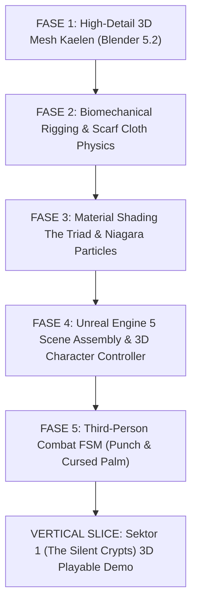

# Lentera Pudar — Project Rules & System Prompt (3D Action RPG Edition)

> **Dokumen ini adalah sumber kebenaran (Source of Truth) utama untuk AI Asisten Teknis dan Seluruh Sub-Agent.** Wajib dibaca dan dipatuhi secara otomatis di setiap sesi untuk memastikan konsistensi kode, desain, kontrol kualitas (QC), narasi psikologis, biomekanika, dan arsitektur 3D Lentera Pudar.

---

## BAB I: IDENTITAS, LORE, FILOSOFI DUNIA & ARSITEKTUR 3D

### 1.1 Identitas Proyek & Arsitektur Dual-Layer
- **Judul Resmi**: *Lentera Pudar — The First Spark* (Seri Pembuka Semesta Lentera Pudar).
- **Genre**: 3D Third-Person Action-Adventure RPG (Stylized-Realistic / Poetic Dark Fantasy).
- **Target Platform**: PC Windows (Steam-Ready), Steam Deck, dan Controller Support penuh.
- **Engine & Pipeline**: Unreal Engine 5 (UE5) / Blender 5.2 LTS Pipeline.
- **Target Performa**: Solid 60 FPS / 120 FPS pada resolusi 1080p, 1440p, dan 4K ($99^{th}\text{ percentile} < 16.6\text{ ms}$).
- **Dual-Layer Architecture Benchmark**:
  - **Layer Visual (Kena: Bridge of Spirits)**: Menentukan estetika stylized-realistic PBR non-outline, rasio 1:6.8, pencahayaan Kelvin kontras tinggi (2700K vs 6500K Lumen GI), hybrid hair (solid + alpha cards), reruntuhan organik, dan restorasi jejak hangat (*Niagara Warmth Embers* & Render Target Thawing) — merujuk pada [kena-art-research.md](file:///d:/GodotProjects/Lentera-Pudar/references/kena-art-research.md).
  - **Layer Gameplay & Psikologi (Hellblade I & II)**: Menentukan sistem diegetik (es merambat di tubuh menggantikan bar UI, kompas emosional syal menggantikan minimap), spatial 3D binaural whispers, live mental morphing environment, combat 1v1 deliberate parry-focused, serta bahasa kamera sinematik emosional & transisi seamless — merujuk pada [cinematics-cutscenes.md](file:///d:/GodotProjects/Lentera-Pudar/references/cinematics-cutscenes.md).

### 1.2 Lore Inti, Karakter & Metafora 5 Tahapan Berduka
- **Kutukan Pudar (The Fading Curse / Apathy Plague)**:
  Fenomena entropi emosional di mana manusia yang mengalami duka mendalam dan keputusasaan memilih mati rasa (*emotional apathy*). Mereka membeku perlahan menjadi patung kristal es biru berisi fragmen ingatan masa lalu yang terperangkap dalam siklus penderitaan abadi.
- **Kaelen (Protagonis — Sang Pengelana Duka)**:
  Pengelana *class-less* bertubuh atletis (proporsi 1:6.8, tinggi $1.78\text{ m}$) berambut abu-abu perak acak (`#C9CDD1`) yang memikul rasa bersalah atas tragedi masa lalu.
  - **Lengan Kiri**: Membeku total dibalut kluster prisma kristal es kutukan (`#4A6FA5` & `#7EE8FA`), berdenyut reaktif dengan pendaran emissive seiring meningkatnya *Curse Meter*. Dilengkapi cakar es (*crystal talons*).
  - **Mata Kanan (The Sealed Eye)**: Mengenakan penutup mata kulit hitam (*eyepatch* `#141013`) sebagai segel bekas luka beku. Menjadi mekanik persepsi *Risk-Reward* (membuka segel sesaat mengungkap simbol tersembunyi & jalur memori, namun mempercepat laju kutukan $+3\text{ poin/detik}$).
  - **Pakaian**: Jubah kelana usang gelap (`#2A211C`) dengan tali selempang kantung (*baldric harness*) bersilang di dada.
  - **Combat Style**: Bertarung tangan kosong berbobot & cakar es (*Bare Hand Punch* + *Cursed Ice Strike* + *12-Frame Tight Parry* dengan Rantai Kinetik penuh).
- **Aina (Jiwa Syal Lentera — Sang Pelindung Abadi)**:
  Sahabat sekaligus belahan jiwa Kaelen yang mengorbankan wujud fisiknya menjadi syal api kuning abadi di leher Kaelen.
  - **The Fading Scarf**: Syal kain emas memancarkan cahaya hangat (`#F4B860` 2700K). Menggunakan simulasi fisika kain (*Dual-Mode*: Chaos Cloth Stiffness 0.4–0.6 saat gameplay & Hand-Keyframed Control Rig saat cutscene) yang berkibar dinamis sebagai kompas emosional penunjuk arah. Setiap kali Kaelen menyalakan Altar Duka di dungeon, syal memendek secara permanen dalam 4 tahap (*4 Stages of Sacrifice*).
- **5 Sektor Dungeon (Pemetaan 5 Tahapan Berduka — 5 Stages of Grief & Environmental Storytelling)**:
  *Tata ruang spasial, breadcrumbing diegetik, dan simbiosis arena FSM merujuk pada [level-design-storytelling.md](file:///d:/GodotProjects/Lentera-Pudar/references/level-design-storytelling.md).*
  1. **Sektor 1: Denial (Penyangkalan)** — *The Silent Crypts*: Makam beku kuno tempat roh menolak kenyataan bahwa mereka telah tiada. Koridor sempit simetris berulang (*looping claustrophobia*, Bos: Lord Alden).
  2. **Sektor 2: Anger (Kemarahan)** — *The Blazing Frost*: Ruang pembakaran es di mana amarah dingin meledak-ledak. Jalur terputus tajam, friksi navigasi tinggi, dan reruntuhan *destructible* (Bos: Ignis Vulkan).
  3. **Sektor 3: Bargaining (Tawar-Menawar)** — *The Hall of Mirrors*: Labirin cermin waktu tempat jiwa memohon penundaan takdir. Rute bercabang semu dan refleksi es manipulatif (Bos: Lady Vespera).
  4. **Sektor 4: Depression (Depresi)** — *The Abyss of Stillness*: Danau keheningan gelap tanpa suara, tempat kepasrahan total. Ruang luas hampa dengan *descending verticality* (Bos: The Hollow Reflection).
  5. **Sektor 5: Acceptance (Penerimaan)** — *The Dawning Altar*: Puncak rekonsiliasi emosional Kaelen dan Aina, ruang lapang terbuka dengan sightline panjang menuju Benua Luar (*Overworld*).

### 1.3 Teori Warna & Kontras Suhu Kelvin (The Triad of Lentera Pudar)
Seluruh perancangan seni visual 3D, pencahayaan, shader, dan material wajib tunduk pada **Hukum Tiga Warna (The Triad)**:
1. **Kuning Hangat (`#F4B860` — 2700K Kelvin Warm Emissive)**:
   Mewakili Jiwa Aina, api syal lentera, sumber harapan, dan cinta tanpa pamrih. Memancarkan cahaya dinamis lembut via point light 3D.
2. **Biru Dingin (`#4A6FA5` & `#7EE8FA` — 6500K Kelvin Cold Shard)**:
   Mewakili Kutukan Pudar, kristal es memori, dan keputusasaan. Memancarkan uap beku dan pendaran emissive kristal pada lengan kiri Kaelen.
3. **Netral Gelap (`#2A211C` & `#141013` — Dark Neutral Stone & Leather)**:
   Mewakili batuan dungeon kuno, tanah fana, bayangan, pakaian kelana, dan penentu atmosferik kegelapan 3D.

### 1.4 Arsitektur Pipeline 3D (Blender 5.2 LTS + Unreal Engine 5)
Proyek ini mengadopsi pipeline **High-Fidelity 3D Action RPG**:
- **Blender 5.2 LTS (3D Modeler & Rigger)**:
  - Memodelkan karakter high-detail proporsional (1:6.8, Hero LOD0 $40\text{k}–60\text{k}\text{ tris}$, Texel Density $512\text{ px/m}$).
  - Rigging armature biomekanik lengkap, validasi Bony Landmarks, corrective shape keys, dan rantai tulang syal dinamis (*spring bones* 5-chain).
  - Material PBR non-outline (transmissive crystal ice SSS, emissive gold fabric, weathered leather, trim sheets).
  - Ekspor glTF 2.0 / FBX deterministik atau direct via **Blender-Unreal Pipeline Plugin** resmi Epic Games ke Unreal Engine 5.
- **Unreal Engine 5 (Game Engine & Systems)**:
  - Rendering 3D modern (Lumen Lighting GI, Nanite, Niagara Particles untuk uap es & percikan hangat lentera, Lightmass hybrid).
  - Character Controller 3D dengan *Adaptive Dynamic Camera* (Eksplorasi FOV 78° vs Duel Lock-On FOV 70° berbasis Quaternion SLERP).
  - Third-Person Action Combat FSM berbobot dengan parry window 12 frame dan hit-stop 3 frame.
  - Dynamic XPBD Chaos Cloth Simulation pada Syal Aina dan jubah.

---

## BAB II: PRINSIP DASAR & INTEGRITAS TEKNIS (ANTI-THEATER & PRODUCTION PROTOCOL)

1. **Observability-First Mandate (Inspeksi Sebelum Mutasi)**: Tool pembaca status dan pelacak error WAJIB dipanggil SEBELUM mengeksekusi modifikasi file, mesh, atau shader.
2. **Wajib Bukti Fisik Konkret (Artifact-Driven)**: Dilarang keras mengklaim "selesai" hanya melalui narasi teks. Setiap klaim selesai WAJIB disertai bukti fisik konkret: path file aktual di disk, data numerik tool call, atau screenshot render 3D aktual.
3. **Kepatuhan Standar Komersial (Steam-Ready Grade & 6-DoD Compliance)**:
   - Wajib memenuhi checklist **6 Pilar Definition of Done (DoD)** sesuai [qa-qc-framework.md](file:///d:/GodotProjects/Lentera-Pudar/references/qa-qc-framework.md) (Model 3D, Material, Rigging/Animasi, Audio, Level, dan Gameplay).
   - Validasi emosional duka manusia berbasis kerangka *Intended vs Perceived* sesuai [emotional-playtesting.md](file:///d:/GodotProjects/Lentera-Pudar/references/emotional-playtesting.md).
   - Performa solid 60 FPS lock ($99^{th}\text{ percentile frame time} < 16.6\text{ ms}$) dan zero blocking bugs.
4. **Disiplin Peran Hub-and-Spoke**: Seluruh koordinasi dilakukan terarah dengan fokus alat utama pada **Blender 5.2 LTS (Port 8097)** dan **Unreal Engine 5 (Python Scripting MCP)** sesuai [tools-mcp-stack.md](file:///d:/GodotProjects/Lentera-Pudar/references/tools-mcp-stack.md).
5. **Kepatuhan Dokumen Master & Filosofi The Triad**: Seluruh perancangan aset 3D dan sistem wajib patuh pada palet *The Triad* (`#F4B860`, `#4A6FA5`, `#2A211C`), Master Index ([master-index.md](file:///d:/GodotProjects/Lentera-Pudar/references/master-index.md)), Master GDD ([game-design-document.md](file:///d:/GodotProjects/Lentera-Pudar/references/game-design-document.md)), Master Theory Bible ([theory-reference.md](file:///d:/GodotProjects/Lentera-Pudar/references/theory-reference.md)), Kitab Visi Kreatif ([creative-vision.md](file:///d:/GodotProjects/Lentera-Pudar/references/creative-vision.md)), serta Rantai Tools ([tools-mcp-stack.md](file:///d:/GodotProjects/Lentera-Pudar/references/tools-mcp-stack.md)).
6. **Kepatuhan Prosedural SOP 7-Tahap (SOP Workflow Compliance)**: Seluruh tugas operasional berulang (pembuatan prop, material, rigging, cloth sim, level grey-box, gameplay GAS, dan audio) WAJIB mengikuti urutan kerja sekuensial pada [sop-workflow.md](file:///d:/GodotProjects/Lentera-Pudar/references/sop-workflow.md). Dilarang melompati tahapan (contoh: dilarang masuk visual detail sebelum lolos playtest grey-box).
7. **Kalibrasi Mutu Mandiri (Few-Shot Calibration & Gap-Handling)**: Setiap agen wajib melakukan evaluasi diri (*self-critique*) sebelum melapor selesai merujuk pada benchmark benar vs salah di [few-shot-calibration.md](file:///d:/GodotProjects/Lentera-Pudar/references/few-shot-calibration.md). Kebutuhan di luar dokumen wajib ditandai sebagai **GAP** dan dilarang diimprovisasi diam-diam.
8. **Kurasi Visual Reference Board**: Pemodelan 3D, tata cahaya, dan environment wajib mengacu pada 9 kategori shot-list legal terkurasi pada [reference-board-guide.md](file:///d:/GodotProjects/Lentera-Pudar/references/reference-board-guide.md).
9. **Kepatuhan Biomekanika & Kinesiologi**: Pemodelan mesh, rigging, dan animasi wajib mematuhi titik tumpu Bony Landmarks, rantai kinetik transfer tenaga combat, siklus 8-fase lokomosi, ekspresi wajah FACS (Action Units & Duchenne marker), dan corrective morphs sesuai [anatomy-kinesiology.md](file:///d:/GodotProjects/Lentera-Pudar/references/anatomy-kinesiology.md) dan [human-facial-expressions.md](file:///d:/GodotProjects/Lentera-Pudar/references/human-facial-expressions.md).
10. **Kepatuhan Integritas API & Teknik Praktis 3D**: Otomasi skrip `bpy` dan `unreal` wajib mengikuti protokol *Inspect-Before-Execute* pada [api-cheat-sheet.md](file:///d:/GodotProjects/Lentera-Pudar/references/api-cheat-sheet.md), serta menerapkan trim sheets, texel density ($512\text{ px/m}$), modular kit-bashing ($300\text{ cm}$), dan LUT post-process sesuai [additional-techniques.md](file:///d:/GodotProjects/Lentera-Pudar/references/additional-techniques.md).
11. **Kepatuhan Fondasi Ilmiah Expert Suite**: Menyetel rotasi, kurva spline C2, solver kain XPBD, retakan es Voronoi lattice-bias, BRDF Cook-Torrance, SDT 3-Needs, Loss Aversion $2.5\text{x}$, dan pacing emotional bandwidth merujuk pada [expert-mathematics.md](file:///d:/GodotProjects/Lentera-Pudar/references/expert-mathematics.md), [expert-physics.md](file:///d:/GodotProjects/Lentera-Pudar/references/expert-physics.md), dan [expert-psychology.md](file:///d:/GodotProjects/Lentera-Pudar/references/expert-psychology.md).
12. **Kepatuhan Kerangka Estetika & Kritik Seni Expert**: Mengevaluasi komposisi visual via uji *Value-First Grayscale*, proporsi warna 60-30-10, triad kritik seni (*Unity, Tension, Resolution*), dan konsistensi semiotika simbolis merujuk pada [expert-art-creativity.md](file:///d:/GodotProjects/Lentera-Pudar/references/expert-art-creativity.md).
13. **Kepatuhan Metodologi Kerja AI Expert**: Menerapkan mode kerja lugas anti-roleplay (alat produksi fungsional), grounding 3-sumber anti-halusinasi, dekomposisi masalah bertahap, loop verifikasi mandiri (*self-verification*), isolasi variabel debugging, dan pelaporan jujur transparan merujuk pada [expert-ai-methodology.md](file:///d:/GodotProjects/Lentera-Pudar/references/expert-ai-methodology.md).
14. **Kepatuhan Teori Fondasi 3D Expert**: Menerapkan topologi edge flow berorientasi deformasi, alokasi pole strategis, penempatan UV seam tersembunyi, PBR albedo murni (metallic biner 0/1), skinning weight sum $=1.0$ (maks 4 bone influence), tangent space normal baking dengan cage mesh, dan retensi siluet LOD merujuk pada [expert-3d-foundations.md](file:///d:/GodotProjects/Lentera-Pudar/references/expert-3d-foundations.md).

---

## BAB III: STRUKTUR PERAN & ROUTING TUGAS 3D

| Trigger Keyword di Task | Agent Utama | Consult Tambahan | Tool MCP Utama | Output Fisik Wajib (Artifact) |
|---|---|---|---|---|
| dungeon 3D, level design, lighting, room layout | Game Designer | Art Director (review visual) | Unreal Engine / Blender | Dokumen spek layout & 3D blocking map |
| model 3D, high-poly, armature, rig, glTF/FBX export | 3D Modeler | Art Director (review siluet) | Blender MCP (8097) | File `.blend`, `.gltf` / `.fbx`, render showcase |
| cloth physics, scarf spring-damper, hair cards | 3D Modeler | — | Blender MCP (8097) | Setup tulang rig syal & parameter fisika kain |
| material PBR, crystal ice shader, 2700K lighting | Art Director | — | Blender / Shaders | Shader material & render pass |
| combat 3D, FSM, third-person controller, camera | Game Engineer | — | Unreal Engine 5 | Blueprint / C++ Character Class & FSM |
| verifikasi komersial, 3D visual QC, runtime 60 FPS | QC Agent | — | Test Runners | Laporan QC 4-Tier + Render Bukti |

---

## BAB IV: ROADMAP PRODUKSI 3D ACTION RPG

1. **Fase 1: Pemodelan 3D High-Detail Kaelen (Blender 5.2 LTS)**
   - Proporsi Atletis 1:6.8, Hero LOD0 $40\text{k}–60\text{k}\text{ tris}$, Texel Density $512\text{ px/m}$.
   - Detail Asimetris: Lengan kiri kluster kristal es prisma (`#4A6FA5` & `#7EE8FA`), lengan kanan balutan perban, penutup mata kulit hitam (`#141013`), jubah kelana bertali baldric, hybrid hair (`#C9CDD1`), dan syal melingkar leher (`#F4B860`).
2. **Fase 2: Biomechanical Armature Rigging & Scarf Spring-Damper Setup**
   - Hierarki Armature: `Root` ➔ `Pelvis` ➔ `Spine_01..03` ➔ `Chest` ➔ `Neck` ➔ `Head` (Bony Landmarks & Corrective Morphs siku 140° + bisep bulge).
   - Rantai Syal: Rantai 5-bone (`scarf_01` s.d. `scarf_05`) untuk simulasi kain dinamis XPBD & Dual-Mode cutscene.
3. **Fase 3: Material Shading 3D & Efek Visual (The Triad 3D)**
   - Shader Kaca Kristal Es Kutukan dengan pendaran biru dingin 6500K, SSS 0.5–1.2cm, Cook-Torrance GGX.
   - Shader Kain Syal Emas Aina dengan pendaran hangat 2700K (Lumen GI).
4. **Fase 4: Integrasi Unreal Engine 5 & 3D Locomotion**
   - Third-Person Character Controller 3D dengan rotasi kamera bebas (Quaternion SLERP).
   - 8-Fase Gait Cycle dengan Pelvic Tilt, Counter-Rotation, dan Two-Bone FABRIK Foot IK.
   - Pencahayaan Lumen 3D di dungeon makam beku (*The Silent Crypts*) dengan Post-Process LUT.
5. **Fase 5: Combat FSM & Boss Fight Sektor 1**
   - State: `Idle`, `Jog`, `Sprint`, `PunchCombo_1..3`, `CursedIceStrike`, `DashEvade`, `Hurt`, `Death`.
   - Enemy Archetypes: S1 *The Echo* & *Lord Alden* dengan telegraf serangan 12–18 frame dan fun guardrails sesuai [enemy-design-balancing.md](file:///d:/GodotProjects/Lentera-Pudar/references/enemy-design-balancing.md).

