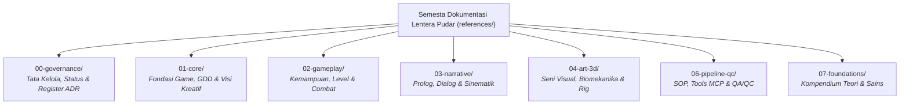

# Master Index — Lentera Pudar Master Reference
### Peta Navigasi Dokumentasi Pra-Produksi, Arsitektur Tata Kelola & Matriks Otoritas Kanonikal

> **Dokumen Indeks Master (*Master Documentation & Governance Hub*)**
> Menjadi titik masuk pertama bagi seluruh agen AI dan tim pengembang untuk menavigasi semesta dokumentasi **Lentera Pudar — The First Spark** (3D Third-Person Action-Adventure RPG; Unreal Engine 5 + Blender 5.2 LTS), memahami pembagian otoritas domain (*Scope-Based Authority*), dan mematuhi tata kelola kebenaran data kanonikal.

---

## BAB I: ARSITEKTUR TATA KELOLA DOKUMENTASI & SUMBER KEBENARAN

### 1.1 Prinsip Otoritas Berbasis Lingkup (*Scope-Based Authority*)
- **Tidak Ada Hierarki Dokumen Universal**: Otoritas dokumen tidak bersifat linier satu arah. Otoritas ditentukan oleh **domain fungsional, tujuan dokumen, dan lingkup penentu yang dideklarasikan secara resmi (*declared scope*)**.
- **Otoritas Keputusan ADR**: Architecture Decision Records (ADR) di [adr/](adr/) memegang otoritas keputusan arsitektur HANYA jika:
  1. ADR berstatus `ACCEPTED`;
  2. ADR secara eksplisit mengatur domain, nilai, atau keputusan teknis yang bersangkutan;
  3. ADR secara eksplisit menyatakan suksesi atau perubahan atas keputusan sebelumnya.
  *Jika suatu ADR tidak mengatur domain spesifik secara tegas, dokumen otoritas kanonikal untuk domain tersebut tetap berlaku penuh.*

### 1.2 Pemilik Kanonikal Domain (*Canonical Domain Authorities*)

| Domain Fungsional | Dokumen Pemilik Kanonikal (*Canonical Authority*) | Lingkup Otoritas (*Declared Scope*) | Peran Otoritatif |
|---|---|---|---|
| **Navigasi & Tata Kelola Dokumen** | [master-index.md](master-index.md) | `navigation.master_index` | Peta navigasi global, SSoT governance, dan routing agen. |
| **Status Kebenaran Proyek** | [project-status.md](project-status.md) | `project.status` | Pelaporan fase proyek, status engine/tooling riil, dan blocker. |
| **Genesis Repository & Verifikasi Migrasi** | [repository-genesis-plan.md](repository-genesis-plan.md) | `repository.genesis` | Manifest, gate keselamatan, eksekusi R7, dan verifikasi independen R8. |
| **Identitas & Filosofi Game** | [game-design-document.md](../01-core/game-design-document.md) | `project.identity` | Master GDD 9 Bab, arsitektur dual-layer Kena/Hellblade, premis duka. |
| **Visi Kreatif & Semiotika Seni** | [creative-vision.md](../01-core/creative-vision.md) | `creative.vision` | Filosofi seni The Triad (2700K vs 6500K), diksi puitis, resonansi duka. |
| **Progresi Kemampuan Hero** | [sector-ability-progression.md](../02-gameplay/sector-ability-progression.md) | `gameplay.progression` | Progresi sekuensial GRIS model, 5 kemampuan hero, Altar Duka 1–5. |
| **Level Design & Spasial Duka** | [level-design-storytelling.md](../02-gameplay/level-design-storytelling.md) | `gameplay.level_design` | Desain spasial 5 sektor duka, grey-box, breadcrumbing diegetik. |
| **Desain Musuh & Balancing** | [enemy-design-balancing.md](../02-gameplay/enemy-design-balancing.md) | `gameplay.enemy_balancing` | 5 Arketipe musuh, telegraphing 450–600ms, combat pacing guardrails. |
| **Ekosistem Dunia & Satwa** | [ambient-world-life.md](../02-gameplay/ambient-world-life.md) | `gameplay.ambient_world` | Perilaku NPC latar, ekosistem satwa spasial, persistensi jejak dunia. |
| **UI/UX & Aksesibilitas** | [ui-ux-accessibility.md](../02-gameplay/ui-ux-accessibility.md) | `gameplay.ui_ux` | Minimal-diegetic HUD, aksesibilitas empati buta warna/tuli, lokalisasi. |
| **Sinematografi & Kamera** | [cinematics-cutscenes.md](../03-narrative/cinematics-cutscenes.md) | `narrative.cinematics` | Bahasa kamera duka 5 sektor, transisi seamless, cakupan 3-shot, DoF. |
| **Naskah Tutorial Prolog** | [prologue-tutorial-script.md](../03-narrative/prologue-tutorial-script.md) | `narrative.script` | Naskah onboarding langkah-demi-langkah, glyph kontekstual diegetik. |
| **Arahan Vokal & Dialog Subteks** | [vocal-direction-dialogue.md](../03-narrative/vocal-direction-dialogue.md) | `narrative.dialogue_direction` | Subteks vokal 5 sektor duka, format lembar VA, non-verbal voice sync. |
| **Konstanta Visual & Style Guide**| [style-guide.md](../04-art-3d/style-guide.md) | `art.visual_constants` | Hex sRGB The Triad, poly budget (40k–60k LOD0), texel density, Chaos Cloth. |
| **Biomekanika & Kinesiologi Hero** | [anatomy-kinesiology.md](../04-art-3d/anatomy-kinesiology.md) | `art.biomechanics` | Proporsi 1:6.8, Tri-Layer Shingling lengan es, lokomosi 8-fase. |
| **Rig Wajah Manusia & FACS** | [human-facial-expressions.md](../04-art-3d/human-facial-expressions.md) | `art.facial_rig` | Action Units (AU1..AU43), Duchenne marker, ekspresi mikro duka. |
| **Pipeline Produksi Aset 3D** | [3d-asset-pipeline.md](../04-art-3d/3d-asset-pipeline.md) | `art.3d_pipeline` | Topologi quad organik, UV seam, baking cage, ekspor glTF Blender MCP. |
| **Modular Environment 3D** | [environment-modular-techniques.md](../04-art-3d/environment-modular-techniques.md) | `art.environment_modular` | Grid 300cm, trim sheets, texel density 512/256 px/m, post-process LUTs. |
| **Prosedur SOP Produksi 3D** | [sop-workflow.md](../06-pipeline-qc/sop-workflow.md) | `pipeline.sop` | 7 SOP sekuensial (Prop, Mat, Rig, Cloth, Level Grey-Box, GAS, Audio). |
| **Kontrol Kualitas** | [qa-qc-framework.md](../06-pipeline-qc/qa-qc-framework.md) | `pipeline.qc` | DoD per deliverable, stage-gate roadmap, evidence contract, severity P0–P3. |
| **Rantai Perkakas & MCP Stack** | [tools-mcp-stack.md](../06-pipeline-qc/tools-mcp-stack.md) | `pipeline.tools_stack` | Registry Blender MCP Hardened-v1, hasil revalidasi, capability gate Unreal. |

### 1.3 Taksonomi Tipe Dokumen (*Document-Type Taxonomy*)
- **`GOVERNANCE`**: Dokumen tata kelola, indeks navigasi, rekam jejak status, dan baseline.
- **`SPECIFICATION`**: Dokumen spesifikasi desain, parameter numerik, mekanik, narasi, dan aset 3D kanonikal (`canonical: true`).
- **`GUIDELINE`**: Panduan arah kreatif, semiotika, dan filosofi seni proyek.
- **`REFERENCE`**: Kompendium teori pendukung, riset benchmark eksternal, dan bible sains (`canonical: false`).
- **`SOP`**: Prosedur kerja operasional langkah-demi-langkah yang dapat diulang.
- **`DECISION_RECORD`**: Rekam jejak keputusan arsitektural resmi di `references/00-governance/adr/`.

### 1.4 Model Kebenaran Status 3-Dimensi (*Three-Dimensional Truth Model*)
Untuk mencegah halusinasi dan pelaporan fiktif, setiap klaim status proyek dievaluasi melalui 3 dimensi independen:
1. **Dimensi A: Maturity / Delivery** (`NOT_STARTED`, `DESIGNED`, `DOCUMENTED`, `IMPLEMENTED`, `EXECUTED`, `VERIFIED`).
2. **Dimensi B: Availability** (`AVAILABLE`, `UNAVAILABLE`, `UNKNOWN`).
3. **Dimensi C: Disposition / Planning** (`ACTIVE`, `PLANNED`, `DEFERRED`, `CANCELLED`).

$$\text{Tool Registration} \neq \text{Implementation} \neq \text{Server Availability} \neq \text{Execution} \neq \text{Verification}$$

- Respons payload `{status: "ok"}` dari stub mock HANYA berstatus `EXECUTED` dan **DILARANG KERAS** diklaim sebagai mutasi selesai.
- Klaim bahwa suatu tugas selesai (*completed*) HANYA sah jika berstatus **`VERIFIED`** berdasarkan kriteria keberterimaan tugas dan bukti fisik independen.

### 1.5 Resolusi Konflik Otoritas (*Conflict Resolution*)
Jika terdeteksi pertentangan data antar-dokumen:
1. Identifikasi domain dan lingkup masalah yang bersengketa.
2. Periksa apakah terdapat ADR `ACCEPTED` di [adr/](adr/) yang secara eksplisit mengatur keputusan tersebut.
3. Jika ada ADR eksplisit, terapkan keputusan ADR tersebut.
4. Jika tidak ada ADR, gunakan dokumen pemilik kanonikal domain terkait (*Canonical Owner*).
5. Jika konflik tidak terselesaikan, tandai status `[CONFLICT]` dan minta resolusi manusia.

### 1.6 Panduan Pengambilan Konteks Dinamis (*Dynamic Reference Routing*)
- **Prinsip Utama**: **Global Minimum Context + Relevant On-Demand Knowledge**.
- AI Agent dilarang memuat seluruh dokumen sekaligus ke context window. Dokumen referensi dimuat secara selektif per domain tugas merujuk pada 5 langkah pengambilan:
  1. Identifikasi domain tugas aktif.
  2. Muat dokumen otoritas kanonikal primer.
  3. Muat sub-bagian yang relevan.
  4. Muat dokumen referensi sekunder/pendukung HANYA jika terdapat dependensi spesifik.
  5. Hindari memuat dokumen yang tidak relevan.

---

## BAB II: PETA NAVIGASI 7 DOMAIN AKTIF

> [!NOTE]
> **Domain 05 (Unreal Engine Architecture)**: Ditunda pengerjaannya (*CREATE_AFTER_H1*) dan akan diinisiasi saat Phase H1 (Unreal Pipeline Readiness Audit) mengevaluasi environment runtime engine secara fisik.

---

### 1. Domain 00: Governance & Architecture Decisions (`references/00-governance/`)

| Dokumen Master | Isi & Fokus Utama | Kapan Harus Dirujuk |
|---|---|---|
| [master-index.md](master-index.md) | Indeks Master Peta Navigasi & Tata Kelola Otoritas SSoT | Pintu masuk awal navigasi seluruh semesta dokumentasi proyek. |
| [project-status.md](project-status.md) | Status Kebenaran Proyek, Engine/Tooling Status, dan Blocker Registry | Memeriksa fase proyek riil dan status kesiapan implementasi. |
| [repository-genesis-plan.md](repository-genesis-plan.md) | Rencana kanonikal fresh repository genesis, backup/rollback boundary, manifest, dan settings target | Otoritas eksekusi wajib untuk R7 dan checklist verifikasi wajib untuk R8. |
| [adr/](adr/) | Direktori Rekam Jejak Keputusan Arsitektur Resmi (*ADR Register*) | Meninjau keputusan arsitektural struktural yang telah disahkan. |

R7 dan R8 wajib memuat [repository-genesis-plan.md](repository-genesis-plan.md) sebagai otoritas eksekusi dan verifikasi. Perubahan terhadap manifest, transformasi, stop condition, atau retirement boundary memerlukan governance review terpisah.

---

### 2. Domain 01: Core Game Foundation (`references/01-core/`)

| Dokumen Master | Isi & Fokus Utama | Kapan Harus Dirujuk |
|---|---|---|
| [game-design-document.md](../01-core/game-design-document.md) | Master GDD 9 Bab: Kena/Hellblade Dual-Layer, Sektor Duka, Altar Duka, The Fading Scarf, Respawn Diegetik | Menentukan arah visual, sistem combat, sistem respawn, atau mekanik dasar fitur baru. |
| [creative-vision.md](../01-core/creative-vision.md) | Master Visi Kreatif: Filosofi The Triad (2700K vs 6500K), resonansi puitis Kaelen & Aina, diksi dialog | Menulis dialog, menyusun sinematografi, atau memvalidasi suasana emosional. |

---

### 3. Domain 02: Gameplay, Level & Combat (`references/02-gameplay/`)

| Dokumen Master | Isi & Fokus Utama | Kapan Harus Dirujuk |
|---|---|---|
| [sector-ability-progression.md](../02-gameplay/sector-ability-progression.md) | Progresi Kemampuan Kaelen (Model GRIS), Pengorbanan Syal Altar Duka, GA_ShatterStrike | Merancang progresi kemampuan, rintangan level, dan pemetaan konseptual GAS. |
| [level-design-storytelling.md](../02-gameplay/level-design-storytelling.md) | Tata Ruang Spasial 5 Sektor Duka, Breadcrumbing Diegetik, Pacing S4, Apathy Statues Hazard Loop | Desain level grey-box (SOP 5), penataan koridor dungeon, penempatan prop naratif. |
| [enemy-design-balancing.md](../02-gameplay/enemy-design-balancing.md) | Arketipe Musuh Duka (The Echo, Berserker, Deceiver, Weight, Mirror), Telegraphing, Fun Guardrails | Merancang perilaku AI musuh, balancing encounter kombat, dan timing tell. |
| [ambient-world-life.md](../02-gameplay/ambient-world-life.md) | Perilaku NPC Latar, Ekosistem Satwa Spasial, Local World Awareness, Karakter Sampingan | Menempatkan NPC latar, merancang perilaku satwa ambient, dan persistensi jejak dunia. |
| [ui-ux-accessibility.md](../02-gameplay/ui-ux-accessibility.md) | Spesifikasi Minimal-Diegetic HUD, Fitur Aksesibilitas Empatik, Colorblind/Hearing, Lokalisasi | Mendesain antarmuka grafis/diegetik, menu pause/settings, dan fitur aksesibilitas. |

---

### 4. Domain 03: Narrative, Script & Cinematics (`references/03-narrative/`)

| Dokumen Master | Isi & Fokus Utama | Kapan Harus Dirujuk |
|---|---|---|
| [prologue-tutorial-script.md](../03-narrative/prologue-tutorial-script.md) | Skenario & Naskah Step-by-Step Tutorial Prolog Onboarding, Diegetic Fail-Safe, Contextual Glyphs | Menyusun urutan perkenalan kontrol awal, grey-box prolog, dan pacing onboarding. |
| [vocal-direction-dialogue.md](../03-narrative/vocal-direction-dialogue.md) | Arahan Vokal Subteks, Karakteristik Intonasi 5 Sektor Duka, Sinkronisasi FACS AU, Non-Verbal Voice | Mengarahkan voice acting, menyusun lembar dialog naratif, dan sinkronisasi bibir/suara. |
| [cinematics-cutscenes.md](../03-narrative/cinematics-cutscenes.md) | Bahasa Kamera Duka, Pacing Cutscene, Sinkronisasi FACS AU, Transisi Seamless, Emotional Depth of Field | Merancang sinematografi in-game, shot planning cutscene, dan transisi kamera. |

---

### 5. Domain 04: Visual Art, 3D & Biomechanics (`references/04-art-3d/`)

| Dokumen Master | Isi & Fokus Utama | Kapan Harus Dirujuk |
|---|---|---|
| [style-guide.md](../04-art-3d/style-guide.md) | Master Style Guide Numerik: Hex warna The Triad, poly budget, texel density, Chaos Cloth solver | Mengambil parameter angka pasti dan baku lintas-sistem. |
| [anatomy-kinesiology.md](../04-art-3d/anatomy-kinesiology.md) | Proporsi 1:6.8, Tri-Layer Biomechanical Shingling Lengan Es, Kinetic Chain Combat, 8-Fase Lokomosi | Sculpting mesh, weight painting, rigging armature, atau animasi kombat. |
| [human-facial-expressions.md](../04-art-3d/human-facial-expressions.md) | Anatomi Otot Wajah, FACS Action Units, Duchenne Marker, Asimetri, Eye Gaze Dynamics | Rigging blend shape wajah, animasi ekspresi mikro, ekspresi 5 sektor duka. |
| [kena-art-research.md](../04-art-3d/kena-art-research.md) | Riset Benchmark Visual: Stylized PBR non-outline, Hybrid Hair, Dynamic Thawing | Mempelajari benchmark dan inspirasi visual Stylized PBR non-outline. |
| [reference-board-guide.md](../04-art-3d/reference-board-guide.md) | Panduan Kurasi Reference Board PureRef/Figma | Menyusun atau mengevaluasi papan referensi visual terkurasi. |
| [3d-asset-pipeline.md](../04-art-3d/3d-asset-pipeline.md) | Teori Topologi Edge Flow, UV Seam, PBR Shading, Rigging Deformasi, LOD Siluet, Baking Pipeline | Kerja teknis pemodelan, unwrapping, baking, dan ekspor 3D. |
| [environment-modular-techniques.md](../04-art-3d/environment-modular-techniques.md) | Trim Sheets, Texel Density ($512/256\text{ px/m}$), Modular Kit ($300\text{ cm}$), Normal Baking | Menerapkan teknik produksi lingkungan dan optimalisasi modular 3D. |

---

### 6. Domain 06: Pipeline, Automation, QA/QC & Operations (`references/06-pipeline-qc/`)

| Dokumen Master | Isi & Fokus Utama | Kapan Harus Dirujuk |
|---|---|---|
| [sop-workflow.md](../06-pipeline-qc/sop-workflow.md) | 7 SOP Prosedural: Prop, Material, Rigging, Cloth, Level Grey-Box, Gameplay GAS, Audio | Mengerjakan tugas produksi operasional berulang secara konsisten. |
| [tools-mcp-stack.md](../06-pipeline-qc/tools-mcp-stack.md) | Kontrak Blender MCP `HEADLESS_FILE_BACKED`, public registry 23 tool, regresi terbuka, dan status Unreal MCP | Memeriksa capability sebelum setup atau eksekusi toolchain. |
| [api-cheat-sheet.md](../06-pipeline-qc/api-cheat-sheet.md) | Referensi sintaks stabil antarmuka JSON-RPC Blender MCP | Menjalankan otomasi skrip di Blender 5.2 LTS via MCP. |
| [qa-qc-framework.md](../06-pipeline-qc/qa-qc-framework.md) | DoD per deliverable, Stage-Gate 0 s.d. 7, verification contract, P0–P3 | Melakukan pengujian kualitas sebelum menyatakan tugas selesai. |
| [qc-patterns.md](../06-pipeline-qc/qc-patterns.md) | Knowledge base pola anomali visual 3D, rigging, audio, dan tindakan korektif | Menangani bug atau anomali spesifik saat inspeksi QC. |
| [few-shot-calibration.md](../06-pipeline-qc/few-shot-calibration.md) | 7 Contoh Benchmark Benar vs Salah (Few-Shot Calibration) | Melakukan evaluasi mandiri (*self-critique*) sebelum melapor ke user. |
| [emotional-playtesting.md](../06-pipeline-qc/emotional-playtesting.md) | Validasi Emosional, Intended vs Perceived Framework, Observasi Non-Intrusif | Memvalidasi apakah resonansi duka tersampaikan ke pemain manusia. |
| [ai-agent-methodology.md](../06-pipeline-qc/ai-agent-methodology.md) | Mode kerja Anti-Roleplay, Grounding 3-Sumber, Problem Decomposition, Self-Verification | Prinsip dasar cara berpikir dan bekerja AI agent di seluruh proyek. |

---

### 7. Domain 07: Supporting Foundations & Theory Bible (`references/07-foundations/`)

| Dokumen Master | Isi & Fokus Utama | Kapan Harus Dirujuk |
|---|---|---|
| [theory-reference.md](../07-foundations/theory-reference.md) | Master Theory Bible 19 Bab: Game design, kinesiologi, shader PBR, fisika XPBD, matematika, psikologi | Titik rujuk kompendium teori umum lintas disiplin ilmu. |
| [physics.md](../07-foundations/physics.md) | Solver Sequential Impulse, XPBD Cloth, Lattice-Biased Voronoi, Cook-Torrance GGX, FABRIK IK | Memahami prinsip mekanika simulasi fisika dan trade-off 60 FPS. |
| [mathematics.md](../07-foundations/mathematics.md) | Vektor, Quaternion SLERP/NLERP, Cubic Bezier, Arc-Length Spline C2, SDF 1-Lipschitz, fBm noise | Memahami dasar komputasi matematis kamera, spline level, dan orientasi. |
| [psychology.md](../07-foundations/psychology.md) | SDT 3-Needs, motivasi crowding-out, Loss Aversion 2.5x, Emotional Bandwidth Pacing | Memahami prinsip psikologi pemain, pacing emosi, dan resonansi duka. |
| [art-creativity.md](../07-foundations/art-creativity.md) | Uji Nilai Grayscale Value-First, Dominasi Warna 60-30-10, Triad Kritik Seni, Semiotika Bentuk | Memahami prinsip evaluasi estetika, hierarki komposisi, dan kritik visual. |

---

## BAB III: URUTAN BACA YANG WAJIB DIIKUTI AI AGENT BARU

1. [ai-agent-methodology.md](../06-pipeline-qc/ai-agent-methodology.md) — Fondasi cara berpikir, grounding anti-halusinasi, dan etika kerja alat produksi.
2. [game-design-document.md](../01-core/game-design-document.md) + [creative-vision.md](../01-core/creative-vision.md) — Pemahaman semesta, duka Kaelen-Aina, dan hukum suhu The Triad.
3. [style-guide.md](../04-art-3d/style-guide.md) — Pengetahuan angka parameter pasti lintas-sistem.
4. **Dokumen Spesifikasi Sesuai Domain**:
   - 3D Modeling / Rigging / Shading: [3d-asset-pipeline.md](../04-art-3d/3d-asset-pipeline.md), [anatomy-kinesiology.md](../04-art-3d/anatomy-kinesiology.md), [physics.md](../07-foundations/physics.md).
   - Estetika & Sinematik: [art-creativity.md](../07-foundations/art-creativity.md), [reference-board-guide.md](../04-art-3d/reference-board-guide.md), [cinematics-cutscenes.md](../03-narrative/cinematics-cutscenes.md).
   - Gameplay & Level Design: [sector-ability-progression.md](../02-gameplay/sector-ability-progression.md), [level-design-storytelling.md](../02-gameplay/level-design-storytelling.md), [enemy-design-balancing.md](../02-gameplay/enemy-design-balancing.md).
   - Dialog & Narasi: [vocal-direction-dialogue.md](../03-narrative/vocal-direction-dialogue.md), [prologue-tutorial-script.md](../03-narrative/prologue-tutorial-script.md), [psychology.md](../07-foundations/psychology.md).
5. [sop-workflow.md](../06-pipeline-qc/sop-workflow.md) + [few-shot-calibration.md](../06-pipeline-qc/few-shot-calibration.md) — Eksekusi sekuensial dan evaluasi mandiri.
6. [qa-qc-framework.md](../06-pipeline-qc/qa-qc-framework.md) — Verifikasi 6-DoD dan penyerahan bukti fisik konkret (*artifact-driven*).
