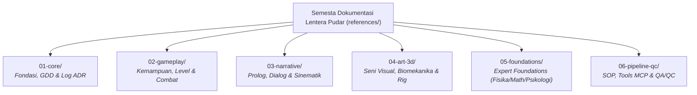

# Master Index — Lentera Pudar Master Reference
### Peta Lengkap Navigasi Dokumentasi Pra-Produksi, Arsitektur Tata Kelola & Rantai Rujukan 6-Domain Modular

> **Dokumen Indeks Master (*Master Documentation & Governance Hub*)**  
> Menjadi titik masuk pertama bagi AI Asisten Teknis, Supervisor, dan seluruh Sub-Agent untuk menavigasi semesta dokumentasi **Lentera Pudar** — 3D Action RPG (Unreal Engine 5 + Blender 5.2 LTS) secara terstruktur, memahami pembagian otoritas domain (*Scope-Based Authority*), dan mematuhi tata kelola kebenaran data kanonikal.

---

## BAB I: ARSITEKTUR TATA KELOLA DOKUMENTASI & OTORITAS SUMBER KEBENARAN

### 1.1 Prinsip Otoritas Berbasis Lingkup (*Scope-Based Authority*)
- **Tidak Ada Hierarki Dokumen Universal**: Otoritas dokumen tidak bersifat linier satu arah (misal: tidak ada asumsi bahwa ADR otomatis menimpa seluruh dokumen lain). Otoritas ditentukan oleh **domain fungsional, tujuan dokumen, dan lingkup penentu yang dideklarasikan secara resmi (*declared scope*)**.
- **Otoritas Keputusan ADR**: Architecture Decision Records (ADR) di [design-decisions.md](file:///d:/GodotProjects/Lentera-Pudar/references/01-core/design-decisions.md) memegang otoritas keputusan arsitektur HANYA jika:
  1. ADR berstatus `ACCEPTED`;
  2. ADR secara eksplisit mengatur domain, nilai, atau keputusan teknis yang bersangkutan;
  3. ADR secara eksplisit menyatakan suksesi atau perubahan atas keputusan sebelumnya.
  *Jika suatu ADR tidak mengatur domain spesifik secara tegas, dokumen otoritas kanonikal untuk domain tersebut tetap berlaku penuh.*

### 1.2 Pemilik Kanonikal Domain (*Canonical Domain Authorities*)

| Domain Fungsional | Dokumen Pemilik Kanonikal (*Canonical Authority*) | Tipe Otoritas | Lingkup Penentu Otoritatif (*Declared Scope*) |
|---|---|---|---|
| **Project Identity & Scope** | [game-design-document.md](file:///d:/GodotProjects/Lentera-Pudar/references/01-core/game-design-document.md) | DESIGN AUTHORITY | Judul resmi, genre 3D Action RPG, target platform PC/Deck, arsitektur dual-layer Kena/Hellblade. |
| **Arsitektur & Keputusan Sistem** | [design-decisions.md](file:///d:/GodotProjects/Lentera-Pudar/references/01-core/design-decisions.md) | ADR DECISION SSoT | Keputusan arsitektur engine, pivot teknologi, standarisasi API, invarian desain. |
| **Arah Kreatif & Diksi Emosi** | [creative-vision.md](file:///d:/GodotProjects/Lentera-Pudar/references/01-core/creative-vision.md) | CREATIVE AUTHORITY | Filosofi seni melankolis-hangat The Triad, resonansi duka Kaelen/Aina, diksi dialog. |
| **Konstanta Numerik & Parameter Visual**| [style-guide.md](file:///d:/GodotProjects/Lentera-Pudar/references/04-art-3d/style-guide.md) | NUMERICAL SSoT | Hex sRGB The Triad, Kelvin, poly budget, timing detik/ms, koefisien kain. |
| **Progresi Kemampuan Karakter** | [sector-ability-progression.md](file:///d:/GodotProjects/Lentera-Pudar/references/02-gameplay/sector-ability-progression.md) | DESIGN SPEC (GAS) | 5 Kemampuan naratif GRIS, frame data Finisher, kelas GAS, Altar Duka. |
| **Biometrik & Kinesiologi 3D** | [anatomy-kinesiology.md](file:///d:/GodotProjects/Lentera-Pudar/references/04-art-3d/anatomy-kinesiology.md) | BIOMECHANICAL SPEC | Bony landmarks, Tri-Layer Shingling, siklus 8-gait, limit rotasi sendi. |
| **Wajah Manusia & FACS** | [human-facial-expressions.md](file:///d:/GodotProjects/Lentera-Pudar/references/04-art-3d/human-facial-expressions.md) | TECHNICAL SPEC (FACS) | Action Units (AU1..AU43), Duchenne marker, asimetri mikro, eye gaze dynamics. |
| **Level & Environmental Storytelling** | [level-design-storytelling.md](file:///d:/GodotProjects/Lentera-Pudar/references/02-gameplay/level-design-storytelling.md) | DESIGN SPEC (SPATIAL) | Karakteristik spasial 5 sektor, breadcrumbing diegetik, alur vertikal S4. |
| **Desain Musuh & Balancing Kombat** | [enemy-design-balancing.md](file:///d:/GodotProjects/Lentera-Pudar/references/02-gameplay/enemy-design-balancing.md) | DESIGN SPEC (COMBAT) | 5 Arketipe duka, windup telegraf 12–18f, fun guardrails, pacing encounter. |
| **Sinematografi & Kamera** | [cinematics-cutscenes.md](file:///d:/GodotProjects/Lentera-Pudar/references/03-narrative/cinematics-cutscenes.md) | CINEMATOGRAPHY SPEC | Bahasa kamera 5 sektor, transisi seamless, cakupan 3-shot, DoF. |
| **Naskah Dialog & Arahan Vokal** | [vocal-direction-dialogue.md](file:///d:/GodotProjects/Lentera-Pudar/references/03-narrative/vocal-direction-dialogue.md) | VOCAL SPEC | Subteks vokal 5 sektor duka, format lembar VA, non-verbal sync. |
| **UI/UX & Aksesibilitas** | [ui-ux-accessibility.md](file:///d:/GodotProjects/Lentera-Pudar/references/02-gameplay/ui-ux-accessibility.md) | DESIGN SPEC (UI/UX) | Minimal HUD diegetik, opsi aksesibilitas 3 jalur, lokalisasi buffer. |
| **Fondasi Ilmiah (*Canonical Authority Set*)** | [physics.md](file:///d:/GodotProjects/Lentera-Pudar/references/05-foundations/physics.md) (`foundations.physics`)<br>[mathematics.md](file:///d:/GodotProjects/Lentera-Pudar/references/05-foundations/mathematics.md) (`foundations.mathematics`)<br>[psychology.md](file:///d:/GodotProjects/Lentera-Pudar/references/05-foundations/psychology.md) (`foundations.psychology`)<br>[art-creativity.md](file:///d:/GodotProjects/Lentera-Pudar/references/05-foundations/art-creativity.md) (`foundations.art_creativity`) | SCIENTIFIC SSoT SET | SLERP 4D, XPBD solver, Voronoi fracture, Loss Aversion 2.5x, SDT 3-needs. |
| **Prosedur Kerja Operasional** | [sop-workflow.md](file:///d:/GodotProjects/Lentera-Pudar/references/06-pipeline-qc/sop-workflow.md) | PROCEDURE SSoT | 7 SOP sekuensial (Prop, Mat, Rig, Cloth, Level, GAS, Audio). |
| **Kontrol Kualitas Komersial** | [qa-qc-framework.md](file:///d:/GodotProjects/Lentera-Pudar/references/06-pipeline-qc/qa-qc-framework.md) | QC SSoT | 6 Pilar DoD (A s.d. F), 8-Stage Gate, triase bug, adversarial QC. |
| **Perilaku AI & Metodologi Kerja** | [ai-agent-methodology.md](file:///d:/GodotProjects/Lentera-Pudar/references/06-pipeline-qc/ai-agent-methodology.md) | POLICY SSoT | Anti-roleplay, grounding 3-sumber, inspect-before-execute, ITS protocol. |

### 1.3 Taksonomi Tipe Dokumen (*Document-Type Taxonomy*)
- **`POLICY`**: Menetapkan aturan operasional dan batas perilaku AI (misal: [ai-agent-methodology.md](file:///d:/GodotProjects/Lentera-Pudar/references/06-pipeline-qc/ai-agent-methodology.md)). Mengikat penuh seluruh agen.
- **`PROJECT KNOWLEDGE`**: Konteks dunia, tema duka, latar belakang naratif, dan teori pendukung (misal: [creative-vision.md](file:///d:/GodotProjects/Lentera-Pudar/references/01-core/creative-vision.md), [theory-reference.md](file:///d:/GodotProjects/Lentera-Pudar/references/01-core/theory-reference.md)).
- **`DESIGN SPEC`**: Spesifikasi mekanik, progresi naratif, ruang level, dan sistem kombat (misal: [game-design-document.md](file:///d:/GodotProjects/Lentera-Pudar/references/01-core/game-design-document.md), [sector-ability-progression.md](file:///d:/GodotProjects/Lentera-Pudar/references/02-gameplay/sector-ability-progression.md)).
- **`TECHNICAL SPEC`**: Parameter angka baku, konstanta PBR, formula, dan rigging (misal: [style-guide.md](file:///d:/GodotProjects/Lentera-Pudar/references/04-art-3d/style-guide.md), [anatomy-kinesiology.md](file:///d:/GodotProjects/Lentera-Pudar/references/04-art-3d/anatomy-kinesiology.md)).
- **`ADR / DECISION LOG`**: Rekam jejak keputusan arsitektur struktural mengikat ([design-decisions.md](file:///d:/GodotProjects/Lentera-Pudar/references/01-core/design-decisions.md)).
- **`PROCEDURE / SOP`**: Panduan alur kerja deterministik langkah-demi-langkah ([sop-workflow.md](file:///d:/GodotProjects/Lentera-Pudar/references/06-pipeline-qc/sop-workflow.md)).
- **`VERIFICATION / QC`**: Kriteria pengujian mutu, checklist DoD, dan standar gate ([qa-qc-framework.md](file:///d:/GodotProjects/Lentera-Pudar/references/06-pipeline-qc/qa-qc-framework.md)).
- **`TOOL CONTRACT`**: Spesifikasi antarmuka API, parameter, dan skema MCP ([tools-mcp-stack.md](file:///d:/GodotProjects/Lentera-Pudar/references/06-pipeline-qc/tools-mcp-stack.md), [api-cheat-sheet.md](file:///d:/GodotProjects/Lentera-Pudar/references/06-pipeline-qc/api-cheat-sheet.md)).
- **`CALIBRATION`**: Panduan kalibrasi mutu Few-Shot dan evaluasi mandiri ([few-shot-calibration.md](file:///d:/GodotProjects/Lentera-Pudar/references/06-pipeline-qc/few-shot-calibration.md)).
- **`REFERENCE`**: Material referensi pendukung, benchmark, dan panduan kurasi visual ([kena-art-research.md](file:///d:/GodotProjects/Lentera-Pudar/references/04-art-3d/kena-art-research.md), [reference-board-guide.md](file:///d:/GodotProjects/Lentera-Pudar/references/04-art-3d/reference-board-guide.md)).
- **`SKILL`**: Panduan alur kerja prosedural on-demand di `.agents/skills/*/SKILL.md`.

#### Skema Metadata Frontmatter (*Lightweight Metadata Schema*)
Setiap dokumen referensi memuat blok metadata frontmatter YAML di baris awal.

**Field Wajib Dasar (*Baseline Required Fields*)**:
```yaml
---
status: ACTIVE | DRAFT | DEPRECATED
type: POLICY | PROJECT_KNOWLEDGE | DESIGN_SPEC | TECHNICAL_SPEC | ADR_DECISION_LOG | PROCEDURE | VERIFICATION_QC | TOOL_CONTRACT | REFERENCE | CALIBRATION
authority_scope: <domain.subdomain>
canonical: true | false
---
```

**Field Opsional Berbasis Bukti (*Optional Evidence-Backed Fields*)**:
- `authority_set`: Kelompok otoritas kolektif (misal: `foundations.scientific`).
- `introduced_by`: Nomor ADR yang secara langsung memperkenalkan/menetapkan dokumen atau konsep domain (misal: `ADR-034`).
- `governed_by`: Nomor ADR yang secara aktif mengatur dokumen/domain secara menyeluruh (misal: `ADR-013`).
- `supersedes`: Dokumen atau keputusan yang digantikan.
- `superseded_by`: Dokumen atau keputusan pengganti.

> **Aturan Provenansi**: *Field provenansi opsional WAJIB dihilangkan jika bukti fisik di repositori tidak mencukupi atau bersifat ambigu. Metadata yang ringkas dan akurat jauh lebih diutamakan daripada metadata lengkap yang menyesatkan.*

### 1.4 Model Status Dokumen & Keputusan (*Status Semantics*)
Status dokumen terbagi ke dalam dua dimensi independen:
1. **Status Keputusan / Lifecycle** (berlaku untuk ADR & keputusan desain):
   - `PROPOSED`: Usulan baru, belum disahkan dan belum mengikat.
   - `ACCEPTED`: Keputusan disahkan resmi sebagai rujukan aktif dalam lingkup deklarasinya.
   - `SUPERSEDED`: Keputusan lama telah digantikan oleh ADR baru; beralih fungsi menjadi rekam jejak sejarah murni.
   - `REJECTED`: Usulan ditolak setelah evaluasi; dilarang diterapkan.
   - `ARCHIVED`: Rekam jejak era lama disimpan permanen untuk tujuan audit sejarah.
2. **Status Operasional Dokumen** (berlaku untuk spesifikasi, SOP, dan skill):
   - `ACTIVE`: Dokumen berlaku sah dan menjadi acuan operasional aktif saat ini.
   - `DRAFT`: Dokumen dalam proses penyusunan/revisi; belum divalidasi penuh.
   - `DEPRECATED`: Dokumen menandai sistem yang dalam proses transisi menuju penghapusan.

> **Penegasan Status**: *Status bukan tingkatan otoritas. Otoritas ditentukan oleh lingkup domain dan peran dokumen. Materi berstatus `SUPERSEDED` atau `ARCHIVED` adalah catatan sejarah dan DILARANG dijadikan pedoman implementasi aktif.*

### 1.5 Arsitektur Kapabilitas 5-Dimensi (*Capability-State Semantics*)
Untuk mencegah halusinasi kemampuan perkakas AI, proyek membedakan 5 dimensi kapabilitas:
1. **Technology Adoption**: Status adopsi teknologi oleh proyek (`ACTIVE`, `PLANNED`, `EXPERIMENTAL`, `DEPRECATED`, `ARCHIVED`, `UNKNOWN`).
2. **Server Availability**: Ketersediaan proses server transport di lingkungan runtime (`AVAILABLE`, `PARTIAL`, `UNAVAILABLE`, `PLANNED`, `UNKNOWN`).
3. **Tool Registration**: Status deklarasi antarmuka/skema tool di registry (`REGISTERED`, `NOT_REGISTERED`, `UNKNOWN`).
4. **Handler Implementation**: Status kode logika eksekusi nyata di backend (`IMPLEMENTED`, `PARTIAL`, `STUB`, `NOT_IMPLEMENTED`, `UNKNOWN`).
5. **Effective Capability**: Kapabilitas fungsional efektif nyata yang dapat digunakan agen (`AVAILABLE`, `PARTIAL`, `UNAVAILABLE`, `UNKNOWN`).

> **Prinsip Kunci Kapabilitas**:  
> $\text{Tool Registration} \neq \text{Implementation} \neq \text{Server Availability} \neq \text{Execution} \neq \text{Verification}$

### 1.6 Tingkatan Kebenaran Kapabilitas (*Capability Truth Semantics*)
$$\text{DOCUMENTED} \longrightarrow \text{IMPLEMENTED} \longrightarrow \text{AVAILABLE} \longrightarrow \text{EXECUTED} \longrightarrow \text{VERIFIED}$$
- Respons tool berupa payload `{status: "ok"}` dari stub mock HANYA berstatus `EXECUTED` dan **DILARANG KERAS** diklaim sebagai mutasi selesai.
- Klaim bahwa suatu tugas selesai (*completed*) HANYA sah jika berstatus **`VERIFIED`** berdasarkan kriteria keberterimaan tugas (*task acceptance criteria*).

### 1.7 Resolusi Konflik Otoritas (*Conflict-Resolution Semantics*)
Jika terdeteksi pertentangan data antara dua dokumen:
1. Identifikasi domain dan lingkup masalah yang dipersengketakan.
2. Kumpulkan kandidat sumber otoritatif terkait.
3. Periksa status keputusan (hanya evaluasi sumber `ACCEPTED` / `ACTIVE`).
4. Periksa apakah terdapat ADR `ACCEPTED` yang secara eksplisit mengatur keputusan/perubahan nilai tersebut.
5. Jika ada ADR eksplisit terkait, terapkan keputusan ADR tersebut.
6. Jika tidak ada ADR eksplisit, gunakan Dokumen Otoritas Kanonikal (*Canonical Owner*) untuk domain tersebut.
7. Terapkan aturan spesifisitas (*Specific Overrides Generic*) murni di dalam lingkup domain terkait.
8. Jika konflik tetap tidak terselesaikan $\rightarrow$ tandai status **`[CONFLICT]`**, sajikan kutipan bukti dari kedua sumber, dan minta resolusi manusia. Pembuatan atau pembaruan ADR dilakukan HANYA jika resolusi tersebut merepresentasikan keputusan arsitektur atau desain yang memerlukan pencatatan rekam jejak resmi (bukan untuk koreksi typo, sinkronisasi dokumentasi, atau perbaikan editorial non-arsitektural).

### 1.8 Panduan Pengambilan Konteks Dinamis (*Dynamic Reference-Routing Guidance*)
- **Prinsip Utama**: **Global Minimum Context + Relevant On-Demand Knowledge**.
- Tabel navigasi referensi berfungsi sebagai **panduan pencarian dinamis (*routing hints*)**, BUKAN paket muatan statis wajib yang harus dimuat seluruhnya.
- **Alur 5-Langkah Pengambilan Konteks**:
  1. Identifikasi domain tugas (misal: Kombat, Rigging, Level Design).
  2. Pilih dokumen otoritas kanonikal primer.
  3. Periksa dan muat bagian yang relevan dari dokumen primer.
  4. Muat dokumen referensi sekunder HANYA jika terdapat dependensi spesifik yang diperlukan.
  5. Hindari memuat dokumen yang tidak relevan demi efisiensi context window.

### 1.9 Tata Kelola Materi Historis (*Legacy Governance Guidance*)
- Keputusan historis era 2D Godot/PixelLab ([ADR-001](file:///d:/GodotProjects/Lentera-Pudar/references/01-core/design-decisions.md#L9), [ADR-002](file:///d:/GodotProjects/Lentera-Pudar/references/01-core/design-decisions.md#L16), [ADR-003](file:///d:/GodotProjects/Lentera-Pudar/references/01-core/design-decisions.md#L23), [ADR-008](file:///d:/GodotProjects/Lentera-Pudar/references/01-core/design-decisions.md#L67)) tetap dilestarikan di dalam log ADR dengan penandaan eksplisit `SUPERSEDED by ADR-013`.
- Dokumen atau ADR berstatus `SUPERSEDED` atau `ARCHIVED` adalah catatan sejarah yang sah, namun **DILARANG** dijadikan pedoman implementasi teknis saat ini.
- Penyesuaian metadata legacy pada repositori MCP dijadwalkan pada fase terpisah (*Phase G — MCP Tooling Contract & Hardening*).

### 1.10 Prinsip Kepemilikan Data Kanonikal Tunggal (*Canonical-Ownership Guidance*)
- Setiap konstanta numerik, parameter visual, dan data spesifikasi penting wajib memiliki **Satu Dokumen Pemilik Kanonikal Tunggal** (contoh: Hex The Triad di [style-guide.md](file:///d:/GodotProjects/Lentera-Pudar/references/04-art-3d/style-guide.md) Bab 1.A, Proporsi Hero di [anatomy-kinesiology.md](file:///d:/GodotProjects/Lentera-Pudar/references/04-art-3d/anatomy-kinesiology.md) Bab 1).
- Dokumen lain diperbolehkan merujuk via tautan markdown, namun dilarang menyalin nilai angka mentah secara berlebihan.
- Nilai turunan (*derived values*, misal: frame @60fps turunan dari detik) dapat dicantumkan di mana konteks membutuhkannya, dengan tetap mempertahankan rujukan ke pemilik kanonikalnya.

### 1.11 Panduan Provenansi Data & Keputusan (*Provenance Guidance*)
Keputusan arsitektur penting dan konstanta kanonikal utama harus memiliki jejak provenansi yang terlacak:
- **Canonical Owner**: Dokumen SSoT pemilik sah.
- **Introducing ADR**: Nomor ADR pembuat asal.
- **Decision Status**: Status keputusan saat ini (`ACCEPTED` / `SUPERSEDED`).
- **Superseding ADR**: Nomor ADR pengganti (jika ada).
- **Governing Document**: Dokumen yang mengatur penerapan operasional.
- **Last Confirmed**: Tanggal verifikasi konsistensi terakhir (hanya jika data bukti tersedia).

---

## BAB II: PETA NAVIGASI 6-DOMAIN MODULAR



---

## 1. Domain 01: Core & Decision Records (`references/01-core/`)

| Dokumen Master | Isi & Fokus Utama | Kapan Harus Dirujuk |
|---|---|---|
| [master-index.md](file:///d:/GodotProjects/Lentera-Pudar/references/01-core/master-index.md) | Indeks Master Peta Navigasi 32 Dokumen Pra-Produksi & Tata Kelola Otoritas | Pintu masuk awal navigasi seluruh semesta dokumentasi proyek dan tata kelola SSoT. |
| [game-design-document.md](file:///d:/GodotProjects/Lentera-Pudar/references/01-core/game-design-document.md) | Master GDD 9 Bab: Kena/Hellblade Dual-Layer, Sektor Duka, Altar Duka, The Fading Scarf, Respawn Diegetik | Menentukan arah visual, sistem combat, sistem respawn, atau mekanik dasar fitur baru. |
| [design-decisions.md](file:///d:/GodotProjects/Lentera-Pudar/references/01-core/design-decisions.md) | Log Keputusan Arsitektur Resmi (**ADR-001 s.d. ADR-041**) | Meninjau alasan historis dan keputusan teknis/desain yang telah dikunci. |
| [creative-vision.md](file:///d:/GodotProjects/Lentera-Pudar/references/01-core/creative-vision.md) | Master Visi Kreatif: Filosofi The Triad (2700K vs 6500K), resonansi puitis Kaelen & Aina, diksi dialog, semiotika visual | Menulis dialog, menyusun sinematografi, atau memvalidasi suasana emosional. |
| [theory-reference.md](file:///d:/GodotProjects/Lentera-Pudar/references/01-core/theory-reference.md) | Master Theory Bible 19 Bab: Game design, kinesiologi, shader PBR, fisika XPBD, matematika SLERP/spline, psikologi SDT | Titik rujuk teori umum sebelum masuk ke dokumen expert domain spesifik. |

---

## 2. Domain 02: Gameplay, Level & Combat (`references/02-gameplay/`)

| Dokumen Master | Isi & Fokus Utama | Kapan Harus Dirujuk |
|---|---|---|
| [sector-ability-progression.md](file:///d:/GodotProjects/Lentera-Pudar/references/02-gameplay/sector-ability-progression.md) | Progresi Kemampuan Kaelen (Model GRIS), Pengorbanan Syal Altar Duka, Utilitas Kumulatif & GA_ShatterStrike | Mengintegrasikan GameplayAbility GAS, merancang rintangan level, dan puzzle sektor. |
| [level-design-storytelling.md](file:///d:/GodotProjects/Lentera-Pudar/references/02-gameplay/level-design-storytelling.md) | Tata Ruang Spasial 5 Sektor Duka, Breadcrumbing Diegetik, Pacing S4, Apathy Statues Hazard Loop | Desain level grey-box (SOP 5), penataan koridor dungeon, penempatan prop naratif. |
| [enemy-design-balancing.md](file:///d:/GodotProjects/Lentera-Pudar/references/02-gameplay/enemy-design-balancing.md) | Arketipe Musuh Duka (The Echo, Berserker, Deceiver, Weight, Mirror), Telegraphing, Fun Guardrails | Merancang perilaku AI musuh, balancing encounter kombat, dan timing tell. |
| [ambient-world-life.md](file:///d:/GodotProjects/Lentera-Pudar/references/02-gameplay/ambient-world-life.md) | Perilaku NPC Latar, Ekosistem Satwa Spasial, Local World Awareness, Karakter Sampingan | Menempatkan NPC latar, merancang perilaku satwa ambient, dan persistensi jejak dunia. |
| [ui-ux-accessibility.md](file:///d:/GodotProjects/Lentera-Pudar/references/02-gameplay/ui-ux-accessibility.md) | Spesifikasi Minimal-Diegetic HUD, Fitur Aksesibilitas Empatik, Colorblind/Hearing, Lokalisasi | Mendesain antarmuka grafis/diegetik, menu pause/settings, dan fitur aksesibilitas. |

---

## 3. Domain 03: Narrative, Script & Cinematics (`references/03-narrative/`)

| Dokumen Master | Isi & Fokus Utama | Kapan Harus Dirujuk |
|---|---|---|
| [prologue-tutorial-script.md](file:///d:/GodotProjects/Lentera-Pudar/references/03-narrative/prologue-tutorial-script.md) | Skenario & Naskah Step-by-Step Tutorial Prolog Onboarding, Diegetic Fail-Safe, Contextual Glyphs | Menyusun urutan perkenalan kontrol awal, grey-box prolog, dan pacing onboarding. |
| [vocal-direction-dialogue.md](file:///d:/GodotProjects/Lentera-Pudar/references/03-narrative/vocal-direction-dialogue.md) | Arahan Vokal Subteks, Karakteristik Intonasi 5 Sektor Duka, Sinkronisasi FACS AU, Non-Verbal Voice | Mengarahkan voice acting, menyusun lembar dialog naratif, dan sinkronisasi bibir/suara. |
| [cinematics-cutscenes.md](file:///d:/GodotProjects/Lentera-Pudar/references/03-narrative/cinematics-cutscenes.md) | Bahasa Kamera Duka, Pacing Cutscene, Sinkronisasi FACS AU, Transisi Seamless, Emotional Depth of Field | Merancang sinematografi in-game, shot planning cutscene, dan transisi kamera. |

---

## 4. Domain 04: Visual Art, 3D & Biomechanics (`references/04-art-3d/`)

| Dokumen Master | Isi & Fokus Utama | Kapan Harus Dirujuk |
|---|---|---|
| [style-guide.md](file:///d:/GodotProjects/Lentera-Pudar/references/04-art-3d/style-guide.md) | Master Style Guide Numerik: Hex warna The Triad, poly budget, texel density, Chaos Cloth solver, Lumen stakes | Mengambil parameter angka pasti dan baku lintas-sistem. |
| [anatomy-kinesiology.md](file:///d:/GodotProjects/Lentera-Pudar/references/04-art-3d/anatomy-kinesiology.md) | Proporsi 1:6.8, Tri-Layer Biomechanical Shingling Lengan Es, Kinetic Chain Combat, 8-Fase Lokomosi | Sculpting mesh, weight painting, rigging armature, atau animasi kombat. |
| [human-facial-expressions.md](file:///d:/GodotProjects/Lentera-Pudar/references/04-art-3d/human-facial-expressions.md) | Anatomi Otot Wajah, FACS Action Units, Duchenne Marker, Asimetri, Eye Gaze Dynamics | Rigging blend shape wajah, animasi ekspresi mikro, ekspresi 5 sektor duka. |
| [kena-art-research.md](file:///d:/GodotProjects/Lentera-Pudar/references/04-art-3d/kena-art-research.md) | Riset 3D Art Kena: Bridge of Spirits (Ember Lab), Hybrid Hair, Dynamic Environmental Thawing, Wind System | Memahami dan mereplikasi pipeline visual Stylized PBR non-outline. |
| [reference-board-guide.md](file:///d:/GodotProjects/Lentera-Pudar/references/04-art-3d/reference-board-guide.md) | 9 Kategori Shot-List Legal PureRef/Figma dari Kena dan Hellblade | Menyusun atau mengevaluasi papan referensi visual terkurasi. |
| [3d-asset-pipeline.md](file:///d:/GodotProjects/Lentera-Pudar/references/04-art-3d/3d-asset-pipeline.md) | Teori Topologi Edge Flow, UV Seam, PBR Shading, Rigging Deformasi, LOD Siluet, Tangent Normal Baking Cage | Kerja teknis pemodelan, unwrapping, baking, dan rigging 3D. |
| [environment-modular-techniques.md](file:///d:/GodotProjects/Lentera-Pudar/references/04-art-3d/environment-modular-techniques.md) | Trim Sheets, Texel Density ($512/256\text{ px/m}$), Modular Kit-Bashing ($300\text{ cm}$), Normal Baking, Post-Process LUTs | Menerapkan teknik produksi lingkungan dan optimalisasi memori. |

---

## 5. Domain 05: Scientific & Expert Bible Foundations (`references/05-foundations/`)

| Dokumen Master | Isi & Fokus Utama | Kapan Harus Dirujuk |
|---|---|---|
| [physics.md](file:///d:/GodotProjects/Lentera-Pudar/references/05-foundations/physics.md) | Solver Sequential Impulse, XPBD Cloth, Lattice-Biased Voronoi, Cook-Torrance GGX, FABRIK IK, trade-off 60 FPS | Menyetel parameter solver fisika secara presisi di UE5 Chaos / Blender. |
| [mathematics.md](file:///d:/GodotProjects/Lentera-Pudar/references/05-foundations/mathematics.md) | Vektor, Quaternion SLERP/NLERP, Cubic Bezier emosi, Arc-Length Spline C2, SDF 1-Lipschitz, fBm noise | Implementasi teknis matematis kamera, spline level, atau noise prosedural. |
| [psychology.md](file:///d:/GodotProjects/Lentera-Pudar/references/05-foundations/psychology.md) | SDT 3-Needs, motivasi crowding-out, Loss Aversion 2.5x, Emotional Bandwidth Pacing, Non-Linear Grief Echoes | Mendesain pacing reward, jeda kontemplatif, atau diegetic HUD. |
| [art-creativity.md](file:///d:/GodotProjects/Lentera-Pudar/references/05-foundations/art-creativity.md) | Uji Nilai Grayscale Value-First, Dominasi Warna 60-30-10, Triad Kritik Seni (Unity, Tension, Resolution), Semiotika | Mengevaluasi kekuatan artistik dan komposisi visual sebelum finalisasi. |

---

## 6. Domain 06: Pipeline, Automation, QA/QC & Operations (`references/06-pipeline-qc/`)

| Dokumen Master | Isi & Fokus Utama | Kapan Harus Dirujuk |
|---|---|---|
| [sop-workflow.md](file:///d:/GodotProjects/Lentera-Pudar/references/06-pipeline-qc/sop-workflow.md) | 7 SOP Prosedural: Prop, Material, Rigging, Cloth, Level Grey-Box, Gameplay GAS, Audio | Mengerjakan tugas produksi operasional berulang secara konsisten. |
| [tools-mcp-stack.md](file:///d:/GodotProjects/Lentera-Pudar/references/06-pipeline-qc/tools-mcp-stack.md) | Rantai Tools Terkini: Blender MCP (23 Public Tools, HEADLESS_FILE_BACKED), UE5 Python MCP, Epic Pipeline Plugin, ZBrush, PCG | Setup environment produksi atau integrasi software baru. |
| [api-cheat-sheet.md](file:///d:/GodotProjects/Lentera-Pudar/references/06-pipeline-qc/api-cheat-sheet.md) | Referensi sintaks stabil modul `bpy` dan `unreal` Python dengan protokol *Inspect-Before-Execute* | Menjalankan otomasi skrip di Blender 5.2 LTS atau Unreal Engine 5. |
| [qa-qc-framework.md](file:///d:/GodotProjects/Lentera-Pudar/references/06-pipeline-qc/qa-qc-framework.md) | 6 Pilar Definition of Done (DoD), Stage-Gate 0 s.d. 7, 4-Tier Bug Classification, dan Gatekeeper Mandate | Melakukan pengujian kualitas sebelum menyatakan tugas selesai. |
| [qc-patterns.md](file:///d:/GodotProjects/Lentera-Pudar/references/06-pipeline-qc/qc-patterns.md) | Knowledge base pola anomali visual 3D, rigging, audio, dan tindakan korektif | Menangani bug atau anomali spesifik saat inspeksi QC. |
| [few-shot-calibration.md](file:///d:/GodotProjects/Lentera-Pudar/references/06-pipeline-qc/few-shot-calibration.md) | 7 Contoh Benchmark Benar vs Salah (Few-Shot Calibration) | Melakukan evaluasi mandiri (*self-critique*) sebelum melapor ke user. |
| [emotional-playtesting.md](file:///d:/GodotProjects/Lentera-Pudar/references/06-pipeline-qc/emotional-playtesting.md) | Validasi Emosional, Intended vs Perceived Framework, Observasi Non-Intrusif, Uji Retensi Memori | Memvalidasi apakah resonansi duka tersampaikan ke pemain manusia. |
| [ai-agent-methodology.md](file:///d:/GodotProjects/Lentera-Pudar/references/06-pipeline-qc/ai-agent-methodology.md) | Mode kerja Anti-Roleplay (alat produksi), Grounding 3-Sumber, Problem Decomposition, Self-Verification, Isolasi Debugging | Prinsip dasar cara berpikir dan bekerja AI agent di seluruh proyek. |

---

## 7. Urutan Baca yang Wajib Diikuti AI Agent Baru

1. [ai-agent-methodology.md](file:///d:/GodotProjects/Lentera-Pudar/references/06-pipeline-qc/ai-agent-methodology.md) — Fondasi cara berpikir, grounding anti-halusinasi, dan etika kerja alat produksi.
2. [game-design-document.md](file:///d:/GodotProjects/Lentera-Pudar/references/01-core/game-design-document.md) + [creative-vision.md](file:///d:/GodotProjects/Lentera-Pudar/references/01-core/creative-vision.md) — Pemahaman semesta, duka Kaelen-Aina, dan hukum suhu The Triad.
3. [style-guide.md](file:///d:/GodotProjects/Lentera-Pudar/references/04-art-3d/style-guide.md) — Pengetahuan angka parameter pasti lintas-sistem.
4. **Dokumen Expert Sesuai Domain**:
   - 3D/Rigging/Shader: [3d-asset-pipeline.md](file:///d:/GodotProjects/Lentera-Pudar/references/04-art-3d/3d-asset-pipeline.md), [anatomy-kinesiology.md](file:///d:/GodotProjects/Lentera-Pudar/references/04-art-3d/anatomy-kinesiology.md), [physics.md](file:///d:/GodotProjects/Lentera-Pudar/references/05-foundations/physics.md).
   - Estetika & Sinematik: [art-creativity.md](file:///d:/GodotProjects/Lentera-Pudar/references/05-foundations/art-creativity.md), [reference-board-guide.md](file:///d:/GodotProjects/Lentera-Pudar/references/04-art-3d/reference-board-guide.md).
   - Matematika & Kamera: [mathematics.md](file:///d:/GodotProjects/Lentera-Pudar/references/05-foundations/mathematics.md).
   - Narasi & Pacing: [psychology.md](file:///d:/GodotProjects/Lentera-Pudar/references/05-foundations/psychology.md).
5. [sop-workflow.md](file:///d:/GodotProjects/Lentera-Pudar/references/06-pipeline-qc/sop-workflow.md) + [few-shot-calibration.md](file:///d:/GodotProjects/Lentera-Pudar/references/06-pipeline-qc/few-shot-calibration.md) — Eksekusi sekuensial dan evaluasi mandiri.
6. [qa-qc-framework.md](file:///d:/GodotProjects/Lentera-Pudar/references/06-pipeline-qc/qa-qc-framework.md) — Verifikasi 6-DoD dan penyerahan bukti fisik konkret (*artifact-driven*).
