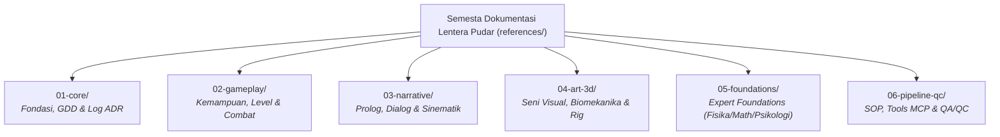

# Master Index — Lentera Pudar Master Reference
### Peta Lengkap Navigasi Dokumentasi Pra-Produksi & Rantai Rujukan 6-Domain Modular

> **Dokumen Indeks Master (*Master Documentation Hub*)**  
> Menjadi titik masuk pertama bagi AI Asisten Teknis, Supervisor, dan seluruh Sub-Agent untuk menavigasi 32 dokumen pra-produksi **Lentera Pudar** — 3D Action RPG (Unreal Engine 5 + Blender 5.2 LTS) secara terstruktur, cepat, dan terorganisir per domain.

---

---

## 1. Domain 01: Core & Decision Records (`references/01-core/`)

| Dokumen Master | Isi & Fokus Utama | Kapan Harus Dirujuk |
|---|---|---|
| [master-index.md](file:///d:/GodotProjects/Lentera-Pudar/references/01-core/master-index.md) | Indeks Master Peta Navigasi 32 Dokumen Pra-Produksi | Pintu masuk awal navigasi seluruh semesta dokumentasi proyek. |
| [game-design-document.md](file:///d:/GodotProjects/Lentera-Pudar/references/01-core/game-design-document.md) | Master GDD 9 Bab: Kena/Hellblade Dual-Layer, Sektor Duka, Altar Duka, The Fading Scarf, Respawn Diegetik | Menentukan arah visual, sistem combat, sistem respawn, atau mekanik dasar fitur baru. |
| [design-decisions.md](file:///d:/GodotProjects/Lentera-Pudar/references/01-core/design-decisions.md) | Log Keputusan Arsitektur Resmi (**ADR-001 s.d. ADR-041**) | Meninjau alasan historis dan keputusan teknis/desain yang telah dikunci. |
| [creative-vision.md](file:///d:/GodotProjects/Lentera-Pudar/references/01-core/creative-vision.md) | Master Visi Kreatif: Filosofi The Triad (2700K vs 6500K), resonansi puitis Kaelen & Aina, diksi dialog, semiotika visual | Menulis dialog, menyusun sinematografi, atau memvalidasi suasana emosional. |
| [theory-reference.md](file:///d:/GodotProjects/Lentera-Pudar/references/01-core/theory-reference.md) | Master Theory Bible 19 Bab: Game design, kinesiologi, shader PBR, fisika XPBD, matematika SLERP/spline, psikologi SDT | Titik rujuk teori umum sebelum masuk ke dokumen expert domain spesifik. |

---

## 2. Domain 02: Gameplay, Level & Combat (`references/02-gameplay/`)

| Dokumen Master | Isi & Fokus Utama | Kapan Harus Dirujuk |
|---|---|---|
| [sector-ability-progression.md](file:///d:/GodotProjects/Lentera-Pudar/references/02-gameplay/sector-ability-progression.md) | Progresi Kemampuan Kaelen (Model GRIS), Pengorbanan Syal Altar Duka, Utilitas Kumulatif & GA_ShatterStrike | Mengintegrasikan GameplayAbility GAS, merancang rintangan level, dan puzzle sektor. |
| [level-design-storytelling.md](file:///d:/GodotProjects/Lentera-Pudar/references/02-gameplay/level-design-storytelling.md) | Tata Ruang Spasial 5 Sektor Duka, Breadcrumbing Diegetik, Pacing S4, Apathy Statues Hazard Loop | Desain level grey-box (SOP 5), penataan koridor dungeon, penempatan prop naratif. |
| [enemy-design-balancing.md](file:///d:/GodotProjects/Lentera-Pudar/references/02-gameplay/enemy-design-balancing.md) | Arketipe Musuh Duka (The Echo, Berserker, Deceiver, Weight, Mirror), Telegraphing, Fun Guardrails | Merancang perilaku AI musuh, balancing encounter kombat, dan timing tell. |
| [ambient-world-life.md](file:///d:/GodotProjects/Lentera-Pudar/references/02-gameplay/ambient-world-life.md) | Perilaku NPC Latar, Ekosistem Satwa Spasial, Local World Awareness, Karakter Sampingan | Menempatkan NPC latar, merancang perilaku satwa ambient, dan persistensi jejak dunia. |
| [ui-ux-accessibility.md](file:///d:/GodotProjects/Lentera-Pudar/references/02-gameplay/ui-ux-accessibility.md) | Spesifikasi Minimal-Diegetic HUD, Fitur Aksesibilitas Empatik, Colorblind/Hearing, Lokalisasi | Mendesain antarmuka grafis/diegetik, menu pause/settings, dan fitur aksesibilitas. |

---

## 3. Domain 03: Narrative, Script & Cinematics (`references/03-narrative/`)

| Dokumen Master | Isi & Fokus Utama | Kapan Harus Dirujuk |
|---|---|---|
| [prologue-tutorial-script.md](file:///d:/GodotProjects/Lentera-Pudar/references/03-narrative/prologue-tutorial-script.md) | Skenario & Naskah Step-by-Step Tutorial Prolog Onboarding, Diegetic Fail-Safe, Contextual Glyphs | Menyusun urutan perkenalan kontrol awal, grey-box prolog, dan pacing onboarding. |
| [vocal-direction-dialogue.md](file:///d:/GodotProjects/Lentera-Pudar/references/03-narrative/vocal-direction-dialogue.md) | Arahan Vokal Subteks, Karakteristik Intonasi 5 Sektor Duka, Sinkronisasi FACS AU, Non-Verbal Voice | Mengarahkan voice acting, menyusun lembar dialog naratif, dan sinkronisasi bibir/suara. |
| [cinematics-cutscenes.md](file:///d:/GodotProjects/Lentera-Pudar/references/03-narrative/cinematics-cutscenes.md) | Bahasa Kamera Duka, Pacing Cutscene, Sinkronisasi FACS AU, Transisi Seamless, Emotional Depth of Field | Merancang sinematografi in-game, shot planning cutscene, dan transisi kamera. |

---

## 4. Domain 04: Visual Art, 3D & Biomechanics (`references/04-art-3d/`)

| Dokumen Master | Isi & Fokus Utama | Kapan Harus Dirujuk |
|---|---|---|
| [style-guide.md](file:///d:/GodotProjects/Lentera-Pudar/references/04-art-3d/style-guide.md) | Master Style Guide Numerik: Hex warna The Triad, poly budget, texel density, Chaos Cloth solver, Lumen stakes | Mengambil parameter angka pasti dan baku lintas-sistem. |
| [anatomy-kinesiology.md](file:///d:/GodotProjects/Lentera-Pudar/references/04-art-3d/anatomy-kinesiology.md) | Proporsi 1:6.8, Tri-Layer Biomechanical Shingling Lengan Es, Kinetic Chain Combat, 8-Fase Lokomosi | Sculpting mesh, weight painting, rigging armature, atau animasi kombat. |
| [human-facial-expressions.md](file:///d:/GodotProjects/Lentera-Pudar/references/04-art-3d/human-facial-expressions.md) | Anatomi Otot Wajah, FACS Action Units, Duchenne Marker, Asimetri, Eye Gaze Dynamics | Rigging blend shape wajah, animasi ekspresi mikro, ekspresi 5 sektor duka. |
| [kena-art-research.md](file:///d:/GodotProjects/Lentera-Pudar/references/04-art-3d/kena-art-research.md) | Riset 3D Art Kena: Bridge of Spirits (Ember Lab), Hybrid Hair, Dynamic Environmental Thawing, Wind System | Memahami dan mereplikasi pipeline visual Stylized PBR non-outline. |
| [reference-board-guide.md](file:///d:/GodotProjects/Lentera-Pudar/references/04-art-3d/reference-board-guide.md) | 9 Kategori Shot-List Legal PureRef/Figma dari Kena dan Hellblade | Menyusun atau mengevaluasi papan referensi visual terkurasi. |
| [3d-asset-pipeline.md](file:///d:/GodotProjects/Lentera-Pudar/references/04-art-3d/3d-asset-pipeline.md) | Teori Topologi Edge Flow, UV Seam, PBR Shading, Rigging Deformasi, LOD Siluet, Tangent Normal Baking Cage | Kerja teknis pemodelan, unwrapping, baking, dan rigging 3D. |
| [environment-modular-techniques.md](file:///d:/GodotProjects/Lentera-Pudar/references/04-art-3d/environment-modular-techniques.md) | Trim Sheets, Texel Density ($512/256\text{ px/m}$), Modular Kit-Bashing ($300\text{ cm}$), Normal Baking, Post-Process LUTs | Menerapkan teknik produksi lingkungan dan optimalisasi memori. |

---

## 5. Domain 05: Scientific & Expert Bible Foundations (`references/05-foundations/`)

| Dokumen Master | Isi & Fokus Utama | Kapan Harus Dirujuk |
|---|---|---|
| [physics.md](file:///d:/GodotProjects/Lentera-Pudar/references/05-foundations/physics.md) | Solver Sequential Impulse, XPBD Cloth, Lattice-Biased Voronoi, Cook-Torrance GGX, FABRIK IK, trade-off 60 FPS | Menyetel parameter solver fisika secara presisi di UE5 Chaos / Blender. |
| [mathematics.md](file:///d:/GodotProjects/Lentera-Pudar/references/05-foundations/mathematics.md) | Vektor, Quaternion SLERP/NLERP, Cubic Bezier emosi, Arc-Length Spline C2, SDF 1-Lipschitz, fBm noise | Implementasi teknis matematis kamera, spline level, atau noise prosedural. |
| [psychology.md](file:///d:/GodotProjects/Lentera-Pudar/references/05-foundations/psychology.md) | SDT 3-Needs, motivasi crowding-out, Loss Aversion 2.5x, Emotional Bandwidth Pacing, Non-Linear Grief Echoes | Mendesain pacing reward, jeda kontemplatif, atau diegetic HUD. |
| [art-creativity.md](file:///d:/GodotProjects/Lentera-Pudar/references/05-foundations/art-creativity.md) | Uji Nilai Grayscale Value-First, Dominasi Warna 60-30-10, Triad Kritik Seni (Unity, Tension, Resolution), Semiotika | Mengevaluasi kekuatan artistik dan komposisi visual sebelum finalisasi. |

---

## 6. Domain 06: Pipeline, Automation, QA/QC & Operations (`references/06-pipeline-qc/`)

| Dokumen Master | Isi & Fokus Utama | Kapan Harus Dirujuk |
|---|---|---|
| [sop-workflow.md](file:///d:/GodotProjects/Lentera-Pudar/references/06-pipeline-qc/sop-workflow.md) | 7 SOP Prosedural: Prop, Material, Rigging, Cloth, Level Grey-Box, Gameplay GAS, Audio | Mengerjakan tugas produksi operasional berulang secara konsisten. |
| [tools-mcp-stack.md](file:///d:/GodotProjects/Lentera-Pudar/references/06-pipeline-qc/tools-mcp-stack.md) | Rantai Tools Terkini: Epic Pipeline Plugin, Blender (Port 8097), UE5 Python MCP, ZBrush, Auto-Rig Pro, PCG | Setup environment produksi atau integrasi software baru. |
| [api-cheat-sheet.md](file:///d:/GodotProjects/Lentera-Pudar/references/06-pipeline-qc/api-cheat-sheet.md) | Referensi sintaks stabil modul `bpy` dan `unreal` Python dengan protokol *Inspect-Before-Execute* | Menjalankan otomasi skrip di Blender 5.2 LTS atau Unreal Engine 5. |
| [qa-qc-framework.md](file:///d:/GodotProjects/Lentera-Pudar/references/06-pipeline-qc/qa-qc-framework.md) | 6 Pilar Definition of Done (DoD), Stage-Gate 0 s.d. 7, 4-Tier Bug Classification, dan Gatekeeper Mandate | Melakukan pengujian kualitas sebelum menyatakan tugas selesai. |
| [qc-patterns.md](file:///d:/GodotProjects/Lentera-Pudar/references/06-pipeline-qc/qc-patterns.md) | Knowledge base pola anomali visual 3D, rigging, audio, dan tindakan korektif | Menangani bug atau anomali spesifik saat inspeksi QC. |
| [few-shot-calibration.md](file:///d:/GodotProjects/Lentera-Pudar/references/06-pipeline-qc/few-shot-calibration.md) | 7 Contoh Benchmark Benar vs Salah (Few-Shot Calibration) | Melakukan evaluasi mandiri (*self-critique*) sebelum melapor ke user. |
| [emotional-playtesting.md](file:///d:/GodotProjects/Lentera-Pudar/references/06-pipeline-qc/emotional-playtesting.md) | Validasi Emosional, Intended vs Perceived Framework, Observasi Non-Intrusif, Uji Retensi Memori | Memvalidasi apakah resonansi duka tersampaikan ke pemain manusia. |
| [ai-agent-methodology.md](file:///d:/GodotProjects/Lentera-Pudar/references/06-pipeline-qc/ai-agent-methodology.md) | Mode kerja Anti-Roleplay (alat produksi), Grounding 3-Sumber, Problem Decomposition, Self-Verification, Isolasi Debugging | Prinsip dasar cara berpikir dan bekerja AI agent di seluruh proyek. |

---

## 7. Urutan Baca yang Wajib Diikuti AI Agent Baru

1. [ai-agent-methodology.md](file:///d:/GodotProjects/Lentera-Pudar/references/06-pipeline-qc/ai-agent-methodology.md) — Fondasi cara berpikir, grounding anti-halusinasi, dan etika kerja alat produksi.
2. [game-design-document.md](file:///d:/GodotProjects/Lentera-Pudar/references/01-core/game-design-document.md) + [creative-vision.md](file:///d:/GodotProjects/Lentera-Pudar/references/01-core/creative-vision.md) — Pemahaman semesta, duka Kaelen-Aina, dan hukum suhu The Triad.
3. [style-guide.md](file:///d:/GodotProjects/Lentera-Pudar/references/04-art-3d/style-guide.md) — Pengetahuan angka parameter pasti lintas-sistem.
4. **Dokumen Expert Sesuai Domain**:
   - 3D/Rigging/Shader: [3d-asset-pipeline.md](file:///d:/GodotProjects/Lentera-Pudar/references/04-art-3d/3d-asset-pipeline.md), [anatomy-kinesiology.md](file:///d:/GodotProjects/Lentera-Pudar/references/04-art-3d/anatomy-kinesiology.md), [physics.md](file:///d:/GodotProjects/Lentera-Pudar/references/05-foundations/physics.md).
   - Estetika & Sinematik: [art-creativity.md](file:///d:/GodotProjects/Lentera-Pudar/references/05-foundations/art-creativity.md), [reference-board-guide.md](file:///d:/GodotProjects/Lentera-Pudar/references/04-art-3d/reference-board-guide.md).
   - Matematika & Kamera: [mathematics.md](file:///d:/GodotProjects/Lentera-Pudar/references/05-foundations/mathematics.md).
   - Narasi & Pacing: [psychology.md](file:///d:/GodotProjects/Lentera-Pudar/references/05-foundations/psychology.md).
5. [sop-workflow.md](file:///d:/GodotProjects/Lentera-Pudar/references/06-pipeline-qc/sop-workflow.md) + [few-shot-calibration.md](file:///d:/GodotProjects/Lentera-Pudar/references/06-pipeline-qc/few-shot-calibration.md) — Eksekusi sekuensial dan evaluasi mandiri.
6. [qa-qc-framework.md](file:///d:/GodotProjects/Lentera-Pudar/references/06-pipeline-qc/qa-qc-framework.md) — Verifikasi 6-DoD dan penyerahan bukti fisik konkret (*artifact-driven*).
