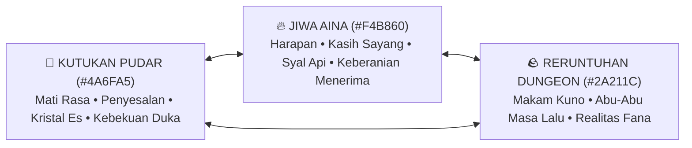

# Lentera Pudar — Master Creative Vision & Artistic Direction

> **Dokumen Visi Kreatif**: Sumber kebenaran estetika, emosional, puitis, dan artistik semesta *Lentera Pudar*. Seluruh sub-agent (Art Director, Game Designer, Psychology Agent, 3D Modeler, Pixel Editor, Godot Engineer) wajib merujuk dokumen ini untuk menjaga jiwa, resonansi duka, dan kehangatan semesta *Lentera Pudar*.

---

## BAB I: FILOSOFI KREATIF & INTI ARTISTIK

### 1.1 Pilar Estetika Utama: *"Melankolis-Hangat yang Puitis"* (Poetic Melancholy & Warmth)
Dunia *Lentera Pudar* dibangun di atas ketegangan emosional antara **Dua Kutub Suhu Ekstrem**:
- **Dinginnya Keputusasaan (6500K Kelvin — `#4A6FA5`)**: Kutukan Pudar bukan sekadar es fisik, melainkan metafora mati rasa emosional (*emotional numbness & apathy*). Orang-orang yang putus asa memilih membeku daripada terus merasakan sakitnya duka.
- **Hangatnya Pengorbanan & Cinta (2700K Kelvin — `#F4B860`)**: Jiwa Aina yang menyala di leher Kaelen adalah satu-satunya sumber cahaya dan kehangatan sejati. Api ini tidak membakar musuh dengan amarah, melainkan mencairkan kebekuan hati dengan kasih sayang dan empati.

### 1.2 Referensi Visi & Karya Inspirasi:
- **Atmosfer & Kesunyian Puitis**: *Hyper Light Drifter*, *Signalis*, *Ender Lilies: Quietus of the Knights*.
- **Psikologi Penerimaan Duka**: *Gris*, *Celeste*, *ICO*.
- **Bobot Fisik & Ketajaman Visual Retro**: *Chrono Trigger*, *Vagrant Story*, *Sword & Sworcery*.

---

## BAB II: PEDOMAN BAHASA & NADA BICARA (NARRATIVE & DIALOGUE TONE)

### 2.1 Kaelen (Sang Pengelana Duka)
- **Kepribadian**: Pria pendiam, membawa rasa bersalah mendalam atas tragedi masa lalu. Bertarung bukan untuk mencari kejayaan, tetapi untuk menuntaskan janji terakhirnya kepada Aina.
- **Gaya Bicara**:
  - Hemat kata (*laconic*), kalimat pendek, nada rendah, tanpa basa-basi heroik klise.
  - Sering merespons dunia melalui bahasa tubuh (menggenggam syal, menatap tangan esnya, menghela napas panjang).
- **Contoh Diksi**:
  > *"Syal ini... semakin pendek. Tapi langkahku belum boleh berhenti."*  
  > *"Jangan membeku di sini. Duka ini memang sakit, tapi kau harus tetap merasakannya."*

### 2.2 Aina (Suara Jiwa Syal Lentera)
- **Kepribadian**: Jiwa penuh keikhlasan, pelindung batin Kaelen, lembut namun memiliki keteguhan luar biasa.
- **Gaya Bicara**:
  - Puitis, hangat, berbicara dalam bisikan lembut melalui angin syal.
  - Tidak pernah meratapi wujud fisiknya yang terkikis, melainkan fokus menyembuhkan luka batin Kaelen.
- **Contoh Diksi**:
  > *"Jangan takut saat apiku memendek, Kaelen. Setiap percikan yang hilang sedang menyalakan kembali dunia yang sempat padam."*  
  > *"Dinginnya dungeon ini tidak akan sanggup menyentuh hatimu, selama kau masih mengingat mengapa kita memulai perjalanan ini."*

### 2.3 Korban Pudar & Roh Kenangan (The Echoes)
- Terikat pada **5 Tahapan Berduka (*5 Stages of Grief*)** sesuai sektornya:
  1. **Sektor 1 (Denial)**: Menolak kenyataan bahwa mereka telah mati, mengulangi rutinitas harian di makam beku.
  2. **Sektor 2 (Anger)**: Menyalahkan takdir, meledak-ledak, membakar diri dalam amarah dingin.
  3. **Sektor 3 (Bargaining)**: Mencoba bertransaksi dengan waktu, memohon penundaan kematian.
  4. **Sektor 4 (Depression)**: Tenggelam dalam keheningan total, pasrah hancur menjadi debu es.
  5. **Sektor 5 (Acceptance)**: Melepaskan masa lalu dan membimbing Kaelen menuju pintu keluar dungeon.

---

## BAB III: PEDOMAN VISUAL & DESAIN PIKSEL 3D-TO-PIXEL

### 3.1 Kontras Siluet & Kejelasan Asimetri (Asymmetry Readability)
- **Tangan Kiri Kutukan Es**: Memancarkan urat es biru retak (`#4A6FA5`) dengan partikel uap beku halus (*frost mist*). Saat memukul, kristal es merekah dan pecah.
- **Tangan Kanan Normal**: Dibalut perban cokelat kusam dan kulit kelana (`#2A211C`). Pukulan berbobot tanah (*earthy impact*).
- **Syal Aina (The Fading Scarf)**: Menjuntai di punggung Kaelen, meliuk lembut dengan fisika spring-damper. Memancarkan cahaya keemasan lembut (`PointLight2D` 2700K) yang menerangi langkah Kaelen di lantai batu yang gelap.

### 3.2 Kerapihan Kluster Piksel & Hard Edges
- Dilarang membuat piksel tunggal yang tercecer (*orphan/stray pixels*).
- Warna harus dikelompokkan dalam kluster tegas (*clean color clusters*) dengan **Hue Shifting**:
  - Bayangan bergeser ke arah dingin kebiruan (`#2A211C` ➔ `#1A1829`).
  - Sorotan terang bergeser ke arah kuning hangat keemasan (`#F4B860` ➔ `#FFF275`).

---

## BAB IV: PEDOMAN GERAK, BOBOT FISIK & COMBAT FEEL

1. **Weight & Impact (Rasa Hantaman Nyata)**:
   - Setiap serangan Kaelen memiliki fase *anticipation* (tarikan napas), *snap impact* (hentakan pukulan), dan *recovery* (hembusan napas).
   - **Hit-Stop**: Jeda 3 frame (0.05 detik) saat pukulan mengenai musuh, disertai percikan api kuning dan pecahan es biru.
2. **Kamera & Ruang Emosional**:
   - Kamera menggunakan proyeksi **Orthogonal Low Top-Down 3/4** (kemiringan sudut ~25°).
   - Saat Kaelen diam di dekat Altar atau area aman, kamera melakukan *subtle breathing zoom-in* untuk menciptakan rasa intim dan tenang.

---

## BAB V: PEDOMAN SUARA & MUSIK (AUDIO LANDSCAPE)

1. **Dualitas Nada Musik**:
   - **Elemen Dingin (Atmosfer Duka)**: Droning sintetis rendah, derit kristal es, gemerisik butiran salju di batu.
   - **Elemen Hangat (Jiwa Aina)**: Denting piano berdebu yang intim, petikan gitar akustik nylon, melodi soliter cello melankolis.
2. **Dynamic Audio Ducking**:
   - Saat Kaelen memasuki zona altar lentera, gemuruh dungeon meredup (*ducking -6dB*), memberi ruang bagi melodi piano Aina yang lembut dan suara kayu terbakar hangat.
