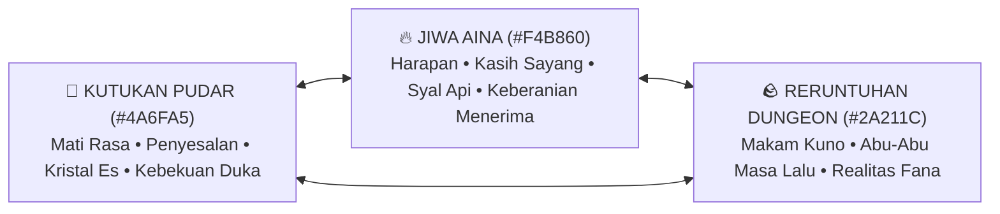

# Lentera Pudar — Master Creative Vision & Artistic Direction (3D Action RPG Edition)

> **Dokumen Visi Kreatif**: Sumber kebenaran estetika, emosional, puitis, dan artistik semesta *Lentera Pudar*. Seluruh sub-agent (Art Director, Game Designer, Psychology Agent, 3D Modeler, QC Agent) wajib merujuk dokumen ini untuk menjaga jiwa, resonansi duka, dan kehangatan semesta *Lentera Pudar*.

---

## BAB I: FILOSOFI KREATIF & INTI ARTISTIK

### 1.1 Pilar Estetika Utama: *"Melankolis-Hangat yang Puitis"* (Poetic Melancholy & Warmth)
Dunia *Lentera Pudar* dibangun di atas ketegangan emosional antara **Dua Kutub Suhu Ekstrem**:
- **Dinginnya Keputusasaan (6500K Kelvin — `#4A6FA5`)**: Kutukan Pudar bukan sekadar es fisik, melainkan metafora mati rasa emosional (*emotional numbness & apathy*). Orang-orang yang putus asa memilih membeku daripada terus merasakan sakitnya duka.
- **Hangatnya Pengorbanan & Cinta (2700K Kelvin — `#F4B860`)**: Jiwa Aina yang menyala di leher Kaelen adalah satu-satunya sumber cahaya dan kehangatan sejati. Api ini tidak membakar musuh dengan amarah, melainkan mencairkan kebekuan hati dengan kasih sayang dan empati.

### 1.2 Referensi Visi & Karya Inspirasi 3D:
- **Atmosfer & Kesunyian Puitis 3D**: *NieR: Automata*, *Ender Lilies*, *Shadow of the Colossus*.
- **Gaya Karakter & Action Combat**: *Final Fantasy VII Remake*, *Crisis Core*, *Genshin Impact*.
- **Psikologi Penerimaan Duka**: *Gris*, *Celeste*, *ICO*.

---

## BAB II: PEDOMAN BAHASA & NADA BICARA (NARRATIVE & DIALOGUE TONE)

### 2.1 Kaelen (Sang Pengelana Duka)
- **Kepribadian**: Pria pendiam, membawa rasa bersalah mendalam atas tragedi masa lalu. Bertarung bukan untuk mencari kejayaan, tetapi untuk menuntaskan janji terakhirnya kepada Aina.
- **Gaya Bicara**:
  - Hemat kata (*laconic*), kalimat pendek, nada rendah, tanpa basa-basi heroik klise.
  - Sering merespons dunia melalui bahasa tubuh 3D (menggenggam syal, menatap tangan esnya, menghela napas panjang).
- **Contoh Diksi**:
  > *"Syal ini... semakin pendek. Tapi langkahku belum boleh berhenti."*  
  > *"Jangan membeku di sini. Duka ini memang sakit, tapi kau harus tetap merasakannya."*

### 2.2 Aina (Suara Jiwa Syal Lentera)
- **Kepribadian**: Jiwa penuh keikhlasan, pelindung batin Kaelen, lembut namun memiliki keteguhan luar biasa.
- **Gaya Bicara**:
  - Puitis, hangat, berbicara dalam bisikan lembut melalui angin syal.
  - Tidak pernah meratapi wujud fisiknya yang terkikis, melainkan fokus menyembuhkan luka batin Kaelen.
- **Contoh Diksi**:
  > *"Jangan takut saat apiku memendek, Kaelen. Setiap percikan yang hilang sedang menyalakan kembali dunia yang sempat padam."*  
  > *"Dinginnya dungeon ini tidak akan sanggup menyentuh hatimu, selama kau masih mengingat mengapa kita memulai perjalanan ini."*

---

## BAB III: PEDOMAN VISUAL & DESAIN 3D

### 3.1 Kontras Siluet & Kejelasan Asimetri 3D
- **Tangan Kiri Kutukan Es**: Kluster kristal es prisma bersudut tajam (`#4A6FA5` & `#7EE8FA`) dengan cakar es dan partikel uap beku halus (*frost mist Niagara*).
- **Tangan Reruntuhan Normal**: Dibalut perban spiral pelindung kepalan tangan (`#FAF2EC` / `#D0C4BA`). Pukulan berbobot fisik nyata (*earthy impact*).
- **Syal Aina (The Fading Scarf)**: Menjuntai di punggung Kaelen, berkibar lembut dengan simulasi fisika kain (*Cloth Simulation & Spring Bones*). Memancarkan cahaya keemasan lembut (PointLight 2700K Lumen) yang menerangi dungeon.

---

## BAB IV: PEDOMAN COMBAT FEEL & KINEMATIKA 3D

1. **Weight & Impact (Rasa Hantaman Nyata)**:
   - Setiap serangan Kaelen memiliki fase *anticipation*, *snap impact*, dan *recovery*.
   - **Hit-Stop & Screen Shake**: Jeda 3 frame (0.05 detik) saat pukulan mengenai musuh, disertai percikan api emas dan pecahan es kristal.
2. **Kamera 3D Third-Person**:
   - Kamera over-the-shoulder dinamis dengan rotasi bebas 360° dan arena lock-on saat boss fight.

---

## BAB V: PEDOMAN SUARA & MUSIK (AUDIO LANDSCAPE)

1. **Dualitas Nada Musik**:
   - **Elemen Dingin (Atmosfer Duka)**: Droning sintetis rendah, derit kristal es, gemerisik butiran salju di batu.
   - **Elemen Hangat (Jiwa Aina)**: Denting piano berdebu yang intim, petikan gitar akustik nylon, melodi soliter cello melankolis.
2. **Dynamic Audio Ducking**:
   - Saat Kaelen memasuki zona altar lentera, gemuruh dungeon meredup (*ducking -6dB*), memberi ruang bagi melodi piano Aina yang lembut dan suara kayu terbakar hangat.
