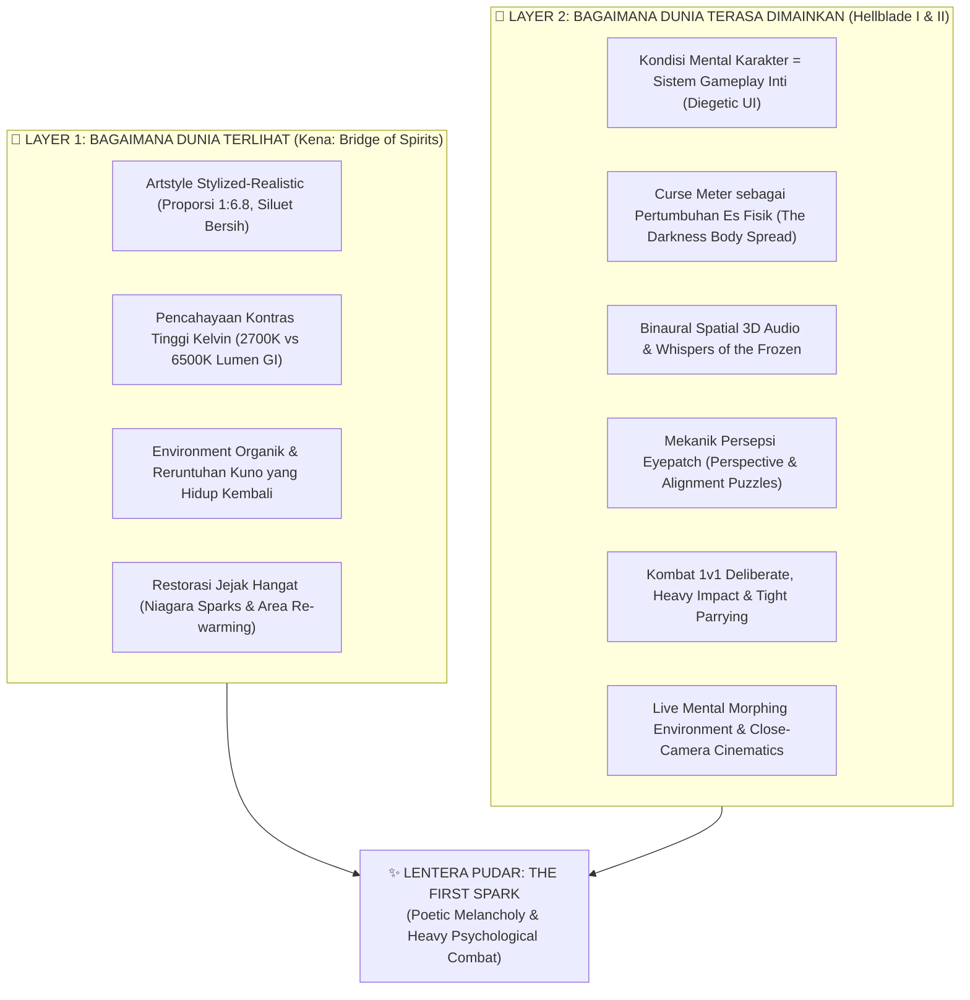
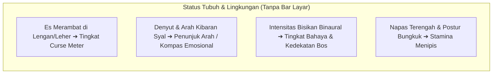
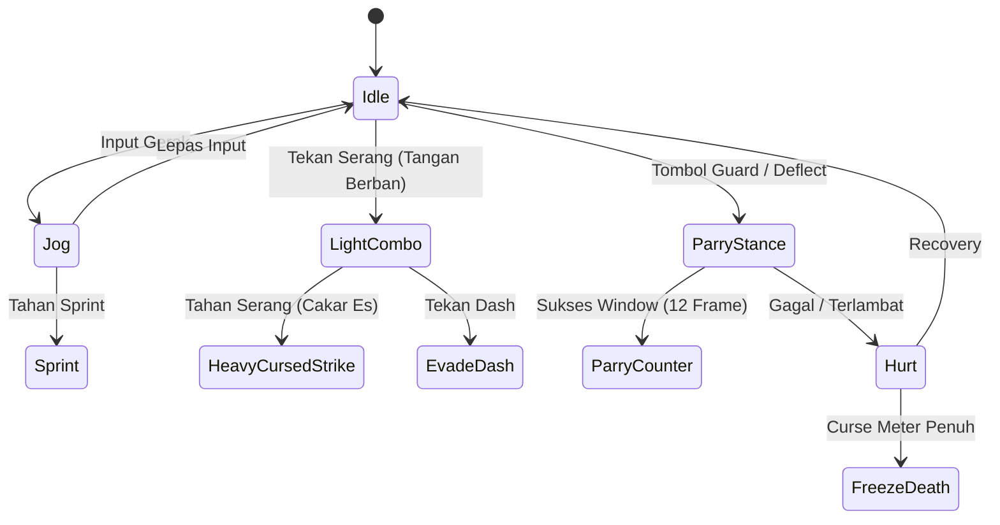
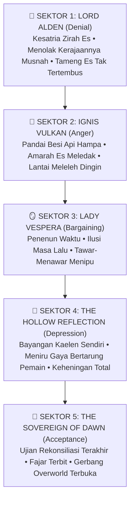

# Game Design Document (GDD) — Lentera Pudar: 3D Action RPG Master Bible

> **Dokumen Sumber Kebenaran Mutlak (*Game Design Source of Truth*)**  
> Mencakup seluruh filosofi, kosmologi semesta, arsitektur dual-layer (Kena & Hellblade), mekanik 3D gameplay, sistem diegetik, psikologi pemain, dan pipeline teknis **Unreal Engine 5 + Blender 5.2 LTS**.

---

## DAFTAR ISI
1. [BAB I: Identitas Proyek, Core Pillars & Arsitektur Dual-Layer](#bab-i-identitas-proyek-core-pillars--arsitektur-dual-layer)
2. [BAB II: Kosmologi Semesta & 5 Tahapan Berduka (5 Stages of Grief)](#bab-ii-kosmologi-semesta--5-tahapan-berduka-5-stages-of-grief)
3. [BAB III: Dualitas Karakter & Tragedi Ikatan Jiwa (Kaelen & Aina)](#bab-iii-dualitas-karakter--tragedi-ikatan-jiwa-kaelen--aina)
4. [BAB IV: Sistem Diegetik & Minimal HUD (Living Body & Scarf)](#bab-iv-sistem-diegetik--minimal-hud-living-body--scarf)
5. [BAB V: Mekanik Persepsi & Eksplorasi (The Eye of Frost / Eyepatch System)](#bab-v-mekanik-persepsi--eksplorasi-the-eye-of-frost--eyepatch-system)
6. [BAB VI: Sistem Kombat 3D Adaptif & Kinematika Berbobot](#bab-vi-sistem-kombat-3d-adaptif--kinematika-berbobot)
7. [BAB VII: Psikologi Auditori & Environment Mental Real-Time](#bab-vii-psikologi-auditori--environment-mental-real-time)
8. [BAB VIII: Desain Encounter & 5 Boss Trauma Manifestation](#bab-viii-desain-encounter--5-boss-trauma-manifestation)
9. [BAB IX: Pipeline Teknis & Standar Produksi (UE5 + Blender 5.2)](#bab-ix-pipeline-teknis--standar-produksi-ue5--blender-52)

---

## BAB I: IDENTITAS PROYEK, CORE PILLARS & ARSITEKTUR DUAL-LAYER

### 1.1 Identitas & Spesifikasi Proyek
- **Judul Resmi**: *Lentera Pudar — The First Spark* (Seri Pembuka Semesta Lentera Pudar).
- **Genre**: 3D Third-Person Action-Adventure RPG (Stylized-Realistic / Poetic Dark Fantasy).
- **Target Platform**: PC Windows (Steam-Ready), Steam Deck, dan Controller Support penuh.
- **Engine & Pipeline**: Unreal Engine 5 (UE5 Pipeline, Nanite, Lumen GI, Niagara, Chaos Cloth) + Blender 5.2 LTS.
- **Target Performa**: Solid 60 FPS / 120 FPS pada resolusi 1080p, 1440p, dan 4K ($99^{th}\text{ percentile frame time} < 16.6\text{ ms}$).

### 1.2 Cetak Biru Arsitektur Dual-Layer (*The Dual-Layer Benchmark Architecture*)
Lentera Pudar mengintegrasikan dua pilar referensi industri secara disiplin tanpa tumpang tindih:



### 1.3 Teori Tiga Warna & Kontras Suhu Kelvin (*The Triad of Lentera Pudar*)
Seluruh perancangan visual, shader, material, dan lighting wajib tunduk pada **Hukum Tiga Warna (The Triad)**:
1. **Kuning Hangat (`#F4B860` — 2700K Kelvin Warm Emissive)**:
   Mewakili Jiwa Aina, api syal lentera, sumber harapan, dan cinta tanpa pamrih. Menerangi kegelapan melalui point light dinamis Lumen.
2. **Biru Dingin (`#4A6FA5` & `#7EE8FA` — 6500K Kelvin Cold Shard)**:
   Mewakili Kutukan Pudar, kristal es memori, kepasrahan, dan mati rasa emosional. Memancarkan uap beku dan pendaran emissive kristal pada lengan kiri Kaelen.
3. **Netral Gelap (`#2A211C` — Dark Neutral Stone)**:
   Mewakili reruntuhan dungeon kuno, tanah fana, abu masa lalu, jubah kelana Kaelen, dan penentu atmosferik bayangan 3D.

---

## BAB II: KOSMOLOGI SEMESTA & 5 TAHAPAN BERDUKA (5 STAGES OF GRIEF)

### 2.1 Hakikat Hakiki Kutukan Pudar (*The Fading Curse / Emotional Apathy*)
Kutukan Pudar bukan sekadar es fisik atau sihir kutukan iblis. Pudar adalah **perwujudan fisik dari kepasrahan total dan kepunahan hasrat hidup (Emotional Numbness / Anhedonia)**.
- Ketika manusia mengalami kepedihan dan trauma hidup yang melampaui batas kewarasannya, suhu tubuh mereka mendingin, molekul mereka melambat, dan jiwa mereka mengkristal menjadi **patung kristal es biru pudar (`#4A6FA5`)**.
- **Ironi Psikologis**: Menjadi es terasa "damai dan bebas dari rasa sakit". Membakar lentera untuk mencairkan mereka berarti mengembalikan rasa sakit dan kenangan pedih hidup mereka.
- **Kristal Es Pudar**: Es ini terbentuk dari air mata dan kenangan masa lalu yang membeku abadi.

### 2.2 Tiga Respon Manusia terhadap Pudar
1. **The Frozen Ascetics (Kaum Pasrah)**: Memilih membeku sukarela dan menganggap api lentera sebagai pengacau kedamaian abadi mereka.
2. **The Ash Fanatics (Pemuja Abu)**: Membakar rumah, sejarah, dan kemanusiaan mereka demi menjaga api unggun tetap menyala karena takut mati rasa.
3. **The Drifters (Para Pengelana — Seperti Kaelen)**: Terjebak di batas kenyataan: separuh tubuh mati rasa oleh es, separuh tubuh menahan perihnya api lentera.

### 2.3 Pemetaan 5 Sektor Dungeon (Model Kübler-Ross & Environmental Storytelling)
*Detail tata ruang spasial, verticality, breadcrumbing diegetik, dan simbiosis arena FSM merujuk pada [level-design-storytelling.md](file:///d:/GodotProjects/Lentera-Pudar/references/level-design-storytelling.md).*

```
[Sektor 1: DENIAL] ➔ [Sektor 2: ANGER] ➔ [Sektor 3: BARGAINING] ➔ [Sektor 4: DEPRESSION] ➔ [Sektor 5: ACCEPTANCE]
```

| Sektor | Tahap Duka | Nama Wilayah | Suasana Visual & Atmosfer | Bos Wilayah |
|---|---|---|---|---|
| **Sektor 1** | **Denial** (Penyangkalan) | *The Silent Crypts* | Makam beku kuno di mana patung-patung warga membeku saat sedang berpura-pura beraktivitas normal. Koridor sempit simetris berulang (*looping claustrophobia*). | **Lord Alden**, Sang Penjaga Gerbang Kosong (Kesatria zirah es yang menolak kerajaannya telah musnah). |
| **Sektor 2** | **Anger** (Kemarahan) | *The Blazing Frost* | Peleburan es di mana amarah dingin meledak-ledak. Jalur terputus tajam, friksi navigasi tinggi, dan reruntuhan *destructible*. | **Ignis Vulkan**, Sang Pandai Besi Api Hampa. |
| **Sektor 3** | **Bargaining** (Tawar-Menawar) | *The Hall of Mirrors* | Labirin cermin waktu dan arsip perjanjian kuno terendam air es. Pantulan cermin memperlihatkan masa lalu palsu dan rute bercabang semu. | **Lady Vespera**, Sang Penenun Perjanjian. |
| **Sektor 4** | **Depression** (Depresi) | *The Abyss of Stillness* | Danau keheningan gelap tanpa suara. Ruang luas hampa (*descending verticality*), langkah kaki terasa sangat berat. | **The Hollow Reflection** (Manifestasi bayangan trauma Kaelen sendiri). |
| **Sektor 5** | **Acceptance** (Penerimaan) | *The Dawning Altar* | Puncak menara di mana fajar pertama menembus badai es abadi. Ruang lapang terbuka dengan sightline panjang menuju Benua Luar (*Overworld*). | **The Sovereign of Dawn** (Ujian akhir rekonsiliasi batin). |

---

## BAB III: DUALITAS KARAKTER & TRAGEDI IKATAN JIWA (KAELEN & AINA)

```
                     [ TRAGEDI IKATAN JIWA ]
             
    🗡️ KAELEN (Protagonis 3D)           🧣 AINA (Jiwa Syal Lentera)
    • Sang Pembawa Rasa Bersalah.       • Sang Pengorbanan Murni.
    • Setengah beku di lengan kiri       • Membakar wujud fisiknya menjadi
      karena keputusasaan masa lalu.       syal api emas 2700K.
    • Bertarung tangan kosong & cakar.   • Menjadi kompas & jangkar batin.
    • Mata kanan tersegel eyepatch.      • Memendek permanen di tiap Altar Duka.
```

### 3.1 Protagonis: Kaelen (Sang Pengelana Duka)
- **Anatomi & Proporsi**: Pria bertubuh atletis (proporsi 1:6.8, siluet bersih ala *FF7 Remake / Kena*), berambut abu-abu perak acak.
- **Lengan Kiri Beku (`#4A6FA5` & `#7EE8FA`)**: Dibalut kluster prisma kristal es tajam yang berdenyut emissive reaktif, berujung pada cakar es kristal (*crystal talons*).
- **Mata Kanan Tersegel (*Eyepatch* `#141013`)**: Penutup mata kulit hitam dengan gesper perak sebagai segel penahan luka beku kutukan masa lalu.
- **Tangan Kanan Normal**: Dibalut perban spiral pelindung kepalan tangan (`#FAF2EC` / `#D0C4BA`), mengeksekusi pukulan fisik berbobot (*earthy impact*).
- **Pakaian**: Jubah kelana gelap usang (`#2A211C`) dengan tali selempang kantung kulit bersilang di dada (*baldric harness*).

### 3.2 Sang Pelindung Abadi: Aina (Jiwa di Balik Syal Kuning)
- **The Fading Scarf (`#F4B860` 2700K)**: Syal kain emas melingkar di leher Kaelen, memancarkan cahaya hangat lembut yang menerangi lingkungan 3D dungeon.
- **Simulasi Fisika Kain Dinamis**: Menggunakan *Cloth Simulation & Spring Bones* (5-bone chain di Blender) sehingga syal berkibar anggun mengikuti gravitasi, inersia langkah kaki, dan tiupan angin badai es.
- **Mekanik Naratif: *4 Stages of Sacrifice***:
  Setiap kali Kaelen menyalakan Altar Duka di akhir sektor dungeon, nyala api menyerap jiwa Aina, menyebabkan panjang syal memendek secara permanen (Panjang ➔ Sedang ➔ Pendek ➔ Koyak/Fragmen).

---

## BAB IV: SISTEM DIEGETIK & MINIMAL HUD (LIVING BODY & SCARF)

Lentera Pudar mengadopsi filosofi antarmuka **Zero-Clutter Diegetic HUD** (terinspirasi dari *Hellblade* dan *Dead Space*), di mana kondisi karakter terbaca langsung dari tubuh dan dunianya.



### 4.1 Pertumbuhan Es Fisik (*The Curse Spread / The Darkness*)
- Tidak ada health/curse bar konvensional yang mendominasi layar.
- **Rambatan Kristal Es**: Saat Kaelen terkena serangan berat, gagal parry, atau menggunakan kekuatan es secara berlebihan, shader *Dynamic Material Instance* pada model 3D Kaelen (`Curse_Spread_0_to_1`) secara visual merambatkan es dari siku, bahu, dada, hingga menyentuh pipi dan lehernya.
- **Peringatan Kritis**: Saat *Curse Meter* mendekati 90%, urat-urat es di wajah Kaelen berpendar biru tajam dan layar mengalami desaturasi dingin (*frost vignette*).

### 4.2 Kompas Emosional Syal Aina (*Scarf Emotional Compass*)
- Tidak ada minimap atau penunjuk arah GPS buatan.
- **Ujung Kibaran Syal**: Ujung syal Aina selalu berkibar lembut mengarah ke Altar Duka terdekat atau jalan keluar.
- **Denyut Cahaya**: Ketika Kaelen mendekati rahasia tersembunyi atau puzzle lingkungan, syal berdenyut lebih terang dengan frekuensi mirip detak jantung yang menenangkan.

### 4.3 Ilusi Kepasrahan Abadi (*Permadeath Illusion / The Freeze of Despair*)
- Jika *Curse Meter* penuh total 3 kali dalam satu pertempuran, layar menggelap dengan suara es yang membekukan jantung Kaelen.
- Alih-alih menghapus save game pemain, sistem memicu **cutscene refleksi trauma personal Kaelen**, di mana bisikan Aina menariknya kembali dari jurang mati rasa sebelum ia membeku selamanya.

### 4.4 Sistem Antarmuka Minimal & Aksesibilitas Empatik (Lihat [ui-ux-accessibility.md](file:///d:/GodotProjects/Lentera-Pudar/references/ui-ux-accessibility.md))
- **Antarmuka Diegetik Utama**: Indikator status tersemat langsung pada tubuh Kaelen (es lengan kiri & panjang syal emas). HUD non-diegetik memudar otomatis saat eksplorasi.
- **Aksesibilitas Komprehensif**: Mode buta warna berbasis bentuk simbol, closed captions vokal emosional, visual cues untuk audio tell, dan slider parry window assist (12 frame ➔ 18 frame).
- **Localization-Ready Architecture**: Desain text container dinamis (+40% ekspansi) dan zero baked text pada aset tekstur 3D.

---

## BAB V: MEKANIK PERSEPSI & EKSPLORASI (THE EYE OF FROST / EYEPATCH SYSTEM)

### 5.1 Mekanik Mata Tersegel (*The Sealed Right Eye: Temptation of Sight*)
Pemain dapat menahan tombol khusus (*Hold Button*) untuk **membuka sesaat penutup mata kanan Kaelen**.

```
[Buka Eyepatch] ➔ [Post-Process Spectral Ice World] ➔ [Lihat Memori & Simbol] ➔ [RISIKO: Curse Naik + Bisikan Menggila]
```

- **Fitur Penglihatan Spektral**:
  1. Mengungkap jalan setapak rahasia yang terbuat dari jembatan es transparan.
  2. Melihat titik lemah musuh/bos yang terbungkus lapisan kristal tipis.
  3. Mengungkap memori masa lalu para korban (*Echoes of the Past*).
- **Konsekuensi *Risk-Reward***:
  - Membuka mata kanan berarti menatap langsung ke jurang Kutukan Pudar.
  - Setiap detik mata terbuka, **Curse Meter bertambah +3 poin/detik** (dari total 100 poin) dan bisikan jiwa beku di telinga pemain makin keras dan agresif.
  - Pemain dipaksa membuat keputusan taktis: *"Berapa lama aku berani membuka mata ini demi melihat jalan?"*

### 5.2 Puzzle Penyelarasan Perspektif Lingkungan (*Environmental Perspective Alignment*)
Terinspirasi dari mekanik persepsi *Hellblade*:
- Pemain menemukan gerbang batu kuno yang disegel oleh pecahan rune es.
- Pemain harus memposisikan kamera 3D Kaelen pada sudut pandang tertentu sehingga reruntuhan batu, pilar yang runtuh, dan retakan es di dinding membentuk simbol yang utuh.
- Saat simbol selaras sempurna, syal Aina memancarkan kilau emas yang membakar segel es gerbang tersebut.

---

## BAB VI: SISTEM KOMBAT 3D ADAPTIF & KINEMATIKA BERBOBOT

### 6.1 Kamera Dinamis Adaptif (*Adaptive Dynamic Camera Stance*)
Kamera beralih secara dinamis dan mulus (*smooth interpolation*) antara dua mode:

```
                  [ ADAPTIVE CAMERA SYSTEM ]
                             │
       ┌─────────────────────┴─────────────────────┐
       ▼                                           ▼
[MODE EKSPLORASI (Ala Kena)]             [MODE DUEL / LOCK-ON (Ala Hellblade)]
• Jarak: 3.8 – 4.5 Meter                 • Jarak: 2.6 – 3.0 Meter (Over-Shoulder)
• FOV: 78° (Luas & Bebas)                • FOV: 70° (Ketat & Intim)
• Fokus: Reruntuhan & Gerak Syal         • Fokus: Gerak Tubuh Musuh & Timing Parry
```

### 6.2 State Machine Kombat 3D (FSM)



1. **Light Punch Combo (1–3 Hit)**:
   Kaelen melancarkan pukulan tinju tangan kanan berbalut perban. Memiliki inersia berat (*earthy root-motion*), menghasilkan getaran fisik padat pada musuh.
2. **Heavy Cursed Strike / Ice Palm Strike**:
   Hantaman cakar kristal es tangan kiri yang memicu ledakan kristal es area (`#4A6FA5`). Menghasilkan *stagger* besar pada musuh, namun menaikkan *Curse Meter* Kaelen sebesar +10%.
3. **Tight Parry Window & Deflect**:
   Jendela tangkisan presisi (12 frame / 0.2 detik). Tangkisan sukses memicu efek *hit-stop* 3-frame, pecahan bunga api emas Aina, dan membuka ruang untuk *Parry Counter* mematikan.
4. **Evade Dash**:
   Gerakan meluncur cepat ke samping/belakang meninggalkan jejak percikan api emas syal Aina (`#F4B860`), memiliki *invulnerability frames* (i-frames) singkat.

### 6.3 Rasa Hantaman & Kinematika (*Combat Kinematics & Weight*)
- **Hit-Stop (Impact Freeze)**: Jeda 3 frame (0.05 detik) saat serangan bertabrakan dengan tubuh musuh, memberi rasa hantaman tulang dan kristal yang sangat berbobot.
- **Procedural Screen Shake & Impulse**: Getaran kamera directional sesuai sudut tebasan/pukulan.
- **Physical Particle Feedback**: Pecahan kristal es tajam dan debu reruntuhan batu berhamburan saat pukulan mendarat.

### 6.4 Arketipe Musuh & Balancing Kombat (Lihat [enemy-design-balancing.md](file:///d:/GodotProjects/Lentera-Pudar/references/enemy-design-balancing.md))
- **Arketipe Manifestasi Duka**: *The Echo* (Denial - duplikasi & ilusi), *The Berserker* (Anger - agresif & parry-reward), *The Deceiver* (Bargaining - proyektil semu & cover), *The Weight* (Depression - tanky & shockwave), *The Mirror* (Acceptance - refleksi gaya Kaelen).
- **Attack Telegraphing**: Fase windup minimal 12–18 frame dengan kilau biru dingin `#4A6FA5`, perubahan siluet instan, dan audio cues spasial.
- **Fun Guardrails**: Nilai kepuasan mekanik (*mechanical satisfaction*) dan responsivitas kontrol tidak boleh dikorbankan demi tema berat.

---

## BAB VII: PSIKOLOGI AUDITORI & ENVIRONMENT MENTAL REAL-TIME

### 7.1 Bisikan Spasial Binaural 3D (*Binaural Whispers of the Frozen*)
- Lentera Pudar menggunakan teknologi tata suara 3D spatialized (MetaSounds / Audio Spatialization):
- **Suara Jiwa Beku (Binaural Whispers)**: Bisikan-bisikan dingin berbicara langsung ke telinga kiri dan kanan pemain menggunakan headset:
  - *"Menyerahlah Kaelen... menjadi es tidak terasa sakit."*
  - *"Lihat syalnya, dia sekarat karenamu..."*
  - *"Di belakangmu! Awas!"* (Sebagian bisikan membantu, sebagian menjatuhkan mental pemain).
- **Intensitas Adaptif**: Frekuensi bisikan meningkat drastis saat *Curse Meter* tinggi dan saat memasuki arena bos.

### 7.2 Perubahan Lingkungan Mental Real-Time (*Live Mental Morphing Environment*)
Terinspirasi dari *Hellblade II*, ruangan dungeon tidak statis:
- Ketika *Curse Meter* Kaelen meningkat tinggi atau saat menghadapi trauma masa lalu, **koridor dungeon merekah, dinding es memanjang secara visual, dan siluet wajah-wajah beku muncul di dinding** secara langsung (*real-time World Position Offset & Nanite Morphing*) tanpa layar loading.
- Ketika Kaelen menyalakan Altar Duka, dinding kembali stabil dan rona hangat 2700K perlahan merambat menyelimuti lantai batu.

### 7.3 Hierarki Musik Adaptif & Audio Ducking
1. **Dua Kutub Aransemen**:
   - **Kutub Dingin (Duka & Kesendirian)**: Droning frekuensi rendah (sub-bass), desau badai salju, dan derit pecahan kristal es.
   - **Kutub Hangat (Aina & Harapan)**: Denting piano berdebu yang intim, petikan gitar akustik nylon lembut, dan solo cello melankolis.
2. **Dynamic Ducking**: Saat Aina berbisik melalui syalnya, seluruh audio ambient dungeon meredup (*ducking -6dB*), menaruh fokus penuh pada kehangatan suaranya.

---

## BAB VIII: DESAIN ENCOUNTER & 5 BOSS TRAUMA MANIFESTATION

Setiap bos di 5 Sektor Dungeon bukan sekadar musuh fisik penjaga pintu, melainkan **cerminan luka batin dan tahapan berduka Kaelen** yang menolak disembuhkan:



### 8.1 Rincian Desain 5 Bos Utama
1. **Sektor 1 (Denial) — Lord Alden, Sang Penjaga Gerbang Kosong**:
   - *Fase 1*: Bertarung di balik tameng es raksasa. Menolak mengakui bahwa prajuritnya sudah menjadi patung es.
   - *Mekanik*: Pemain harus membuka *Eyepatch* sesaat untuk melihat retakan tersembunyi pada zirah punggungnya.
2. **Sektor 2 (Anger) — Ignis Vulkan, Sang Pandai Besi Api Hampa**:
   - *Fase 1*: Menghantamkan palu es raksasa yang menyemburkan pecahan magma beku.
   - *Mekanik*: Arena pertempuran terbelah; pemain harus menggunakan *Evade Dash* melompati retakan api dingin.
3. **Sektor 3 (Bargaining) — Lady Vespera, Sang Penenun Perjanjian**:
   - *Fase 1*: Berpindah-pindah melalui cermin dinding raksasa, menciptakan klon masa lalu yang membujuk Kaelen.
   - *Mekanik*: Pemain menyelaraskan perspektif cermin 3D untuk menghancurkan ilusi aslinya.
4. **Sektor 4 (Depression) — The Hollow Reflection (Bayangan Kaelen)**:
   - *Fase 1*: Bertarung di atas danau air es gelap tanpa suara. Radius cahaya syal menyusut ke titik terendah.
   - *Mekanik*: Bos menggunakan set gerakan yang sama persis dengan Kaelen (*Circular Replay Buffer AI*), memaksa pemain mematahkan pola serangannya sendiri via *Parry*.
5. **Sektor 5 (Acceptance) — The Sovereign of Dawn**:
   - *Fase 1*: Pertarungan rekonsiliasi emosional di puncak menara altar.
   - *Puncak Naratif*: Aina menyerahkan sisa percikan terakhirnya, membuka gerbang menuju dunia luar (*Overworld*).

---

## BAB IX: PIPELINE TEKNIS & STANDAR PRODUKSI (UE5 + BLENDER 5.2)

### 9.1 Standardisasi Pemodelan & Rigging di Blender 5.2 LTS
- **Proporsi Mesh**: Karakter 1:6.8 high-detail stylized-realistic (**40.000–60.000 tris untuk Hero Character LOD0**; deform base mesh pra-subdivisi berkisar 15.000–30.000 tris sebelum high-frequency surface detail di-bake ke normal map).
- **Hybrid Hair System**: Rambut perak Kaelen (`#C9CDD1`) dimodelkan dengan *Solid Geometry Base Mesh* (massa volume utama) dipadu *Alpha Strip Cards* (helai acak alami/flyaways) — mengadopsi standar teknis Kena.
- **Hierarki Armature Biomekanik**:
  - `Root` ➔ `Pelvis` ➔ `Spine_01..03` ➔ `Chest` ➔ `Neck` ➔ `Head`.
  - **Rantai Syal Dinamis (Dual-Mode)**: 5-Bone Chain (`scarf_01` s.d. `scarf_05`) dengan parameter *Spring-Damper* (Stiffness: **0.4–0.6**, Damping: **0.3–0.5**) untuk simulasi inersia kain Chaos Cloth (gameplay) dan Hand-Keyframed Control Rig (cutscene naratif Altar Duka) — sesuai [style-guide.md](file:///d:/GodotProjects/Lentera-Pudar/references/style-guide.md) Bab 4.
- **Konsistensi Bone Roll**: Bone Roll terkunci rapi ($+Y$ along bone, $+Z$ normal forward).
- **Format Ekspor**: glTF 2.0 / FBX deterministik ($+Z$ Up, $+Y$ Forward) ke Unreal Engine 5.

### 9.2 Sistem Shading, Rendering & Restorasi Lingkungan di Unreal Engine 5
1. **Stylized-Realistic PBR (Zero Black Outline)**: Shading PBR murni tanpa post-process cel-shading outline hitam.
2. **Crystal Ice Shader (M_Cursed_Crystal)**:
   - Transmissive Surface, Refraction index 1.31 (Es), Subsurface Scattering (Radius 0.5–1.2cm `#7EE8FA`), dan Emissive Fresnel (`#4A6FA5` & `#7EE8FA`).
   - Parameter dinamis `Curse_Spread` mengontrol perambatan material kristal es ke seluruh tubuh mesh via MPC.
3. **Warm Fabric Shader (M_Aina_Scarf)**:
   - Velvet / Cloth shading model, Two-Sided, Emissive 2700K (`#F4B860`), terintegrasi dengan *Chaos Cloth Solver* di UE5.
4. **Render Target Mask Dynamic Thawing (Pencairan Es Altar Duka)**:
   - Pengaktifan Altar Duka menulis mask pemuaian radius melingkar ke Render Target lantai dungeon, mentransisikan es retak menjadi batu hangat (`#5C5A55`) secara live.
5. **Niagara FX Systems**:
   - `FX_Warmth_Embers`: Partikel percikan api emas syal Aina yang menyebar di area dungeon yang telah disucikan.
   - `FX_Frost_Mist`: Uap beku dingin di sekitar cakar es Kaelen.
   - `FX_Hit_Sparks`: Percikan benturan saat eksekusi parry sukses.

### 9.3 Standar Kelayakan Rilis Komersial (Steam-Ready Grade Compliance)
1. **Performa Solid 60/120 FPS**: Lock 60 FPS pada spesifikasi minimum PC (GTX 1060 / RX 580) dan 120 FPS pada spesifikasi rekomendasi (RTX 3060 / 4060).
2. **Zero Fatal Memory Leaks**: Alokasi memori VRAM & RAM stabil sepanjang sesi dungeon.
3. **Input Compliance Penuh**: Dukungan penuh keyboard/mouse dan controller (Xbox, PlayStation, Steam Deck) dengan *button glyphs* dinamis.
